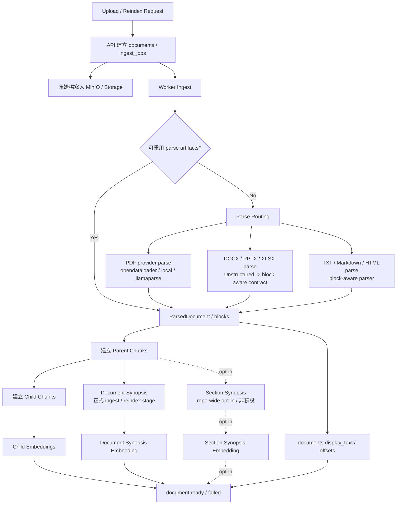
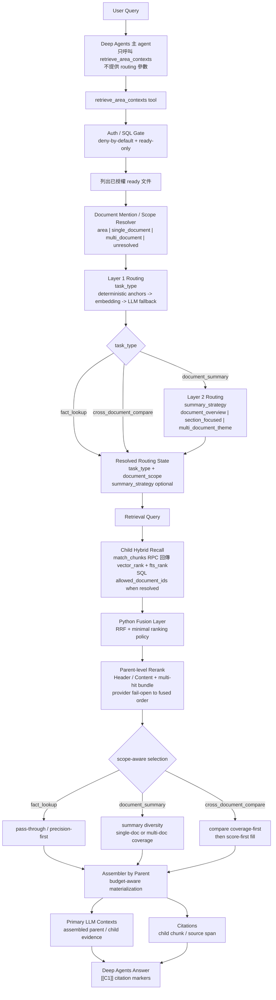

# ARCHITECTURE

## 目的

此文件描述專案的系統設計、模組責任、資料流與核心約束。  
它不負責記錄目前做到哪，而是回答「系統應該如何被設計」。

## 系統組成

### Web (One-Page Dashboard)
- React + Tailwind / Shadcn UI
- **DashboardLayout**: 負責全螢幕網格佈局與頂部全局狀態管理。
- **AreaSidebar**: 負責 Knowledge Areas 的導覽切換與快速建立，支援側邊欄收摺以最大化對話空間。
- **ChatPanel**: 視窗核心，負責 area 內多 session 對話切換、新建 session、串流狀態顯示、句尾 citation chips、工具調用透明化檢視，以及右側全文預覽欄的互動狀態；session metadata 會正式回寫後端。
- **DocumentPreviewPane**: 右側固定全文預覽欄，依 citation 所屬 `start_offset/end_offset` scroll 到對應位置，並以 child chunk 邊界做強/弱/hover 高亮。
- **DocumentsDrawer**: 負責不中斷對話的文件生命週期管理，透過右側滑出式抽屜提供文件上傳、列表、狀態追蹤，以及 ready 文件的 chunk-aware 全文檢視。
- **EvaluationDrawer**: 負責 area 內部的 retrieval correctness reviewer workflow，提供 dataset 建立、`fact_lookup` 題目管理、候選複核、source span 標註、`retrieval_miss` 標記與 benchmark run 檢視；其責任獨立於 `ChatPanel` 與 `DocumentsDrawer`。
- **AccessModal**: 彈窗式權限管理，確保區域權限與角色設定不干擾主對話流程。
- 提供「登入 -> 側邊欄選取區域 -> 中央即時對話」的流暢戰情室體驗。

### API
- FastAPI
- 提供 HTTP / SSE 介面
- 負責 auth integration、RBAC 邊界、service orchestration
- 對外暴露 areas、documents、jobs、chat 與 evaluation 相關 API
- 目前已提供 `auth/context`、`areas` 的 create/list/detail/update/delete、`areas/{area_id}/access` 管理端點，以及 documents / ingest jobs 最小集合
- JWT 驗證目前以 Keycloak issuer + JWKS 為基礎，並要求 access token 內存在 `sub` 與 `groups`
- chat runtime 透過 LangGraph Server 啟動；正式 Web transport 已改為 LangGraph SDK 預設 thread/run 端點，不再維護產品自訂 bridge chat routes

### Worker
- Celery
- 負責背景 ingest / indexing 工作
- 目前已處理 parse routing、parent-child chunk tree、embedding、FTS payload 寫入與狀態轉換

### Infra
- Caddy：唯一對外 reverse proxy，負責 `80/443`、自動 TLS、`/`、`/api/*`、`/auth/*` 路由與 `/auth/admin*` 封鎖策略
- PostgreSQL：主要資料庫 (使用 Supabase / PGroonga 支援繁體中文檢索)
- Redis：Celery broker/result backend
- MinIO：原始檔案儲存 (未來兼容 AWS S3)
- Keycloak：目前正式的身分與群組來源，公開 base path 固定為 `/auth`
- Alembic Migrations：位於 `apps/api/alembic/`，是目前唯一的 schema 正式來源
- Migration Runner：由 `python -m app.db.migration_runner` 統一執行 Alembic 升級，涵蓋 fresh 與既有資料庫

## 關鍵架構原則

### 1. deny-by-default
- 沒有有效角色的使用者，不得看到受保護資源
- 不能依靠前端隱藏按鈕當作授權機制

### 2. SQL gate 必須是主要保護層
- 不能先查全部資料再在記憶體過濾
- 未來 retrieval 與文件讀取都必須先套用 SQL gate

### 2.5. chunk schema 採 SQL-first
- `document_chunks` 的核心欄位必須以實體 SQL 欄位建模
- 不得以 `metadata_json` 或其他半結構欄位承載已知會參與查詢、排序、驗證或 observability 的資訊
- parent-child 關聯、position、section index、child index、heading、offset 等資料都必須可直接以 SQL 查詢

### 3. `documents.status = ready` 才可檢索
- `uploaded`
- `processing`
- `ready`
- `failed`

只有 `ready` 可進入 retrieval / chat。

### 4. phase-by-phase 實作
- 骨架完成前不實作完整 business logic
- auth / areas / documents / retrieval / chat 按階段前進
- Areas CRUD 已補齊；後續 area management 相關工作應以最小、可驗證的回歸與穩定性補強為主

### 5. area hard delete 先清 storage 再刪資料
- `DELETE /areas/{area_id}` 僅 `admin` 可執行
- area hard delete 前，API 必須先依 area 內 documents 的 `storage_key` 清除原始檔與 parse artifacts
- 若 storage cleanup 失敗，area/documents/jobs/chunks 不得刪除，避免資料庫與物件儲存狀態分裂
- 已刪 area/document 對應的舊 worker job 若晚到，只能安全失敗，不得復活資料

## 未來資料流

### 文件上傳流程
1. Web 上傳檔案
2. API 驗證請求並建立 `documents` / `ingest_jobs`
3. API 將原始檔存入 MinIO
4. Worker 會先嘗試從同一文件既有 parse artifacts 重建 `ParsedDocument`；可重用的 artifact 目前包含 `opendataloader.json`、`llamaparse.cleaned.md`、`pdf.unstructured.extracted.html`、`xlsx.extracted.html`、`docx.extracted.html` 與 `pptx.extracted.html`
5. 若找不到可重用 artifact，Worker 才執行 parse routing；其中 `PDF` 會先經 provider-based parsing：預設 `opendataloader` 輸出 `JSON + Markdown`，`local` 走 `Unstructured partition_pdf(strategy="fast")`，`llamaparse` 先轉成 Markdown
6. OpenDataLoader 的 Markdown 會回到既有 Markdown parser，而 JSON semantic elements 會補強 page/bbox locator，與 `TXT/MD/HTML` 路徑共用 block-aware `ParsedDocument`
7. `XLSX` 會先由 `Unstructured partition_xlsx` 解析 worksheet，優先取 `text_as_html` 並回接既有 HTML table-aware parser
8. `DOCX` 與 `PPTX` 會先由 `Unstructured partition_docx` / `partition_pptx` 解析，再映射為既有 `text/table` block-aware contract
9. Worker 依 ParsedDocument 建立 parent section 與 child chunk
10. Worker 以 replace-all 方式重建 `document_chunks`
11. Worker 會保留 `ParsedDocument.normalized_text` 供內部 parser / chunking 使用，並另外產生 `documents.display_text` 作為全文 preview 與 locator offsets 的正式資料來源
12. Worker 為 child chunks 寫入 `embedding`
13. Worker 更新 document/job 狀態為 `ready` 或 `failed`

### 問答流程
1. Web 於 area 內維護多個 LangGraph thread 作為 chat sessions；使用者可建立新 session、切換既有 session，並以目前啟用中的 thread 送出 chat run。每次 run 只附帶新的 user message，既有多輪歷史由 LangGraph thread state 保存
2. API 另外以 `area_chat_sessions` 正式保存 session metadata（`thread_id`、`owner_sub`、`area_id`、`title`、timestamps）；真正的對話內容仍以 LangGraph thread state 為主
3. LangGraph Server 先透過 custom auth 驗證 Bearer token
4. Web 透過 LangGraph SDK 預設 thread/run 端點送出 `area_id` 與 `question`
5. LangGraph auth 在 server 端將已驗證 `sub/groups` 注入 graph input
6. graph 內的主 Deep Agent 可自行判斷是否需要呼叫單一 `retrieve_area_contexts` tool；該 tool 必須維持 SQL gate、deny-by-default 與 ready-only 邊界。以目前正式主線而言，後端會依序執行 document mention / scope 解析、兩層 routing、child hybrid recall、Python `RRF`、minimal ranking policy、parent-level rerank、scope-aware selection 與 assembler；query-time 主線目前不接 `document synopsis recall` 或 `section synopsis recall`
7. 若主 agent 呼叫 retrieval tool，最終 graph state 會帶出 `citations`、`assembled_contexts`、`answer_blocks` 與 `used_knowledge_base`；其中回答引用由 `[[C1]]` marker 解析為 UI 可用的 `answer_blocks`
8. LangGraph thread state 除 `messages` 外，另保存 `message_artifacts`；每個 assistant turn 會持久化 `answer_blocks`、`citations` 與 `used_knowledge_base`，供前端在切回既有 session 或 reload 後還原 chips 與預覽互動
9. Web 直接消費 LangGraph SDK 的 `messages-tuple`、`custom` 與 `values` 事件：token delta 來自 `messages-tuple`，最終 answer / artifacts / citations 來自 `values`
10. `custom` 事件目前承載 `phase` 與 `tool_call`；前端可即時顯示搜尋 / 思考 / 工具呼叫狀態，以及 `retrieve_area_contexts` 的輸入 / 輸出
11. 前端正式引用 UX 為回答句尾 chips + 右側全文預覽欄；`Assembled Contexts`、工具輸入與工具輸出保留為 debug/details
12. `document_summary / cross_document_compare` 與 `fact_lookup` 一樣，都統一走主 `Deep Agents` answer path；前端不再提供 `thinking mode` 切換

### 文件管理預覽流程
1. 使用者在 `DocumentsDrawer` 中選取 `ready` 文件
2. 前端呼叫既有 `GET /documents/{document_id}/preview`
3. API 維持 ready-only、same-404 與 deny-by-default 語意
4. 前端以 `display_text + child chunk map` 建立 chunk list 與全文高亮，不新增第二條 inspector API
5. 點擊 chunk list 或全文中的 chunk 時，兩側同步作用中的 child chunk 狀態

### Retrieval evaluation reviewer 流程
1. 只有 area `admin` 與 `maintainer` 可開啟 `EvaluationDrawer`；`reader` 與無權限者不得看到入口，API 端仍維持 deny-by-default / same-404。
2. reviewer 透過 `POST /areas/{area_id}/evaluation/datasets` 建立 area-scoped dataset；dataset 與 item 都正式支援 `fact_lookup | document_summary | cross_document_compare`，language 固定支援 `zh-TW | en | mixed`。
3. reviewer 透過 `POST /evaluation/datasets/{dataset_id}/items` 建立題目後，前端呼叫 `POST /evaluation/datasets/{dataset_id}/items/{item_id}/candidate-preview` 取得 `recall / rerank / assembled` 三階段候選與文件內搜尋結果。
4. reviewer 一律透過既有 `GET /documents/{document_id}/preview` 的 `display_text + offsets` contract 檢視全文，再以 `POST /evaluation/datasets/{dataset_id}/items/{item_id}/spans` 標註 `document_id + start_offset + end_offset + relevance_grade`，或以 `mark-miss` 標記 `retrieval_miss`。
5. benchmark 由 `POST /evaluation/datasets/{dataset_id}/runs` 或 `python -m app.scripts.run_retrieval_eval` 觸發；所有 runner 都必須維持 SQL gate、deny-by-default 與 ready-only 邊界，但不再要求所有策略都必須綁死同一條 retrieval stage 組合。
6. benchmark 改善任務的正式策略為：先實際跑分建立 baseline；每一輪只允許一個主假設與最小改動；改動後必須重新跑分，若相對目前最佳結果退化，除分析文件外其餘改動一律回退；無論提升與否，都必須重新分析 miss 題與當前查到的 chunks，才能決定下一輪策略。
6.5. benchmark 治理的第一核心是「不得造成 domain overfit」；任何 candidate profile 若引入非 generic-first 的 retrieval wording、query rewrite 或 corpus-specific heuristic，必須在治理腳本層直接視為失敗，不得進入正式 lane 比較。
7. run 完成後，`retrieval_eval_runs` 僅保存可查 metadata，完整 summary / per-query / baseline compare JSON 落在 `retrieval_eval_run_artifacts`，再由 API 與 UI 顯示；benchmark strategy 的擴充必須透過單一 profile registry 進行，資料庫不得新增策略專用欄位

### Phase 8 summary/compare benchmark 契約
1. `summary/compare` 的正式 checkpoint 不沿用 Phase 7 retrieval-only runner，而是透過 `python -m app.scripts.run_summary_compare_checkpoint` 執行固定 dataset。
2. checkpoint runner 直接呼叫真實 chat runtime，逐題保存 `answer`、`answer_blocks`、`citations`、routing / selection trace、fallback reason 與 latency。
3. 判定流程採兩層：先做 deterministic hard blockers，再做 `LLM-as-judge` 的 `completeness / faithfulness_to_citations / structure_quality / compare_coverage` 評分。
3.5. judge 執行模式正式支援兩條路徑：`OpenAI API key` 直跑，以及 `offline packet` 路徑。後者會先匯出 `system_prompt + user_prompt + item context` JSONL，再由 `Codex / ChatGPT Pro` 或人工回填結果 JSONL，最後匯入產生相同 schema 的正式 report。
4. hard blockers 至少包含：`task_type` 命中、`summary_strategy` 命中、citations 只來自 `ready` 文件、必需文件被引用、允許證據不足的題目不得硬編結論、不得 timeout、不得超過 token budget。
5. checkpoint report 固定輸出 `run_metadata`、`aggregate_metrics`、`gate_results`、`per_item_results`、`judge_scores`、`hard_blocker_failures` 與 `recommendations`；`run_metadata.answer_path` 固定標示 `deepagents_unified`。
6. summary / compare 的正式 metric registry 必須對每個指標標示 `source_method` 與 `standard_level`，其中 `standard_level` 固定只允許 `standard | semi_standard | project_contract`。
7. retrieval 排名品質的正式代表主指標為 `nDCG@10`；`Recall@10` 作為漏召回 guardrail。
8. `document_summary` 若具 reference summary，外部代表主指標優先採 `BERTScore`；summary faithfulness 的外部代表 guardrail 優先採 `QAFactEval`。若 dataset 不具備該方法前提，report 必須標示 `not_applicable`。
9. `cross_document_compare` 的正式外部代表方法採 `pairwise_rubric_judge`；不得用單一 overlap 指標取代。
10. `required_document_coverage`、`citation_coverage`、`section_coverage`、`required_document_not_cited` 與 `insufficient_evidence_not_acknowledged` 屬於產品 evidence contract，正式標示為 `project_contract`。
11. `phase8a-summary-compare-v1` 持續作為唯一產品 gate；`summary-compare-real-curated-v1` 則作為 tuning / observability suite，不取代產品 gate。
12. 雙語 summary/compare benchmark suite 的正式主輸出只有 `summary_benchmark_score` 與 `compare_benchmark_score`；不額外定義跨任務單一總分。
13. 離線 judge workflow 只替換 judge 執行方式，不得改動題目、runtime answer、citations、SQL gate、ready-only 邊界或 baseline compare 規則；packet 只是 judge 輸入輸出的搬運層，不是第二條產品 answer path。

### 外部 benchmark curation 流程
1. `python -m app.scripts.prepare_external_benchmark prepare-source` 會將 `QASPER` / `UDA` / `MS MARCO` / `Natural Questions` 類原始資料轉成 repo-local 的 `source_documents/` 與統一 `prepared_items` 中間格式；其中 `MS MARCO` 與 `NQ` 可直接使用 `hf://...` dataset-server 參照。
2. `filter-items` 只保留可映射為 `fact_lookup` 的 curated v1 題目，並輸出 `filter_report.json` 供審查排除原因。
3. `align-spans` 必須讀取目標 area 內 `ready` 文件的 `display_text`，以 `display_text-first` 對齊 evidence；gold truth 不信任外部資料集原始 offsets。
4. 對齊結果分成 `auto_matched`、`needs_review` 與 `rejected`，並輸出 `alignment_candidates.jsonl` 與 `alignment_review_queue.jsonl`；若 queue 非空，可先用 `review_external_benchmark_with_openai.py` 做 `OpenAI` review 補 span，再視需要回到 `EvaluationDrawer + documents preview` 做人工複核。
5. `build-snapshot` 只會將 `auto_matched` 與 reviewer 明確核准的 spans 轉成正式 snapshot；未具穩定 gold span 的題目不得包裝成正式 benchmark 分數來源。
6. `QASPER`、`UDA` 與 `DRCD` 的原始任務都帶有每題指定文件上下文；正式 benchmark runner 對 dataset name 以 `qasper-`、`uda-` 或 `drcd-` 開頭的資料集，會以該題 gold spans 的 `document_id` 作為指定文件 scope，再執行 recall / rerank / assembler。此規則只屬於 benchmark contract，不得套用到產品 chat runtime，也不得把 oracle 文件 scope 分數與舊的 area-wide ambiguous query 分數混讀；若 baseline run 與 candidate run 的文件 scope 模式不同，baseline compare 必須明確標記 skip。

### Web 登入流程
1. 匿名使用者可先進入首頁
2. 進入受保護頁面或按下登入按鈕後，Web 導向 Keycloak
3. Keycloak callback 回到 `/auth/callback`
4. 前端建立 session、取得 access token，並呼叫 `GET /auth/context`
5. 之後受保護 API 請求自動帶上 bearer token
6. 在瀏覽器具備 secure-context Web Crypto 時，前端使用 PKCE `S256`；若在非 secure context 無法取得 `window.crypto.subtle`，則退回無 PKCE 模式並記錄警告
7. token 接近過期時由前端 refresh；失敗則清 session 並回首頁

## 已驗證的 foundation 路徑

### Keycloak -> API auth context
1. 使用者透過 Keycloak 取得 access token
2. access token 必須包含 `sub` 與 `groups`
3. API 透過 issuer / JWKS 驗證 token
4. API 將 token 解析為 principal，提供 `GET /auth/context`

### Group-based area access check
1. `area_group_roles` 或 `area_user_roles` 提供 area 權限映射
2. API 以 SQL 查詢 direct role 與 group role
3. service 取最大值作為 effective role
4. 沒有有效角色者統一回 `404`，避免暴露資源存在性

### Area vertical slice
1. 使用者以 Bearer token 呼叫 `POST /areas`
2. API 建立 `areas` 記錄，並將建立者寫入 `area_user_roles=admin`
3. `GET /areas` 只回傳目前使用者可存取的 area，並附上 effective role
4. `GET /areas/{area_id}` 與 `GET /areas/{area_id}/access` 都先做 SQL access check
5. `PUT /areas/{area_id}/access` 僅允許 `admin` 以整體替換方式更新 direct user roles 與 group roles

### Documents & ingestion vertical slice
1. `POST /areas/{area_id}/documents` 僅允許 `maintainer` 以上上傳單一文件
2. API 先將原始檔寫入物件儲存，再建立 `documents=status=uploaded` 與 `ingest_jobs=status=queued`
3. 所有環境都由 Celery worker 執行 ingest；API 只負責建立 `documents` / `ingest_jobs` 並 dispatch 背景工作
4. Worker 目前真正解析 `TXT`、`Markdown`、`HTML`、`PDF`、`XLSX`、`DOCX` 與 `PPTX`
5. `PDF` 採 provider-based parsing：`PDF_PARSER_PROVIDER=opendataloader|local|llamaparse`；其中 `opendataloader` 為預設值，採 `json,markdown`、`use_struct_tree=true`、`hybrid=off`
6. `opendataloader` 與 `llamaparse` 路徑都會在進入既有 Markdown parser 前先清理常見頁碼 / 分隔符噪音；進入 chunking 前再做 PDF-specific block consolidation，優先合併同 heading 的碎片 text/table runs
7. OpenDataLoader 預設要求 Java 11+，並維持 AI safety filters 開啟；本輪不納入 hybrid/docling backend
7. `local` PDF parser 僅提供自架 fallback 與基本文字擷取；不承諾表格高保真，也不支援 OCR / 掃描 PDF
8. `POST /documents/{document_id}/reindex` 會先清除同 document 舊 chunks、保留既有 parse artifacts，再建立新 ingest job 重建 chunk tree；若帶 `force_reparse=true`，worker 需忽略既有 artifacts 並重跑 parser
9. `DELETE /documents/{document_id}` 會移除 document、相關 jobs、document chunks 與原始檔
10. `GET /areas/{area_id}/documents`、`GET /documents/{document_id}`、`GET /ingest-jobs/{job_id}` 都必須先套 area access 邊界

### Document chunk tree
1. `document_chunks` 採固定兩層結構：`parent -> child`
2. parser 與 chunker 之間使用 block-aware contract：`ParsedDocument(normalized_text, source_format, blocks)` 與 `ParsedBlock(block_kind, heading, content, start_offset, end_offset)`
3. `PDF` 不直接寫入外部 parser 的 chunk 結果；無論是 `marker`、`local` 或 `llamaparse`，都必須先回到既有 parser/chunk tree contract
4. `document_chunks` 除 `chunk_type` 外，另有 `structure_kind=text|table`，供後續 retrieval、citation 與 observability 直接辨識內容結構
5. `parent` chunk 由 custom section builder 建立；TXT 以段落群組為主，Markdown 與 LlamaParse PDF Markdown 先以 heading 分界，再切出 `text/table` blocks，HTML 與 `XLSX` 產生的 worksheet HTML 則由最小 parser 輸出 `text/table` blocks，`DOCX/PPTX` 則由 Unstructured elements 映射到同一份 `text/table` block contract
6. `PDF + marker` 與 `PDF + llamaparse` 都會先做一次 PDF-specific block consolidation，降低同 heading 下因 page noise、碎表格或過短 text block 造成的 parent fragmentation
7. 若 `PDF + marker` 或 `PDF + llamaparse` 命中同 heading 的短 `text -> table -> text` 模式，系統會建立單一 parent cluster，但仍保留 `text/table/text` children，避免破壞 table-aware retrieval 與 citations
8. parse artifacts 只保留可重建 block-aware parse 結果所需的最小集合；reindex 會優先重用既有 `md/html` artifacts，delete 與真正需要重跑 parser 的 ingest 才會清理同文件舊 artifacts
9. parent normalization 採精準度優先策略：除既有短 `text parent` 合併外，過短 `table parent` 也可在同 heading、相鄰且語意連續時，與前後 `text parent` 合併為 mixed parent；合併後仍保留 `text/table/text` children 邊界
10. `text child` 以 `LangChain RecursiveCharacterTextSplitter` 建立，並保留 SQL-first 的 position、index 與 offset 欄位映射
11. `table child` 採 table-aware 規則：小型表格保留整表，大型表格依 row groups 切分並重複表頭
12. `child` chunk 才是後續 retrieval 的最小候選單位
13. child chunk embedding 的正式輸入為 `heading + content` 的自然拼接文字；若沒有 heading，則只使用 content
13.5. `document_chunks.embedding` 與 query embedding 目前固定採 `1536` 維 schema，以對齊 `OpenAI text-embedding-3-small` 主線設定；若使用本機 `Hugging Face Embedding / Qwen/Qwen3-Embedding-0.6B` 或其他較短向量來源，provider 會在寫入前補齊到 schema 維度
13.6. 目前主線 provider 與 schema 維度一致；若 hosted provider 回傳維度與 schema 不符，系統會依 provider 能力嘗試對齊，否則直接視為設定錯誤
14. LangChain `metadata` 不直接進資料模型；只用來回推既有 SQL 欄位
15. `document.status = ready` 的成立條件包含 chunk tree 成功寫入
16. `status != ready` 的文件不得保留可供 retrieval 使用的 chunks
17. `documents.display_text` 是正式全文 preview 的資料來源；其內容必須與 `document_chunks.start_offset/end_offset` 對齊
18. `documents.normalized_text` 保留給 parser / chunking / retrieval 內部使用，不再作為前端 preview 主 contract
19. reindex / failed ingest 開始時必須清空舊的 `documents.display_text` 與 `documents.normalized_text`，避免全文 preview 與現存 chunks 不一致

### Retrieval foundation
1. retrieval 目前先作為 API 內部 service，不提供 public route
2. SQL gate 先以 area scope + effective role 驗證完成，之後才進入 recall
3. 只有 `documents.status=ready` 且 `chunk_type=child` 的 chunk 會進入 recall
4. `document_chunks.embedding` 與 `content` (經 PGroonga 索引) 都屬於 retrieval 的 SQL-first 欄位
4.5. embedding provider abstraction 目前正式支援 `huggingface`、`self-hosted`、`openrouter`、`openai` 與 `deterministic`；其中 runtime 預設為 `openai / text-embedding-3-small`，本機自架選項為 `Hugging Face Embedding / Qwen/Qwen3-Embedding-0.6B`
5. PostgreSQL 正式路徑使用 `pgvector` 與 `PGroonga`；SQLite 測試路徑使用 deterministic fallback，僅供離線驗證
6. PostgreSQL vector recall 目前使用 `hnsw` index 路徑；`1536` 維主線仍位於 `pgvector` 的 ANN 維度限制內
7. FTS 固定使用 `PGroonga` 進行繁體中文分詞檢索
8. retrieval 目前正式 query-time 主線為 `document mention / scope -> task_type routing -> summary_strategy routing (僅 document_summary) -> child hybrid recall -> Python RRF -> minimal ranking policy -> parent-level rerank -> scope-aware selection -> assembler`；正式 Web chat transport 改走 LangGraph SDK 預設 thread/run 端點
8.1. `match_chunks` RPC 目前只回傳已套用 area / ready 邊界的 child recall 候選與 `vector_rank` / `fts_rank`；最終 `RRF`、ranking policy、rerank、selection 與 assembler 都留在 Python 層
8.2. query-time 主線目前不接 `document synopsis recall` 或 `section synopsis recall`；`documents.synopsis_*` 與 `document_chunks.section_synopsis_*` 目前屬於 ingest/ready gating、離線分析與未來 `Phase 8C` planning hint 的預留能力，而不是正式 recall stage
8.5. `production_like_v1` 的實際 baseline 應以當前 benchmark artifact 的 `config_snapshot` 為準；目前最新主線快照維持 `assembler 9 x 3000`
9. rerank 目前僅作為 API 內部 capability，不公開為 HTTP route；production 預設 provider 為自架 `/v1/rerank`，預設 model 為 `BAAI/bge-reranker-v2-m3`，另支援本機 `Hugging Face Rerank`（`BAAI/bge-reranker-v2-m3`、`Qwen/Qwen3-Reranker-0.6B`）、`Cohere` 與測試用 `deterministic`
10. rerank 只允許重排 RRF 後前 `RERANK_TOP_N` 個 parent-level 候選，且每筆送入文字受 `RERANK_MAX_CHARS_PER_DOC` 限制
11. parent-level rerank 若啟用，會先以 `(document_id, parent_chunk_id, structure_kind)` 聚合同一 parent 下已命中的 child chunks，並以 `Header:` / `Content:` 前綴建立送入 rerank provider 的文字；多 hit parent 目前會走 budget-aware child bundle，而非額外的 document-side synopsis layer
11.5. 本機 Hugging Face rerank / embedding provider 採 lazy load + process-local cache；首次使用可能下載權重並增加延遲，但任何 provider 建立/推論失敗都必須回退到既有 RRF fail-open 路徑；相關 `torch` / `transformers` 依賴必須維持 optional install，不可成為預設安裝成本
12. assembler 會以 `document_id + parent_chunk_id` 作為 materialization 邊界，將 rerank 後的 child hits 展開為 chat-ready parent-level context 與 context-level reference metadata；最終 context `structure_kind` 以 parent 為準
13. assembler 不得擴張 SQL gate 後的資料集合，但可在同一 parent 內做 precision-first context materialization：小 parent 直接回完整 `parent.content`，大 parent 才以命中 child 為中心做 budget-aware sibling expansion
14. `ASSEMBLER_MAX_CHILDREN_PER_PARENT` 限制的是同一 parent 內可採信的命中 child 數；被此 guardrail 淘汰的 hit 不得在後續 expansion 階段再補回 context
15. 命中 `table` child 時，assembler 會優先補齊同一 parent 內相鄰的 table row-group children，再視 budget 補上前後緊鄰的 `text` child，形成較完整的 `text/table/text` 語意片段
16. `table` chunks 在 assembler 與 parent-level rerank 文字組裝內都維持 Markdown table 文字；同一 context 內多個 row-group child 合併時只保留一次表頭
17. assembler 受 `ASSEMBLER_MAX_CONTEXTS`、`ASSEMBLER_MAX_CHARS_PER_CONTEXT` 與 `ASSEMBLER_MAX_CHILDREN_PER_PARENT` 控制；其中 `ASSEMBLER_MAX_CONTEXTS` 就是送進 LLM 的 context 單位上限，也是前端顯示的 assembled context 上限，而 `ASSEMBLER_MAX_CHARS_PER_CONTEXT` 同時決定 full-parent 與 expanded-window 的 materialization budget
18. rerank runtime failure 採 fail-open fallback 回退到 `RRF` 結果，但不得改變 SQL gate、same-404 與 ready-only 的保護語意；此約束同樣適用於 Cohere 與 Easypinex-host hosted provider
19. retrieval / assembler trace metadata 目前只存在記憶體回傳結構，不落資料庫；其中 retrieval trace 需保留 `query_type`、routing source/confidence、selected profile、resolved settings、`summary_scope`、`resolved_document_ids`、document mention 與 selection metadata，供 chat debug 與 evaluation reviewer 逐題分析
19.5. `Phase 8.1 ~ 8.3` 已完成；目前正式 retrieval 主線已固定為 query-aware routing、mention-scoped diversified selection，以及 document-level synopsis 的 ingest-side 持久化。
19.6. `document_summary` 的 single/multi scope 不依賴 UI/runtime hint，也不讓 deep-agent 直接提供 `document_id`；正式來源為 area-scoped、ready-only 的 deterministic document mention resolver，只能在已通過 SQL gate 的文件集合內運作。
19.7. `cross_document_compare` 採 coverage-first diversified selection：先完成每文件代表 parent 的 coverage pass，再依 rerank 排名補位；不得以硬上限截斷仍具高分證據的 compare 候選。
19.8. 查詢改寫功能已自 runtime、settings、trace 與 evaluation profile lane 移除；query-aware routing profile 不得重新引入 query rewrite 或 rerank-query rewrite。
19.9. `documents` 正式新增 SQL-first `synopsis_text`、`synopsis_embedding` 與 `synopsis_updated_at`；`ready` 的成立條件包含 document synopsis 與 synopsis embedding 成功寫入。
19.10. document synopsis 的正式來源是 upload / reindex 時對全 `parent chunks` 做 coverage 壓縮後，再交由 LLM 生成固定結構 synopsis；`section synopsis` 目前為 repo-wide opt-in，不是正式預設產物。
19.11. API/runtime 的正式 query-time 主線不依賴 synopsis recall。summary/compare 與 fact lookup 共享同一條 `child hybrid recall -> Python RRF -> ranking policy -> rerank -> selection -> assembler` 檢索骨架。
19.12. `task routing` 的正式主線採 2 層統一 classifier framework：第一層 `task_type` 為 `fact_lookup | document_summary | cross_document_compare`，第二層 `summary_strategy` 僅在 `task_type=document_summary` 時啟用，至少包含 `document_overview | section_focused | multi_document_theme`。
19.12.1. 第一層與第二層都必須共用 `deterministic anchors -> embedding classifier -> LLM fallback` 的相同決策哲學；`LLM fallback` 輸入必須嚴格受限為 query、language、document mention summary 與 label options。
19.12.2. Deep Agents 可見的 retrieval tool contract 不應讓 agent 提供 routing 參數；`task_type`、`document_scope` 與 `summary_strategy` 皆由後端 router 根據原始 query 與已授權且 `ready` 文件集合自動判斷。
19.12.3. `task_type=document_summary` 與 `task_type=cross_document_compare` 的最終回答不再走 runtime 專用 synthesis lane；正式主線是一致的 `Deep Agents` 主 agent path，由 agent 根據 `retrieve_area_contexts` 的 assembled contexts 自行完成摘要或比較。
19.12.4. `thinking_mode` 目前僅作為前後端與 checkpoint 的相容 metadata 保留，不再決定 answer lane；正式 trace 只保留固定 `answer_path="deepagents_unified"` 與 `thinking_mode_ignored` 狀態。
19.12.5. `Phase 8B` 的 enrichment lane 已取消並自 runtime / worker / schema 主線移除；正式檢索不得依賴已移除的 enrichment table、query-time recall lane 或 trace contract。
19.12.6. 送進 LLM 的主體必須是 assembled `parent/child` evidence contexts；`document synopsis` 與 `section synopsis` 若要送入，只能以 selected / compressed hints 形式作為 orientation / planning hints，不得與 citation-ready contexts 混成同權重主體。
19.12.7. `Phase 8C v1` 已落地為「單一 `retrieve_area_contexts` tool + agentic contract 擴充」：agent 不新增第二條 planning tool，而是透過同一工具的 `query_variants`、`document_handles`、`inspect_synopsis_handles` 與 `followup_reason` 做 bounded follow-up。tool 仍必須保留 SQL gate、deny-by-default、same-404 與 ready-only 語意；agent 不得直接提供原始 `document_id`，也不得用 synopsis hints 補成沒有 citation-ready evidence 的結論。
19.12.8. `Phase 8C` 的每回合 loop 必須具備明確上限：最大 retrieval 呼叫次數、最大 synopsis inspection 次數、每次 scoped retrieval 最大文件數與 query-variant guardrail。runtime 目前以 `20s` 作為 target latency、`40s` 作為 warning latency；兩者都屬於 trace / benchmark / debug 觀測訊號，不得以超時為理由直接中止對話、session 或 API。若補查沒有新增 evidence，agent 必須停止補查並在回答中標示證據不足。
19.12.9. summary/compare benchmark/test runner 目前允許依資料集特性直接指定 `explicit_document_ids`；但這只屬於 benchmark contract，public chat、`retrieve_area_contexts` tool 與 Deep Agents 主線都不得接受原始 `document_id` override。runner 必須先驗證 area、權限與 `ready` 狀態，再轉成 SQL `allowed_document_ids`。
19.13. 真實 smoke 驗證一律走 `Caddy` 單一公開入口；Keycloak smoke 不再依賴舊的 `web` / `keycloak` 直連埠，而是固定驗證 `/auth/*` 路徑與公開入口 callback / logout 行為
20. public chat 採 LangGraph Server runtime，前端正式透過 LangGraph SDK 預設端點與 thread/run 模型互動；`CHAT_PROVIDER=deepagents` 時會以 `create_deep_agent()` 建立主 agent，並只暴露單一 `retrieve_area_contexts` tool
21. 多輪對話記憶必須以 LangGraph built-in thread state 為主；前端只在本機維護 active session 選擇，session 清單與顯示 metadata 則由後端 `area_chat_sessions` 提供，不能只在前端記住訊息列表卻不回寫 server-side state
22. retrieval pipeline 對 agent 僅以單一 tool 形式暴露，不允許 agent 直接拆呼叫 vector / FTS / rerank，也不再以關鍵字 heuristics 先行分流
23. Deep Agents 的對外 citations 已收斂為 assembled-context level references；前端顯示上限與送進 LLM 的 context 單位上限同為 `ASSEMBLER_MAX_CONTEXTS`
24. custom auth 會將 Bearer token 解析為 `identity/sub/groups`，供 LangGraph built-in routes 與 API app 共用
25. `custom` 事件目前是產品 UI 的正式補充通道：`phase` 用於高層狀態、`tool_call` 用於即時工具輸入輸出；token delta 的正式來源為 `messages-tuple`
26. `tool_call.completed.output` 只回傳 debug-safe 的 context 摘要；最終完整結果仍以 graph `values` 為準
27. retrieval tool 回給 LLM 的 payload 只保留 `context_label`、`context_index`、`document_name`、`heading` 與 `assembled_text`；`start_offset/end_offset` 僅屬於 UI locator payload，不送入 LLM
28. public documents API 新增 `GET /documents/{document_id}/preview`；此 route 必須維持 same-404 與 ready-only，且回傳 `display_text + child chunk map`
29. 全文預覽欄的 hover 高亮以 child chunk 為最小單位；主 citation 命中 chunk 強高亮，同一 context 其他 child 弱高亮，hover chunk 淡高亮
30. retrieval correctness evaluation 為 retrieval pipeline 的正式內部 benchmark；第一版只覆蓋 `fact_lookup`，評分單位固定為 `recall / rerank / assembled`
31. evaluation dataset 的 gold truth 長期來源固定為 source spans，不直接綁定 chunk id；run 前必須先把 span 映射到當前版本的 child chunk、parent 與 assembled context
32. evaluation candidate preview 與 benchmark run 一律沿用正式 retrieval pipeline，因此 non-ready 文件不得出現在候選、document search 或 assembled evidence
33. evaluation metrics 正式輸出 `nDCG@k`、`Recall@k`、`MRR@k`、`Precision@k` 與 `Document Coverage@k`，並可按 `zh-TW / en / mixed / recall / rerank / assembled` 切分
34. rerank runtime failure 仍維持 fail-open fallback 回退到 RRF 順序，但必須記錄 warning log，且 evaluation preview / benchmark per-query detail 必須暴露 `fallback_reason`，避免 reviewer 將 fallback 誤判為真實 rerank 排序
35. `Cohere` rerank 僅允許對 `HTTP 429 Too Many Requests` 做有限次數的 retry/backoff，且必須先等待；等待秒數需加入 jitter，避免 benchmark 批次中的多題在同一時間重撞；非 429 的 HTTP/network 錯誤不得無差別重試，以免拉長失敗路徑並掩蓋真正異常

### Table-aware chunking 規則
1. Markdown table 必須至少包含 header row 與 delimiter row，且後續連續 pipe rows 視為同一張表
2. HTML parser 目前僅處理 `h1~h3`、段落 / list 文字與 `<table>` 的最小結構，不做 `rowspan/colspan` 高保真還原
3. `CHUNK_TABLE_PRESERVE_MAX_CHARS` 控制整表可否保留為單一 child
4. 超過 preserve 上限的表格以 `CHUNK_TABLE_MAX_ROWS_PER_CHILD` 分組；每個 child 只允許在 row boundary 切分
5. `table child.content` 允許重複表頭，因此可比原始 block 內容多出 header；但 child 的 `start_offset/end_offset` 必須仍能正確對回 `display_text` 中對應片段

## 雲端架構演進 (Supabase Migration) - 已完成

本專案在 Phase 6 遷移至以 Supabase 為核心的架構：

### 1. 資料庫層的混合搜尋封裝 (Hybrid Search RPC)
- **資料庫職責收斂**：`match_chunks` RPC 只負責 SQL gate 所需的 area/status/filter、向量召回、PGroonga 全文召回，以及回傳 `vector_rank` / `fts_rank` 等最小排序輸入；它不是最終 ranking policy 的真理來源。
- **PGroonga 支援 (SaaS 官方內建)**：利用 Supabase Cloud 官方支援的 PGroonga 擴充功能，在雲端環境獲得比 `pg_jieba` 更高效、且無需維護字典檔的繁體中文分詞檢索。
- **Python ranking layer**：最終 `RRF`、未來 business rules、source priors、freshness、section boosts、rerank 與 assembler 都保留在 Python 層，避免把常變邏輯鎖死在 SQL/RPC。

### 2. Runtime 收斂
- **正式 auth 路徑**：目前正式支援 `Keycloak` issuer + JWKS 驗證與 `sub/groups` claims。
- **正式 storage 路徑**：目前正式支援 `MinIO` 與 `filesystem`。
- **正式公開入口**：`Caddy` 是唯一對外入口；客戶端正式只走 `https://<PUBLIC_HOST>/`、`/api/*`、`/auth/*`。
- **既有 DB 升級策略**：fresh 與既有資料庫都統一走 `python -m app.db.migration_runner`；不再維持另一套 bootstrap SQL migration。

### 3. 開發環境的一致性 (Local Development Parity)
- **Supabase Docker Stack**：開發環境直接採用 Docker Compose 提供的 Supabase Postgres 容器。這套配置能重現 PGroonga / pgvector 能力，且不需要安裝額外 CLI 工具。
- **完整移除純 PostgreSQL 依賴**：轉換已完成，系統不再依賴於專案內自建的 `infra/docker/postgres` 及其複雜的 C-extension 編譯過程。現有的 PostgreSQL 容器與相關資產已正式退役，簡化了基礎設施的維護鏈。
- **地端部署支援**：此設計確保專案在遷移到雲端的同時，依然保有「地端自架 (Self-hosted)」的完整能力。開發者可以選擇在本機 Docker 中運行完整架構，或連接到雲端 Supabase 資料層，維持高度的環境一致性。

## 預期模組邊界

### `apps/api`
- `core`：settings、runtime helpers
- `auth`：JWT / Keycloak integration
- `chat`：Deep Agents 主 agent、agent tools 與 LangGraph runtime glue
- `db`：session / repository wiring
- `routes`：HTTP routes
- `services`：業務邏輯協調，包含 retrieval、evaluation dataset、mapping、metrics 與 runner

### `apps/worker`
- `core`：worker settings
- `tasks`：Celery task modules
- `scripts`：操作用腳本

### `apps/web`
- `app`：主入口與 `DashboardLayout`
- `auth`：Keycloak / test auth mode、session restore、protected route
- `features/chat`：LangGraph SDK transport、`ChatPanel` 與對話狀態管理
- `features/areas`：`AreaSidebar` 與區域管理邏輯
- `features/documents`：`DocumentsDrawer` 與文件管理邏輯
- `features/evaluation`：`EvaluationDrawer` 與 reviewer/benchmark UI
- `pages`：匿名首頁、callback、`AreasPage` (Dashboard 主頁)
- `components`：可重用元件與 `AccessModal`
- `lib`：API / config / types
- 目前已接上正式 login / callback flow，並以一頁式 Dashboard 提供完整 RAG 操作體驗

### `infra`
- `docker-compose.yml`
- service Dockerfiles
- Keycloak bootstrap assets
