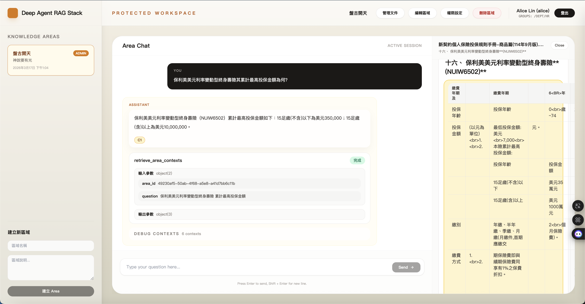
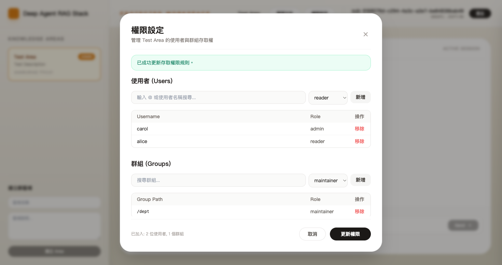
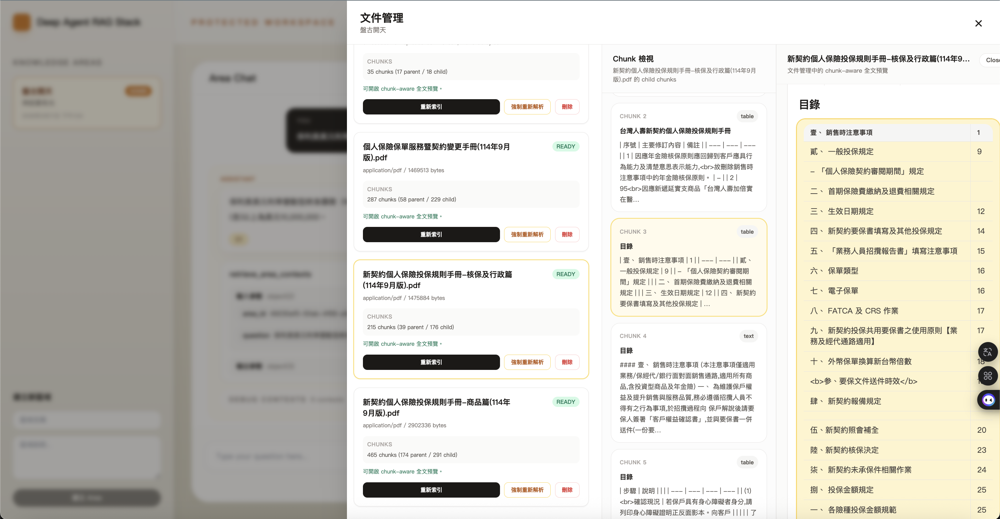

# Deep Agent RAG Stack

An enterprise knowledge assistant prototype with OAuth2-based authentication, RBAC, and multi-strategy retrieval.

[繁體中文版本](README.zh-TW.md)

## Purpose

This repository is an engineering implementation project built around a self-hosted, NotebookLM-style enterprise knowledge chat application, and also serves as an experimental prototype for a multi-agent collaborative development workflow. The development process adopts multi-agent collaboration for task decomposition and implementation. The project focuses on real enterprise problems such as document upload and background processing, multi-strategy `RAG` retrieval, `Keycloak` OAuth2 integration, group-based `RBAC`, and `deny-by-default` access control for knowledge areas and documents.

The "multi-agent" part refers to the development process: task decomposition, role specialization, and collaborative implementation. It is not a user-facing product feature. The goal is not just to build a chat UI, but to validate an end-to-end knowledge system architecture that can scale toward enterprise use cases across auth, data boundaries, background jobs, and retrieval strategy.

## Why This Project

The hard part of enterprise knowledge chat is rarely just plugging in an LLM. The real challenge is organizing, authorizing, indexing, and retrieving internal documents safely while keeping quality and cost under control. This project focuses on those operational constraints to validate a knowledge system prototype that is closer to real enterprise adoption requirements.

## Future Direction

This project is not intended to stop at document Q&A. The longer-term direction is to evolve from "answering questions" into a real assistant that can understand context, call tools, and execute tasks through `Deep Agents`. The next-stage vision includes integrating `MCP`, reusable `Skill` modules, multi-step task orchestration, and external system operations so the knowledge system can participate in enterprise workflows instead of only returning information.

## What Makes This Project Different

Unlike many RAG demos that focus only on a chat interface or a single vector retrieval path, this project treats enterprise constraints as first-class design requirements from the start. That includes `Keycloak` group-based authorization, `deny-by-default`, `ready-only` document lifecycle controls, and a planned `SQL gate + vector recall + FTS recall + RRF + rerank` retrieval flow. The target is not just a system that can answer questions, but a knowledge assistant foundation that is closer to enterprise production expectations.

## Engineering Highlights

- Merges direct roles and `Keycloak groups` to compute an effective area-level `RBAC` role
- Enforces `deny-by-default` at the data access layer and uses consistent unauthorized `404` responses to avoid resource existence leaks
- Models the document lifecycle as `uploaded -> processing -> ready|failed` so incomplete data never enters retrieval
- Implements `SQL gate + vector recall + FTS recall + RRF + rerank + assembled-context citations` as the chat retrieval foundation
- Uses `Deep Agents` as the formal chat core and `LangGraph Server` built-in `thread/run` as the runtime and streaming layer
- Builds a locally reproducible vertical slice with `FastAPI + PostgreSQL + Celery + Redis + MinIO + React`

## What I Personally Owned

- Project scoping, module boundaries, and phase-by-phase implementation planning
- Authentication and authorization design, including JWT claims, group-based access, and area access management
- Local integration across API, worker, web, and Docker Compose
- Document upload and ingest state transitions, test strategy, and E2E testing foundations
- Project documentation, architecture notes, and long-term repo governance docs

## Current Status

The deployment entrypoint is now designed around a single HTTPS origin behind `Caddy`, with automatic TLS issuance and renewal for `easypinex.duckdns.org`. Public traffic is expected to use:

- `https://easypinex.duckdns.org/` for the web app
- `https://easypinex.duckdns.org/api/*` for the API
- `https://easypinex.duckdns.org/auth/*` for Keycloak

The project is currently in `Phase 5.1 — Chat MVP on LangGraph Server`. By the second day of off-hours, multi-agent-driven implementation, the repo had already advanced from the original auth / upload / retrieval foundations to a working area-scoped chat slice on top of `Deep Agents` and `LangGraph Server`.

- Monorepo structure, Docker Compose, and the local development stack
- Basic wiring across the `FastAPI` API, `Celery` worker, and `React + Tailwind` web app
- `Keycloak` OAuth2 login flow, JWT claim parsing, and auth context verification
- Area-level `RBAC` based on merged user roles and group roles
- `deny-by-default` protection for area and document access with consistent `404` behavior
- **User-friendly Access Management**: Integrated `@` mentions for users and groups with autocomplete, consistently using `username` for identification and display.
- Knowledge Area create/list/detail/access-management MVP
- Document upload, object storage, ingest job creation, and `uploaded -> processing -> ready|failed` transitions
- SQL-first `parent -> child` chunk tree generation with `structure_kind=text|table`, covering `TXT`, `Markdown`, and table-aware `HTML`
- Hybrid chunking: custom parent sectioning plus LangChain-based text child splitting, with dedicated table preserve / row-group split rules
- Ready-only retrieval foundation with SQL gate, vector recall, FTS recall, `RRF`, rerank, and table-aware context assembly
- Modernized One-Page Dashboard: A unified workspace featuring fixed sidebar navigation for Knowledge Areas, a full-height center chat as the primary workspace, and a slide-out drawer for non-interruptive file management.
- `Deep Agents` main agent plus single `retrieve_area_contexts` tool for formal chat execution
- `LangGraph Server` built-in `thread/run` runtime, custom auth injection, and streaming to the web app
- Real-time chat features including assembled-context references, tool-call tracking, and interactive debug views

## Not Yet Implemented

- Area rename / delete and related management hardening
- Broader compose smoke coverage for real `Keycloak + LangGraph + Deep Agents` runtime behavior
- More end-to-end coverage for tool failure, no-context answers, and streaming edge cases
- Future `Deep Agents` expansion points such as sub-agents, `MCP`, and reusable `Skill` modules

## TODO / Future Additions

- Add a system architecture diagram showing the relationships among web, API, worker, DB, MinIO, Keycloak, and retrieval flow
- Add an E2E demo that shows the main flow from login to upload, processing, and access validation
- Add a testing coverage summary for authorization, state transitions, API boundaries, and E2E scope
- Add explicit permission boundary examples for different roles and groups across area / document / chat access
- Add failure-handling flow documentation for upload, ingest, unsupported file types, and authorization failures

## License

This project is licensed under `Apache-2.0`. See the root `LICENSE` file for the full text.

## Contact

- Maintainer: Pin-Chih Cho
- Email: `easypinex@gmail.com`

## Repository Structure

- `apps/api`: FastAPI API, JWT auth, RBAC, internal retrieval services, `app/chat` Deep Agents domain, and LangGraph loader/runtime glue
- `apps/worker`: Celery background jobs for ingest and status transitions
- `apps/web`: React + Tailwind frontend, modernized one-page dashboard (integrated area navigation, chat center, and file management drawers)
- `infra`: Docker Compose assets and container build definitions
- `packages/shared`: Reserved space for shared types and configuration

## How to Start

1. Copy the environment file:
   - `cp .env.example .env`
2. Optionally install local Python dependencies:
   - `python -m venv .venv && source .venv/bin/activate`
   - `pip install -e ./apps/api -e ./apps/worker`
   - Shared workspace sync: `uv sync`
   - If you need the Marker PDF path, use a dedicated worker environment instead of the shared workspace:
     Bash: `uv venv .worker-venv --python 3.12 && uv pip install --python .worker-venv/bin/python -e ./apps/worker[dev] "marker-pdf>=1.9.2,<2.0.0"`
     PowerShell: `uv venv .worker-venv --python 3.12; uv pip install --python .worker-venv\Scripts\python.exe -e ".\apps\worker[dev]" "marker-pdf>=1.9.2,<2.0.0"`
   - On Windows PowerShell, prefer the repo scripts instead of typing the commands manually:
     Install: `.\scripts\install-worker-marker.ps1`
     Start: `.\scripts\start-worker-marker.ps1` (starts Compose dependencies first, then launches the local Marker worker)
3. Build and start the local stack:
   - `./scripts/compose.sh up --build`
   - The wrapper always uses the repository root `.env` and `infra/docker-compose.yml`, which prevents secrets such as `OPENAI_API_KEY` from silently becoming empty when the command is run from a different working directory.
   - The Compose project name is pinned to `deep-agent-rag-stack`, so container names stay stable and do not drift to fallback names such as `infra-*`.
4. Point `PUBLIC_HOST` DNS to the deployment host and forward external `80/443` to the Docker machine.
5. Open the public services:
   - Web: `https://easypinex.duckdns.org`
   - API health: `https://easypinex.duckdns.org/api/health`
   - Keycloak OIDC base: `https://easypinex.duckdns.org/auth`
   - MinIO API: `http://localhost:19000`
   - MinIO Console: `http://localhost:19001`

## Public Access Model

- Customers use a single public service port: `443`.
- Port `80` is reserved for ACME validation and HTTP-to-HTTPS redirect.
- Compose no longer publishes `13000`, `18000`, and `18080` to the host.
- `Caddy` terminates TLS, renews certificates automatically, and reverse proxies to `web`, `api`, and `keycloak` over the internal Docker network.
- `KEYCLOAK_EXPOSE_ADMIN=false` blocks `/auth/admin*` at the reverse proxy while keeping the login and OIDC endpoints reachable.

## Database Init and Upgrade

- Fresh database volumes initialize automatically through `supabase/migrations/` because the folder is mounted into the Supabase container's `/docker-entrypoint-initdb.d`.
- Existing database volumes do not re-run those init scripts on restart. Restarting `docker compose` is not a schema upgrade mechanism.
- Existing environments must be upgraded manually with Alembic:
  - `./scripts/compose.sh exec api alembic upgrade head`
- If retrieval SQL or PostgreSQL RPCs change, make sure the change is also represented in Alembic. Do not rely only on `supabase/migrations/` unless the target environment is guaranteed to be a fresh volume.
- After an upgrade, verify the API and retrieval path before assuming the environment is healthy.

## Environment Variables

See `.env.example` for the full local default configuration. The template is grouped by variable category and includes bilingual comments.

## Verification

- API health:
  - `curl https://easypinex.duckdns.org/api/health`
- Auth context:
  - `curl -H "Authorization: Bearer <access-token>" https://easypinex.duckdns.org/api/auth/context`
- LangGraph chat runtime:
  - `cd apps/api && langgraph dev --config langgraph.json --host 0.0.0.0 --port 18000 --no-browser`
- Worker ping task:
  - `./scripts/compose.sh exec worker python -m worker.scripts.healthcheck`
- Web / Areas / Files / Chat:
  - Open `https://easypinex.duckdns.org`, sign in, and verify area listing, file upload, document status, and area-scoped chat behavior
- Phase 1 auth verification guide:
  - `docs/phase1-auth-verification.md`

## Troubleshooting

- If Docker image builds fail, confirm Docker Desktop is running and can reach package registries.
- If Keycloak starts slowly, wait until the `keycloak` health check passes before opening the UI.
- If the web app cannot reach the API, verify `VITE_API_BASE_URL` in `.env`.
- If the API starts but Deep Agents retrieval fails only on an existing database, verify that the PostgreSQL schema and RPCs were upgraded with `alembic upgrade head` instead of assuming Compose restart applied them.
- `uv sync` keeps the shared workspace on dependencies that can coexist. `deepagents` and `marker-pdf` currently require incompatible `anthropic` versions, so Marker must live in a dedicated worker virtualenv such as `.worker-venv`. On Unix-like shells, the interpreter path is usually `.worker-venv/bin/python`; on Windows PowerShell, use `.worker-venv\Scripts\python.exe`. The hybrid worker launcher will prefer `.worker-venv` automatically when `PDF_PARSER_PROVIDER=marker`; otherwise use `PDF_PARSER_PROVIDER=local` or `llamaparse` in the shared `.venv`.
