# Wiki Documentation for https://github.com/easypinex/deep-agent-rag-stack

Generated on: 2026-03-23 08:43:54

## Table of Contents

- [專案總覽與里程碑](#page-1)
- [安裝、啟動與驗證指引](#page-2)
- [系統架構總覽與元件關係圖](#page-3)
- [知識區域與權限管理](#page-4)
- [文件生命週期與 Ingest 流程](#page-5)
- [資料庫結構、遷移與 RPC](#page-6)
- [一頁式戰情室 UI 與文件預覽](#page-7)
- [API 端點與服務層](#page-8)
- [檢索管線：SQL Gate、向量與 FTS、RRF 與 Rerank](#page-9)
- [聊天執行：Deep Agents 與 LangGraph Server](#page-10)
- [部署拓撲、Caddy 與單一公開入口](#page-11)
- [擴充性與多 Agent 協作](#page-12)

<a id='page-1'></a>

## 專案總覽與里程碑

### Related Pages

Related topics: [系統架構總覽與元件關係圖](#page-3), [部署拓撲、Caddy 與單一公開入口](#page-11)

<details>
<summary>Relevant source files</summary>

The following files were used as context for generating this wiki page:

- [README.md](https://github.com/easypinex/deep-agent-rag-stack/blob/main/README.md)
- [README.zh-TW.md](https://github.com/easypinex/deep-agent-rag-stack/blob/main/README.zh-TW.md)
- [Summary.md](https://github.com/easypinex/deep-agent-rag-stack/blob/main/Summary.md)
- [PROJECT_STATUS.md](https://github.com/easypinex/deep-agent-rag-stack/blob/main/PROJECT_STATUS.md)
- [ROADMAP.md](https://github.com/easypinex/deep-agent-rag-stack/blob/main/ROADMAP.md)
- [ARCHITECTURE.md](https://github.com/easypinex/deep-agent-rag-stack/blob/main/ARCHITECTURE.md)
- [AGENTS.md](https://github.com/easypinex/deep-agent-rag-stack/blob/main/AGENTS.md)
- [apps/web/src/components/RoadmapPanel.tsx](https://github.com/easypinex/deep-agent-rag-stack/blob/main/apps/web/src/components/RoadmapPanel.tsx)
- [apps/web/tests/smoke/specs/phase6-full-flow.smoke.spec.ts](https://github.com/easypinex/deep-agent-rag-stack/blob/main/apps/web/tests/smoke/specs/phase6-full-flow.smoke.spec.ts)
- [apps/web/tests/e2e/specs/auth-areas.spec.ts](https://github.com/easypinex/deep-agent-rag-stack/blob/main/apps/web/tests/e2e/specs/auth-areas.spec.ts)
- [apps/web/src/lib/types.ts](https://github.com/easypinex/deep-agent-rag-stack/blob/main/apps/web/src/lib/types.ts)
- [apps/api/src/app/schemas/documents.py](https://github.com/easypinex/deep-agent-rag-stack/blob/main/apps/api/src/app/schemas/documents.py)
</details>

# 專案總覽與里程碑

本頁面彙整 Deep Agent RAG Stack 的專案概觀與里程碑，說明目標、固定技術棧、核心架構、主要流程與分階段實作進度。內容聚焦在實作中的「企業級文件問答與檢索」骨幹，包括認證授權、文件生命週期、背景索引處理、混合召回與重排、以及以 Deep Agents + LangGraph Server 為核心的聊天執行與串流。Sources: [README.zh-TW.md](), [Summary.md](), [ARCHITECTURE.md]()

對應的長期文件請參見：產品背景與需求[總覽](#產品背景與固定技術棧)（Summary）、[架構說明](#架構與模組總覽)（Architecture）、[里程碑與狀態](#分階段里程碑與目前狀態)（Roadmap/Project Status）。Sources: [Summary.md](), [ARCHITECTURE.md](), [ROADMAP.md](), [PROJECT_STATUS.md]()

## 產品背景與固定技術棧
本專案目標為「可自架的 NotebookLM 風格文件問答平台」，強調只支援上傳檔案為知識來源、企業授權邊界、背景索引與混合檢索、以及 area-scoped 問答與 citations。固定技術棧包含 Python + FastAPI、PostgreSQL + pgvector + PGroonga（Supabase）、Celery + Redis、MinIO、Keycloak、React + Tailwind、LangChain + LangGraph、OpenAI、Cohere Rerank v4、Docker Compose 與 Caddy 單一公開入口。Sources: [Summary.md](), [README.zh-TW.md](), [AGENTS.md]()

- 對外單一入口：Caddy 代理，公開路由為「/ -> Web」「/api/* -> API」「/auth/* -> Keycloak」，僅開 443；80 僅供 ACME 與 HTTP→HTTPS。Sources: [README.zh-TW.md](), [Summary.md](), [ARCHITECTURE.md]()

## 架構與模組總覽
本系統由 Web、API、Worker、Infra 四大模組構成，並輔以資料層（Supabase PostgreSQL + PGroonga + pgvector）、物件儲存（MinIO）、身分（Keycloak）、與聊天 runtime（Deep Agents + LangGraph Server）。Sources: [ARCHITECTURE.md](), [README.md](), [README.zh-TW.md]()

- Web（React + Tailwind）：DashboardLayout、AreaSidebar、ChatPanel、DocumentPreviewPane、DocumentsDrawer、AccessModal，提供一頁式戰情室體驗。Sources: [ARCHITECTURE.md]()
- API（FastAPI）：JWT 驗證、RBAC 邊界、service orchestration，提供 areas/documents/jobs/chat 等端點與 HTTP/SSE。Sources: [ARCHITECTURE.md]()
- Worker（Celery）：負責 ingest/indexing，含 parse routing、parent-child chunk tree、embedding、FTS payload 與狀態轉換。Sources: [ARCHITECTURE.md]()
- Infra：Caddy、PostgreSQL（Supabase/PGroonga）、Redis、MinIO、Keycloak、Supabase migrations、migration runner。Sources: [ARCHITECTURE.md]()

### 架構總覽（資料與控制流）
下圖呈現對外單一入口與主要子系統之間的資料流、控制流與邊界。

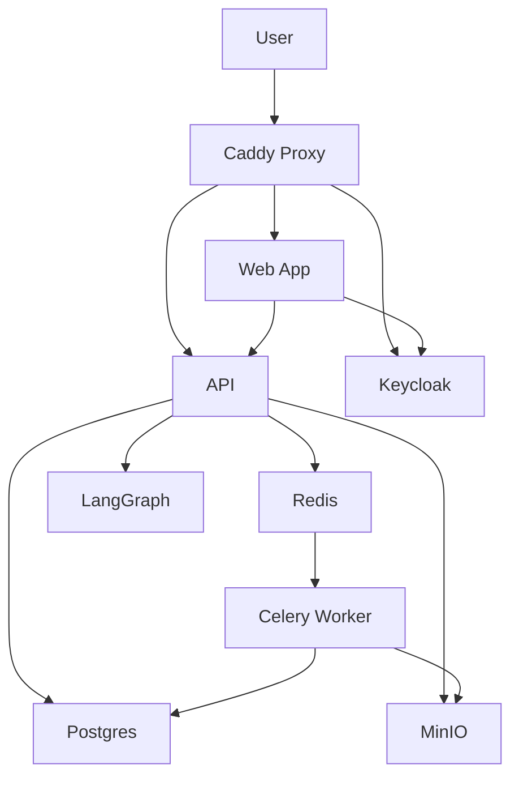
- Caddy 為對外唯一入口；Web、API、Keycloak 共用同一公開網域與 TLS。資料層（Supabase PG + PGroonga + pgvector）承載 SQL gate、向量與全文召回；最終 RRF、rerank 與 assembler 在 Python 層完成。Sources: [README.zh-TW.md](), [Summary.md](), [ARCHITECTURE.md]()

## 產品邊界與核心業務規則
- 僅支援上傳檔案；檔案類型：PDF、DOCX、TXT/MD、PPTX、HTML、XLSX。Sources: [Summary.md](), [AGENTS.md]()
- 授權採 deny-by-default；effective role = 直接角色與 group 角色的最大值；JWT claims 使用 sub 與 groups。Sources: [Summary.md](), [AGENTS.md]()
- 僅 documents.status = ready 可參與檢索與問答；SQL gate 必須先於任何回傳。Sources: [ARCHITECTURE.md](), [AGENTS.md]()
- 檢索順序：SQL gate → 向量召回 → FTS 召回 → RRF → Cohere Rerank v4 → LLM 生成與 citations。Sources: [Summary.md]()

### 關鍵規則表
| 規則 | 說明 |
|---|---|
| deny-by-default | 未具有效角色者，於 SQL/資料存取層即被阻擋 |
| ready-only | 只有 documents.status=ready 才能進入檢索/問答 |
| SQL gate | 保護層，禁止先全撈再記憶體過濾 |
| 角色計算 | effective role = 直接角色與 group 角色中的最大值 |
| Rerank 控制 | 候選數與 chunk 大小必須受控以限制成本 |
Sources: [AGENTS.md](), [ARCHITECTURE.md](), [Summary.md]()

## 文件生命週期與背景索引
文件狀態：uploaded → processing → ready|failed；Worker 依檔類型執行解析（Marker/Unstructured/LlamaParse 等），建立 block-aware ParsedDocument，寫入 SQL-first 的 parent-child chunk tree、embedding、FTS payload，最後更新狀態。Sources: [ARCHITECTURE.md](), [Summary.md](), [PROJECT_STATUS.md]()

```mermaid
sequenceDiagram
  autonumber
  participant U as actor User
  participant W as boundary Web
  participant A as control API
  participant S as storage MinIO
  participant R as queue Redis
  participant K as worker Celery
  participant P as database Postgres

  U->>+W: 上傳檔案
  W->>+A: POST /areas/{id}/documents
  A->>+S: 儲存原始檔
  A->>P: 建立 documents/ingest_jobs
  A-)+R: 派送 ingest 任務
  A-->>-W: 回應已建立
  K->>+S: 讀取原始檔
  K->>K: 解析/切分/embedding/FTS
  K->>P: 寫入 document_chunks
  K->>P: 更新狀態 ready|failed
  K-->>-A: 任務完成
  A-->>U: 前端輪詢/更新
```
- 僅 ready 文件進入檢索；chunk schema 採 SQL-first，承載 parent-child 關聯、位置、結構等關鍵欄位。Sources: [ARCHITECTURE.md](), [Summary.md]()

## 檢索與聊天執行
聊天使用 Deep Agents + LangGraph Server（thread/run）作為 runtime；檢索工具收斂為單一 retrieve_area_contexts tool。召回採 SQL gate + 向量 + FTS（PGroonga）+ RRF，之後以 Cohere Rerank v4 重排並組裝 citation-ready contexts，支援 assembled-context 級引用顯示與 stream。Sources: [README.zh-TW.md](), [PROJECT_STATUS.md](), [Summary.md](), [ARCHITECTURE.md]()

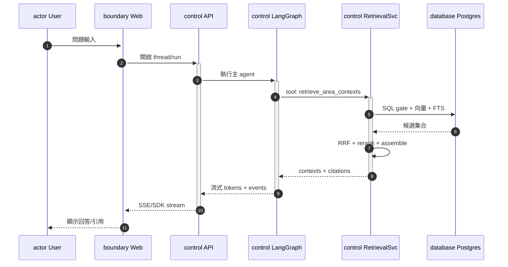
- Web UI 顯示 phase、tool_call、自動解析 [[C1]] 等 citation chips，並支援全文預覽與 chunk 高亮。Sources: [PROJECT_STATUS.md](), [README.zh-TW.md]()

## 領域資料模型與 API 摘要

### 資料模型關係（概念）
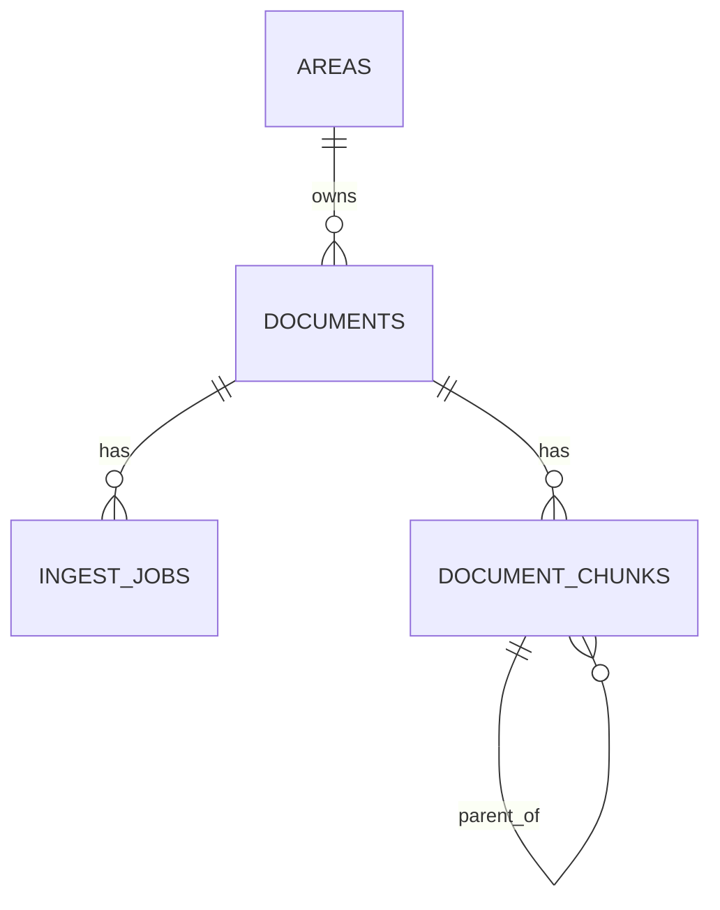
- Areas 管理文件；文件對應多個 ingest jobs 與多個 chunks；chunks 建立 parent-child tree。Sources: [ARCHITECTURE.md](), [Summary.md](), [PROJECT_STATUS.md]()

### 預覽與 Chunk 介面（前端型別）
```ts
// apps/web/src/lib/types.ts (節錄)
export interface PreviewChunk {
  chunk_id: string;
  parent_chunk_id: string | null;
  child_index: number | null;
  heading: string | null;
  structure_kind: ChatStructureKind;
  start_offset: number;
  end_offset: number;
}

export interface DocumentPreviewPayload {
  document_id: string;
  file_name: string;
  content_type: string;
  display_text: string;
  chunks: PreviewChunk[];
}
```
- 前端以 display_text + chunks.offets 支援全文預覽與 chunk 導覽。Sources: [apps/web/src/lib/types.ts]()

### Documents / Jobs 後端 Schema（Pydantic）
```py
# apps/api/src/app/schemas/documents.py (節錄)
class DocumentSummary(BaseModel):
    id: UUID
    area_id: UUID
    file_name: str
    content_type: str
    file_size: int
    status: DocumentStatus
    chunk_summary: ChunkSummary
    created_at: datetime
    updated_at: datetime

class IngestJobSummary(BaseModel):
    id: UUID
    document_id: UUID
    status: IngestJobStatus
    stage: str
    chunk_summary: ChunkSummary
    error_message: str | None
    created_at: datetime
    updated_at: datetime
```
- 狀態欄位承載 ready-only 與 job lifecycle 的前端可顯示資訊。Sources: [apps/api/src/app/schemas/documents.py]()

### API 端點摘要（已出現在文件或測試）
| 類別 | 端點 | 說明 |
|---|---|---|
| 健康 | GET /api/health | API 健康檢查 |
| Auth | GET /auth/context | 回傳 JWT 解析與群組資訊 |
| Areas | POST /areas | 建立 area（creator becomes admin） |
| Areas | GET /areas | 列出可存取的 areas |
| Areas | GET /areas/{id} | 讀取 area 詳細 |
| Areas | PUT /areas/{id} | 更新名稱/描述（admin-only） |
| Areas | DELETE /areas/{id} | 硬刪除（admin-only，先清 storage） |
| Access | GET /areas/{id}/access | 讀取 access 設定 |
| Access | PUT /areas/{id}/access | 更新 access |
| Docs | POST /areas/{id}/documents | 上傳檔案並建立 ingest job |
| Docs | GET /areas/{id}/documents | 列出文件 |
| Jobs | GET /ingest-jobs/{id} | 查詢 ingest job 狀態 |
| Docs | GET /documents/{id} | 讀取單一文件 |
| Docs | GET /documents/{id}/preview | 全文預覽（ready-only） |
- 端點與權限語意、狀態轉換、硬刪除前清 storage 等，均以文件描述與測試片段為依據。Sources: [ARCHITECTURE.md](), [PROJECT_STATUS.md](), [Summary.md](), [apps/web/tests/e2e/specs/auth-areas.spec.ts]()

## 分階段里程碑與目前狀態

### Roadmap（階段定義）
- Phase 0：Project Skeleton（Monorepo、FastAPI、React、Celery、Compose、基礎設施）。Sources: [ROADMAP.md]()
- Phase 1：Auth & Platform Foundations（Keycloak JWT、groups、auth context、access-check）。Sources: [ROADMAP.md]()
- Phase 2：Areas（create/list/detail、access management、Web 登入與基本 UI）。Sources: [ROADMAP.md]()
- Phase 3：Documents & Ingestion（upload、MinIO、documents/ingest_jobs、worker 狀態轉換、XLSX 表格解析）。Sources: [ROADMAP.md]()
- Phase 3.5：Lifecycle Hardening & Chunk Tree（document_chunks SQL-first、parent-child、reindex/delete、observability）。Sources: [ROADMAP.md]()
- Phase 3.6：Table-Aware Chunking（Markdown/HTML/XLSX 表格感知、策略參數）。Sources: [ROADMAP.md]()
- Phase 4.1：Retrieval Foundation（SQL gate、PGroonga、embedding、RRF）。Sources: [ROADMAP.md]()
- Phase 4.2：Ranking & Assembly（rerank、trace、table-aware assembler、chat-ready contexts）。Sources: [ROADMAP.md]()
- Phase 5.1：Chat MVP & One-Page Dashboard（LangGraph Server、thread/run、SDK transport、citations、stream）。Sources: [ROADMAP.md]()
- Phase 6：Cloud Migration & Supabase Transition（PGroonga + pgvector、RPC 候選召回、Runtime 收斂、前端/Worker 部署）。Sources: [ROADMAP.md]()

### 專案狀態（已完成）
- 當前主階段：Phase 6.1 — Public HTTPS Entry & Migration Bootstrap Hardening（Completed）。Sources: [PROJECT_STATUS.md]()
- 已完成：Phase 0 ~ 6.1 之各子項（auth、areas、documents、ingest、chunk tree、table-aware、retrieval、rerank、assembler、LangGraph chat、Caddy 公開入口、migration runner、Supabase/PGroonga 遷移）。Sources: [PROJECT_STATUS.md]()

#### 里程碑總覽表
| Phase | 主題 | 代表性成果（節選） | 狀態 |
|---|---|---|---|
| 0 | Project Skeleton | Monorepo、API/Web/Worker 骨架、Compose、健康檢查 | 已完成 |
| 1 | Auth Foundation | Keycloak JWT、groups、deny-by-default、/auth/context | 已完成 |
| 2 | Areas | create/list/detail、access 管理、Web 登入與 UI | 已完成 |
| 3 | Docs & Ingest | upload、MinIO、ingest_jobs、解析與狀態轉換 | 已完成 |
| 3.5 | Lifecycle & Tree | SQL-first chunks、parent-child、reindex/delete | 已完成 |
| 3.6 | Table-Aware | Markdown/HTML/XLSX 表格感知 chunking | 已完成 |
| 4.1 | Retrieval | SQL gate、PGroonga、向量/FTS、RRF | 已完成 |
| 4.2 | Ranking & Asm | Cohere Rerank、assembler、trace | 已完成 |
| 5.1 | Chat MVP | LangGraph thread/run、retrieve tool、citations/stream | 已完成 |
| 6 | Supabase | PGroonga+pgvector、RPC 候選召回、部署路徑 | 已完成 |
| 6.1 | HTTPS Entry | Caddy 單一公開入口、/auth 固定 base、migration runner | 已完成 |
Sources: [ROADMAP.md](), [PROJECT_STATUS.md]()

## 測試與驗證重點
- 測試要求：單元測試涵蓋 effective role 計算、deny-by-default、非 ready 文件不可檢索、Cohere rerank 前後結構、FTS query builder 與 SQL 組裝；整合測試涵蓋群組授權差異、upload 狀態流、授權問答與 citations、未授權不可見資源、maintainer 刪除/reindex、admin 修改 access。Sources: [AGENTS.md]()
- E2E/Smoke：Playwright 測試覆蓋建立 area、上傳檔案、狀態為 ready、聊天得到含關鍵字回答；另測損毀 PDF 失敗訊息、maintainer 刪除文件、admin 刪除 area、outsider deny-by-default。Sources: [apps/web/tests/smoke/specs/phase6-full-flow.smoke.spec.ts](), [apps/web/tests/e2e/specs/auth-areas.spec.ts]()

### 測試摘要表
| 類型 | 內容 | 目的 |
|---|---|---|
| 單元 | effective role、deny-by-default | 驗證 RBAC 基礎 |
| 單元 | 非 ready 檢索拒絕 | 生命週期邊界 |
| 單元 | Cohere rerank 結構 | 排序正確性 |
| 單元 | FTS builder/SQL | 檢索語法正確性 |
| 整合 | group-based access | 授權差異 |
| 整合 | upload lifecycle | 狀態轉換 |
| 整合 | 授權問答與 citations | 檢索一致性 |
| 整合 | 資源不可見 | 覆蓋保護 |
| E2E | area CRUD / files / chat | 全流程驗證 |
Sources: [AGENTS.md](), [apps/web/tests/smoke/specs/phase6-full-flow.smoke.spec.ts](), [apps/web/tests/e2e/specs/auth-areas.spec.ts]()

## 專案級文件與治理
專案級文件四本柱：Summary（產品背景/需求/規則/選型）、PROJECT_STATUS（目前做到哪）、ROADMAP（階段里程碑/實作順序）、ARCHITECTURE（系統設計/資料流/約束）；任一變更須同步更新對應文件，避免失真。Sources: [AGENTS.md]()

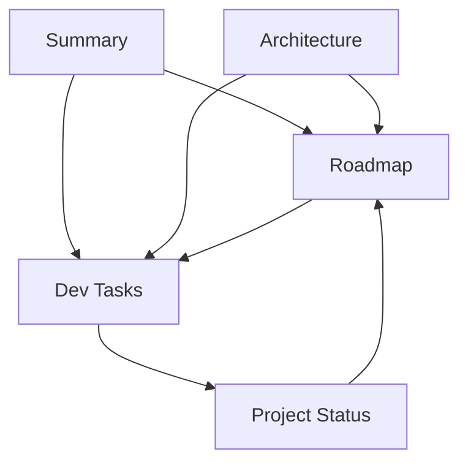
- 工作前先讀 PROJECT_STATUS；若調整實作順序/phase/里程碑，更新 ROADMAP；架構或授權變更，更新 ARCHITECTURE；產品範圍/規則/選型變更，更新 Summary。Sources: [AGENTS.md]()

## 一頁式戰情室與延後項目
- 一頁式戰情室（Dashboard）整合左側區域導覽、中央即時對話、右側文件管理抽屜與彈窗權限；提供串流對話、工具呼叫檢視、引用與全文預覽。Sources: [README.zh-TW.md](), [PROJECT_STATUS.md](), [ARCHITECTURE.md]()
- 在早期 RoadmapPanel 元件中，曾將「Keycloak login 與 callback flow、Knowledge Area CRUD 與 access management、文件上傳、Chat/citations/retrieval/SQL gate/FTS/rerank」列為延後項；目前依 Project Status 多數已完成。Sources: [apps/web/src/components/RoadmapPanel.tsx](), [PROJECT_STATUS.md]()

## 補充：單一公開入口與部署
- 公開入口統一綁定 PUBLIC_HOST，Caddy 自動 TLS；路由固定為 /（Web）、/api/*（API）、/auth/*（Keycloak），/auth/admin* 可由設定封鎖。只開 443，80 僅 ACME 與轉址。Sources: [README.zh-TW.md](), [Summary.md](), [ARCHITECTURE.md]()

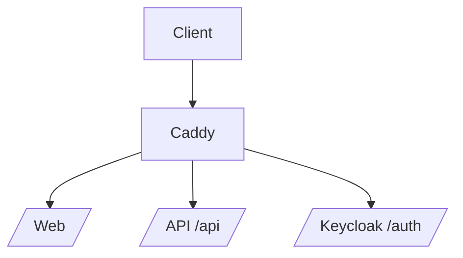
- Compose 中以 migration runner 接手 Supabase bootstrap schema，再升級至 Alembic head。Sources: [ARCHITECTURE.md](), [PROJECT_STATUS.md]()

## 結語
Deep Agent RAG Stack 已完成從骨架、授權、文件生命週期、SQL-first chunk tree、混合召回與重排，到 Deep Agents + LangGraph Server 聊天與單一公開 HTTPS 入口的完整垂直切片。未來持續透過專案級文件與測試治理，確保在 deny-by-default 與 ready-only 邊界下，維持企業可採用的檢索品質與擴充彈性。Sources: [PROJECT_STATUS.md](), [Summary.md](), [ARCHITECTURE.md](), [README.zh-TW.md]()

---

<a id='page-2'></a>

## 安裝、啟動與驗證指引

### Related Pages

Related topics: [部署拓撲、Caddy 與單一公開入口](#page-11), [API 端點與服務層](#page-8)

<details>
<summary>Relevant source files</summary>

The following files were used as context for generating this wiki page:

- [README.zh-TW.md](https://github.com/easypinex/deep-agent-rag-stack/blob/main/README.zh-TW.md)
- [ARCHITECTURE.md](https://github.com/easypinex/deep-agent-rag-stack/blob/main/ARCHITECTURE.md)
- [AGENTS.md](https://github.com/easypinex/deep-agent-rag-stack/blob/main/AGENTS.md)
- [PROJECT_STATUS.md](https://github.com/easypinex/deep-agent-rag-stack/blob/main/PROJECT_STATUS.md)
- [ROADMAP.md](https://github.com/easypinex/deep-agent-rag-stack/blob/main/ROADMAP.md)
- [apps/web/README.md](https://github.com/easypinex/deep-agent-rag-stack/blob/main/apps/web/README.md)
- [apps/web/README.zh-TW.md](https://github.com/easypinex/deep-agent-rag-stack/blob/main/apps/web/README.zh-TW.md)
- [apps/web/tests/smoke/specs/pdf-upload.smoke.spec.ts](https://github.com/easypinex/deep-agent-rag-stack/blob/main/apps/web/tests/smoke/specs/pdf-upload.smoke.spec.ts)
- [apps/web/tests/smoke/specs/phase6-full-flow.smoke.spec.ts](https://github.com/easypinex/deep-agent-rag-stack/blob/main/apps/web/tests/smoke/specs/phase6-full-flow.smoke.spec.ts)
- [apps/web/tests/e2e/specs/auth-areas.spec.ts](https://github.com/easypinex/deep-agent-rag-stack/blob/main/apps/web/tests/e2e/specs/auth-areas.spec.ts)
- [apps/web/src/lib/api.ts](https://github.com/easypinex/deep-agent-rag-stack/blob/main/apps/web/src/lib/api.ts)
- [apps/web/src/lib/types.ts](https://github.com/easypinex/deep-agent-rag-stack/blob/main/apps/web/src/lib/types.ts)
- [apps/web/src/features/documents/components/DocumentsDrawer.tsx](https://github.com/easypinex/deep-agent-rag-stack/blob/main/apps/web/src/features/documents/components/DocumentsDrawer.tsx)
</details>

# 安裝、啟動與驗證指引

本頁說明如何在本機或以 Docker Compose 方式安裝、啟動並驗證 Deep Agent RAG Stack 的完整垂直切片，涵蓋 Web、API、Keycloak、背景 Worker、資料庫與物件儲存等組件的串接，以及以 UI/E2E 測試驗證登入、建立 Knowledge Area、文件上傳、背景處理與 ready-only 檢索。Sources: [README.zh-TW.md](), [ARCHITECTURE.md]()

指南亦納入權限與 deny-by-default 的驗證路徑，並列出前端模組可用的環境變數與疑難排解要點，協助開發者快速完成從啟動到驗證的全流程。Sources: [AGENTS.md](), [apps/web/README.zh-TW.md](), [apps/web/tests/e2e/specs/auth-areas.spec.ts]()

## 環境與先決條件

### 目標與固定技術棧
- 後端：FastAPI
- 前端：React + Tailwind
- 資料庫：PostgreSQL + pgvector + PGroonga
- 背景工作：Celery + Redis
- 物件儲存：MinIO
- 身分與授權：Keycloak
- 檢索編排：LangChain loaders、LangGraph，LLM / rerank：OpenAI、Cohere Rerank v4
- 單一公開入口：Caddy 反向代理，Web、API、Keycloak 分別掛載於根、/api/*、/auth/* 路徑
Sources: [README.zh-TW.md](), [ARCHITECTURE.md]()

### 本機環境與 Python/Node 前置作業
- 複製環境變數檔：cp .env.example .env
- 可選本機 Python 依賴安裝：python -m venv .venv && source .venv/bin/activate；pip install -e ./apps/api -e ./apps/worker
- 若需 Marker PDF 路徑，建議獨立 worker venv：uv venv .worker-venv --python 3.12 並安裝 apps/worker[dev] 與 marker-pdf；Windows PowerShell 提供對應安裝/啟動腳本
- 前端本機 Node 開發：npm install；npm run dev
- Playwright 測試需安裝 Chromium：npx playwright install chromium
Sources: [README.zh-TW.md](), [apps/web/README.zh-TW.md]()

### Python 版本讀取規則（專案級）
- 優先讀取專案根 .python-version 與 pyproject.toml 的 requires-python
- 若存在 .venv/bin/python，即視為本專案使用的 interpreter
- 僅在專案未宣告版本且無虛擬環境時，才補充全域 python/python3
- 同時回報專案與全域版本時需清楚標示
Sources: [AGENTS.md]()

## 使用 Docker Compose 啟動

### 單一入口部署與公開端點
- 對外公開入口統一為 https://easypinex.duckdns.org
- Web: https://easypinex.duckdns.org/
- API: https://easypinex.duckdns.org/api/*
- Keycloak: https://easypinex.duckdns.org/auth/*
- Caddy 自動管理 TLS 憑證；僅對外用 443，80 供 ACME 與轉址
- compose 已不再對外暴露舊的 13000/18000/18080
Sources: [README.zh-TW.md]()

### 本機 Compose 啟動流程
- 建置並啟動本機 stack：./scripts/compose.sh up --build
- 該 wrapper 固定使用 repo 根目錄 .env 與 infra/docker-compose.yml，避免敏感 env 變數遺失
- Compose project name 固定為 deep-agent-rag-stack，避免容器名稱漂移
- 啟用公開服務後可檢查：
  - Web: https://<PUBLIC_HOST>/
  - API health: https://<PUBLIC_HOST>/api/health
  - Keycloak OIDC base: https://<PUBLIC_HOST>/auth
Sources: [README.zh-TW.md]()

## 架構概覽與資料流

### 系統拓樸（單一公開入口）
下圖呈現 Caddy 作為唯一反向代理，將外部請求分流至 Web、API 與 Keycloak；後端由 Postgres、Redis、MinIO 與 Celery Worker 構成：

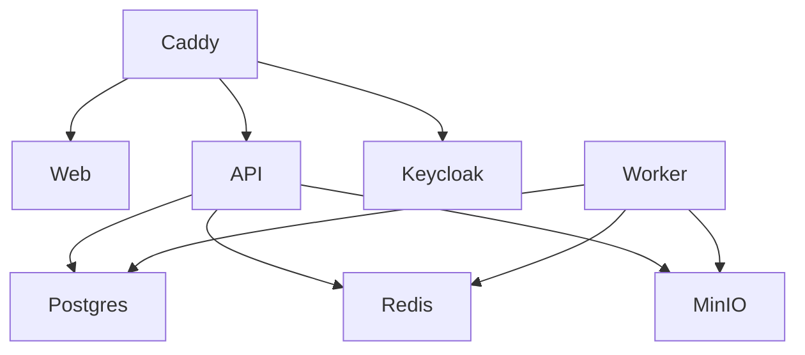
說明：Caddy 負責 80/443 與路由，API 提供授權、領域服務與檢索橋接，Worker 執行 ingest/index 背景作業，資料持久化於 Postgres 與 MinIO。Sources: [ARCHITECTURE.md](), [README.zh-TW.md]()

### 登入、建立 Area、上傳與背景處理（端到端）
以下序列圖整合實際 smoke/E2E 測試流程：使用者透過 Web 觸發 Keycloak 登入、建立 Area、上傳檔案，API 建立文件與工作並存檔至 MinIO，Worker 執行解析與 chunk/index，完成後 Web 看到 ready 狀態。

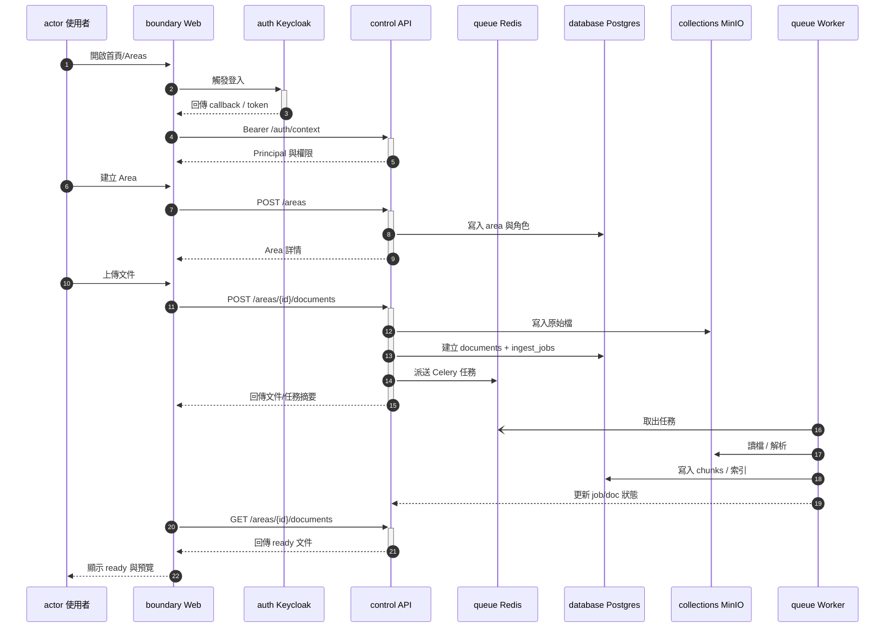
依據檔案，登入/上傳/等待 ready 的 UI 流程與選擇器均已有 smoke/E2E 覆蓋。Sources: [apps/web/tests/smoke/specs/phase6-full-flow.smoke.spec.ts](), [apps/web/tests/smoke/specs/pdf-upload.smoke.spec.ts](), [ARCHITECTURE.md]()

## 啟動與驗證步驟

### 步驟 1：啟動服務
- 準備 .env 後，執行 ./scripts/compose.sh up --build
- 確認公開端點可用：Web 首頁、/api/health、/auth
Sources: [README.zh-TW.md]()

### 步驟 2：前端本機開發（可選）
- 在 apps/web：
  - npm install
  - npm run dev（本機 Node 開發）
- 若以 compose 正式入口存取，改以 https://<PUBLIC_HOST>
Sources: [apps/web/README.zh-TW.md](), [apps/web/README.md]()

### 步驟 3：登入並建立 Knowledge Area
- 以瀏覽器進入首頁，觸發 Keycloak 登入（已於 smoke 覆蓋）
- 登入後自動導向 /areas，建立新 Area（以名稱/描述）
- E2E 斷言會驗證 Area 已出現在列表與細節面板
Sources: [apps/web/tests/smoke/specs/phase6-full-flow.smoke.spec.ts](), [apps/web/tests/smoke/specs/pdf-upload.smoke.spec.ts](), [apps/web/tests/e2e/specs/auth-areas.spec.ts]()

### 步驟 4：上傳文件與等待 ready
- 於「管理文件」抽屜上傳文件
- 等待後台處理至 ready；UI 會出現「ready」字樣，並可開啟 chunk-aware 全文預覽
- 損毀 PDF 範例會顯示 failed 與錯誤訊息
Sources: [apps/web/tests/smoke/specs/phase6-full-flow.smoke.spec.ts](), [apps/web/tests/smoke/specs/pdf-upload.smoke.spec.ts](), [apps/web/src/features/documents/components/DocumentsDrawer.tsx]()

### 步驟 5：驗證聊天與引用（視當前組態）
- Dashboard 整合 Deep Agents + LangGraph Server 的 thread/run runtime；UI 會顯示 assembled contexts 與串流狀態
- smoke 測試在完成 ready 後，會發問並驗證回覆包含關鍵字
Sources: [README.zh-TW.md](), [apps/web/tests/smoke/specs/phase6-full-flow.smoke.spec.ts]()

## 角色與授權驗證（deny-by-default）

- outsider 使用者：area list 應為空（deny-by-default）
- maintainer：
  - 可刪除文件；刪除後列表移除
  - 可 reindex 文件並看到 JOB succeeded
  - 無法操作區域基本資料/權限（按鈕缺席）
- admin：
  - 上傳 PDF 後看到 ready 狀態與 chunk 統計
  - 上傳損毀 PDF 顯示 failed 與錯誤訊息
  - 可刪除整個 Area（先清 storage 再刪資料）
- UI 僅是輔助呈現，真正授權邏輯在 API/SQL gate 與 deny-by-default；未授權資源以 404 掩蔽存在性
Sources: [apps/web/tests/e2e/specs/auth-areas.spec.ts](), [ARCHITECTURE.md](), [AGENTS.md]()

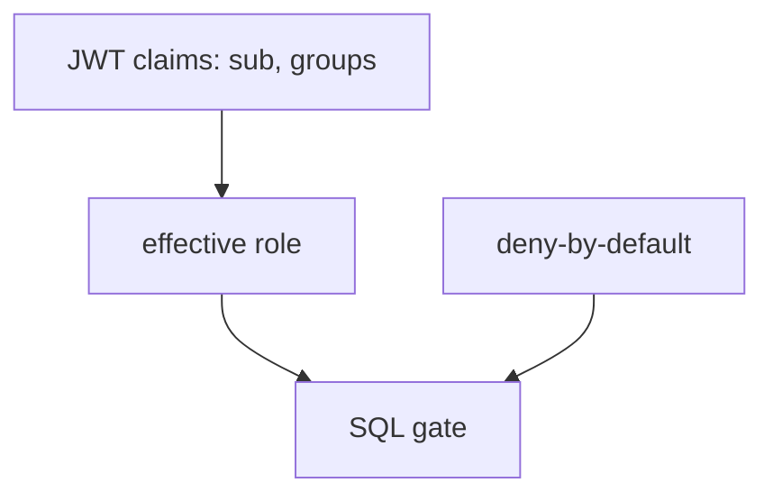
說明：有效角色由直接角色與 Keycloak group 映射計算最大值；所有受保護資料須先經 SQL gate。Sources: [AGENTS.md](), [ARCHITECTURE.md]()

## 前端環境變數

| 變數 | 說明 |
|---|---|
| VITE_APP_NAME | 前端應用名稱 |
| VITE_API_BASE_URL | API Base URL |
| VITE_AUTH_MODE | 認證模式（含測試模式） |
| VITE_KEYCLOAK_URL | Keycloak Base URL |
| VITE_KEYCLOAK_REALM | Keycloak Realm |
| VITE_KEYCLOAK_CLIENT_ID | Keycloak Client ID |
| WEB_ALLOWED_HOSTS | 允許的 Host（避免 dev server 擋下） |
Sources: [apps/web/README.zh-TW.md](), [apps/web/README.md]()

## 公開端點與健康檢查

| 類別 | URL | 說明 |
|---|---|---|
| Web | https://<PUBLIC_HOST>/ | 前端入口 |
| API Health | https://<PUBLIC_HOST>/api/health | 健康檢查 |
| Keycloak | https://<PUBLIC_HOST>/auth | OIDC base path |
Sources: [README.zh-TW.md]()

## 驗證流程（以 smoke/E2E 腳本為準）

| 驗證項目 | 關鍵動作 | 預期結果 |
|---|---|---|
| 登入與導向 | 進入首頁並觸發登入 | 回到 /areas，看到 Knowledge Areas |
| 建立 Area | 填寫名稱/描述並提交 | 列表/細節面板包含新 Area |
| 上傳 PDF | 上傳最小 PDF 範例 | documents 列表顯示 ready 與 chunks 統計 |
| 上傳損毀 PDF | 上傳 broken.pdf | 顯示 failed 與錯誤訊息 |
| maintainer 刪檔 | 刪除指定文件 | 文件自列表移除 |
| admin 刪區 | 刪除指定 Area | Sidebar 移除該區域並顯示提示 |
| outsider 授權 | 以 outsider 登入 | Area list 顯示無可存取 |
Sources: [apps/web/tests/smoke/specs/pdf-upload.smoke.spec.ts](), [apps/web/tests/smoke/specs/phase6-full-flow.smoke.spec.ts](), [apps/web/tests/e2e/specs/auth-areas.spec.ts]()

## API 端點（前端使用）

| 函式 | 方法與路徑 | 說明 |
|---|---|---|
| fetchDocumentDetail | GET /documents/{id} | 讀取文件摘要 |
| fetchDocumentPreview | GET /documents/{id}/preview | 讀取全文預覽與 child chunk map |
| reindexDocument | POST /documents/{id}/reindex?force_reparse=true | 重建索引，支援強制重跑 parser |
| deleteDocument | DELETE /documents/{id} | 刪除文件與相關索引 |
| fetchIngestJob | GET /ingest-jobs/{id} | 讀取 ingest job 摘要 |
| searchUsers | GET /directory/users?q= | 依關鍵字搜尋使用者 |
| searchGroups | GET /directory/groups?q= | 依關鍵字搜尋群組 |
Sources: [apps/web/src/lib/api.ts]()

範例：reindex 強制重跑參數
```ts
const response = await fetchProtected(`/documents/${documentId}/reindex?force_reparse=true`, { method: "POST" });
```
Sources: [apps/web/src/lib/api.ts]()

## 文件預覽與 job 狀態顯示

- DocumentsDrawer 會在文件 ready 時顯示「可開啟 chunk-aware 全文預覽」，否則顯示「尚未可預覽」
- 若存在 ingest job，會在卡片顯示 JOB: 狀態（stage）與錯誤訊息
- 預覽 payload 結構包含 display_text 與 child chunks（含結構型別、offset 範圍）以供高亮與定位
Sources: [apps/web/src/features/documents/components/DocumentsDrawer.tsx](), [apps/web/src/lib/types.ts]()

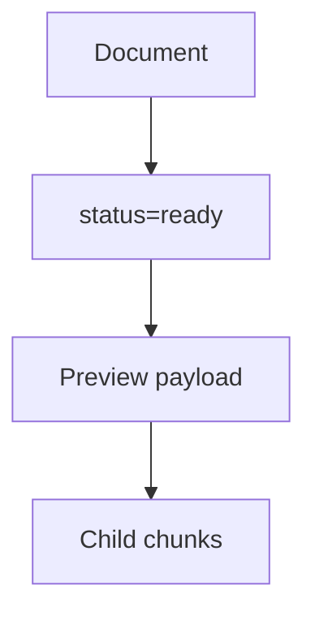
說明：只有 ready 文件才允許進入檢索與預覽流程；child chunk map 用於全文高亮。Sources: [ARCHITECTURE.md](), [apps/web/src/lib/types.ts]()

## 本機 Worker（Marker PDF 路徑）與 Python 規範

- 若需使用 Marker PDF 路徑，請建立獨立 worker venv 並安裝 marker-pdf，避免安裝進共享 workspace
- Windows PowerShell 提供安裝與啟動腳本（會先啟動 Compose 依賴，再啟動本機 Marker worker）
- 回報 Python 版本與 interpreter 時，遵循專案級 Python 版本讀取規則
Sources: [README.zh-TW.md](), [AGENTS.md]()

## 疑難排解

- 頁面顯示 API 錯誤：確認 API container 健康且 VITE_API_BASE_URL 正確
- Areas 頁 Failed to fetch：API_CORS_ORIGINS 需包含前端來源；本機 Node dev 需允許 http://localhost:3000
- 登入後無法回到前端：檢查 Keycloak client deep-agent-web 的 redirect URI 與 VITE_KEYCLOAK_URL、VITE_KEYCLOAK_CLIENT_ID
- Vite 顯示 Blocked request：將公開網域加入 WEB_ALLOWED_HOSTS
- 瀏覽器 Web Crypto/PKCE 問題：使用 https://<PUBLIC_HOST> 或 http://localhost，避免非 secure context
- Area API 一直 401：確認 token 仍含 groups claim，API issuer/JWKS 設定正確
- E2E test-mode 僅供前端流程驗證；真實 Keycloak/SSO 行為請用 smoke:keycloak
Sources: [apps/web/README.zh-TW.md]()

## 附錄：檔案上傳與索引資料流（詳細）

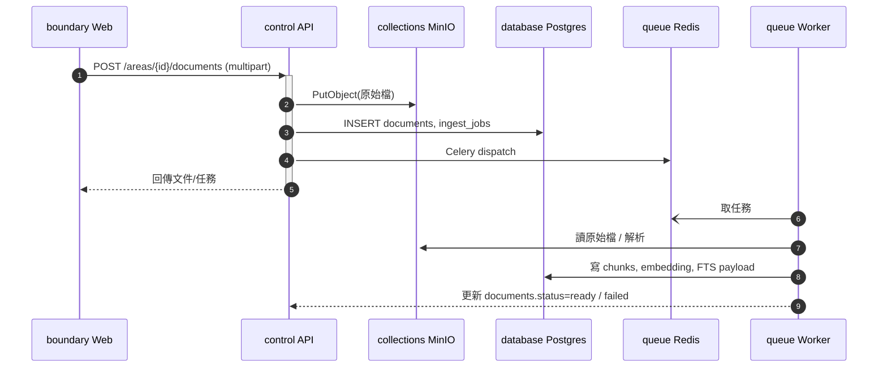
說明：API 僅建立紀錄與派送任務；Worker 實作 parser、chunking、embedding、FTS 與狀態轉換，前端輪詢或刷新後顯示 ready/failed 與 JOB 訊息。Sources: [ARCHITECTURE.md](), [PROJECT_STATUS.md]()

---

總結：本指引提供從環境準備、Compose 啟動、前端本機開發到以 smoke/E2E 驗證登入、Area 管理、文件上傳與 ready-only 檢索的完整路徑，並涵蓋單一入口拓樸、API 端點、文件預覽與權限邏輯重點。依據上述步驟與測試案例，即可快速驗證系統在真實組態下的端到端行為。Sources: [README.zh-TW.md](), [apps/web/tests/smoke/specs/phase6-full-flow.smoke.spec.ts](), [apps/web/tests/e2e/specs/auth-areas.spec.ts](), [ARCHITECTURE.md]()

---

<a id='page-3'></a>

## 系統架構總覽與元件關係圖

### Related Pages

Related topics: [文件生命週期與 Ingest 流程](#page-5), [聊天執行：Deep Agents 與 LangGraph Server](#page-10), [部署拓撲、Caddy 與單一公開入口](#page-11)

<details>
<summary>Relevant source files</summary>

The following files were used as context for generating this wiki page:

- [ARCHITECTURE.md](https://github.com/easypinex/deep-agent-rag-stack/blob/main/ARCHITECTURE.md)
- [README.zh-TW.md](https://github.com/easypinex/deep-agent-rag-stack/blob/main/README.zh-TW.md)
- [ROADMAP.md](https://github.com/easypinex/deep-agent-rag-stack/blob/main/ROADMAP.md)
- [PROJECT_STATUS.md](https://github.com/easypinex/deep-agent-rag-stack/blob/main/PROJECT_STATUS.md)
- [apps/api/src/app/schemas/documents.py](https://github.com/easypinex/deep-agent-rag-stack/blob/main/apps/api/src/app/schemas/documents.py)
- [apps/web/src/lib/types.ts](https://github.com/easypinex/deep-agent-rag-stack/blob/main/apps/web/src/lib/types.ts)
- [apps/web/src/features/documents/components/DocumentsDrawer.tsx](https://github.com/easypinex/deep-agent-rag-stack/blob/main/apps/web/src/features/documents/components/DocumentsDrawer.tsx)
- [apps/web/tests/e2e/specs/auth-areas.spec.ts](https://github.com/easypinex/deep-agent-rag-stack/blob/main/apps/web/tests/e2e/specs/auth-areas.spec.ts)
- [apps/web/tests/smoke/specs/phase6-full-flow.smoke.spec.ts](https://github.com/easypinex/deep-agent-rag-stack/blob/main/apps/web/tests/smoke/specs/phase6-full-flow.smoke.spec.ts)
- [apps/web/AGENTS.md](https://github.com/easypinex/deep-agent-rag-stack/blob/main/apps/web/AGENTS.md)
- [apps/web/src/components/RoadmapPanel.tsx](https://github.com/easypinex/deep-agent-rag-stack/blob/main/apps/web/src/components/RoadmapPanel.tsx)
- [apps/web/src/styles.css](https://github.com/easypinex/deep-agent-rag-stack/blob/main/apps/web/src/styles.css)
</details>

# 系統架構總覽與元件關係圖

本頁整理 Deep Agent RAG Stack 的整體系統架構、核心元件與資料流，說明 Web、API、Worker 與基礎設施如何協作，並以圖示化方式呈現關鍵業務規則與文件生命週期。內容聚焦於「一頁式戰情室」體驗、以 area 為邊界的授權、背景 ingest 與 ready-only 檢索路徑。Sources: [ARCHITECTURE.md](), [README.zh-TW.md]()

本頁同時彙整資料模型與 API schema（文件摘要、ingest job 摘要、全文預覽與 chunk map），輔以 E2E 測試與前端型別對齊，協助開發者快速理解端到端控制面與資料面。Sources: [apps/api/src/app/schemas/documents.py](), [apps/web/src/lib/types.ts](), [apps/web/tests/e2e/specs/auth-areas.spec.ts]()

## 系統元件與責任分工
Sources: [ARCHITECTURE.md](), [README.zh-TW.md](), [apps/web/AGENTS.md]()

### 元件清單與責任

| 元件 | 技術 | 主要責任 |
|---|---|---|
| Web (One-Page Dashboard) | React + Tailwind/Shadcn | 左側 Area 導覽、中央 Chat、右側文件抽屜、全文預覽與 citation 體驗 |
| API | FastAPI | Auth integration、RBAC/SQL gate、areas/documents/jobs/chat 對外 API、LangGraph Server chat runtime 連結 |
| Worker | Celery | 背景 ingest/indexing、parse routing、parent-child chunk tree、embedding、FTS payload |
| Infra | Caddy, PostgreSQL(+PGroonga), Redis, MinIO, Keycloak | 單一公開入口與路由、主要資料庫與 FTS、Broker/Result、物件儲存、OIDC/群組來源 |  
Sources: [ARCHITECTURE.md](), [README.zh-TW.md]()

Web 子元件：
- DashboardLayout：全螢幕網格與頂部全局狀態
- AreaSidebar：Area 導覽與快速建立
- ChatPanel：多輪對話、串流狀態、citation chips、工具調用檢視
- DocumentPreviewPane：右側全文預覽（child chunk 高亮與定位）
- DocumentsDrawer：不中斷對話的文件生命週期管理（上傳/列表/狀態/ready 預覽）
- AccessModal：彈窗式權限管理  
Sources: [ARCHITECTURE.md]()

### 整體關係圖

下圖呈現單一入口、前後端與基礎設施的互動與邊界。

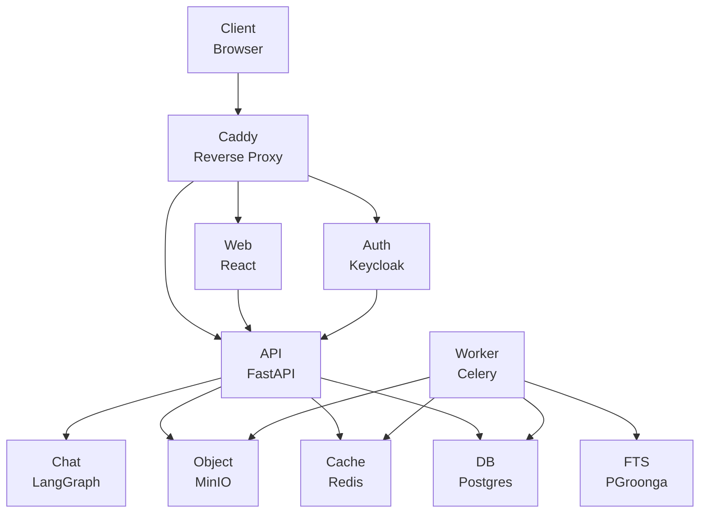

- Caddy 作為唯一公開入口，統一路由 `/`→Web、`/api/*`→API、`/auth/*`→Keycloak。Sources: [ARCHITECTURE.md](), [README.zh-TW.md]()
- API 實作 RBAC/SQL gate 與 areas/documents/jobs/chat 等端點；Chat 經由 LangGraph Server 預設 thread/run。Sources: [ARCHITECTURE.md]()
- Worker 進行背景 ingest/indexing 與 parse/artifact 重用。Sources: [ARCHITECTURE.md]()

## 安全與授權關鍵原則
Sources: [ARCHITECTURE.md](), [README.zh-TW.md](), [PROJECT_STATUS.md]()

- deny-by-default：無有效角色者不得見資源，並統一回 404 避免暴露存在性。Sources: [ARCHITECTURE.md](), [README.zh-TW.md]()
- SQL gate 為主要保護層，不可用記憶體過濾取代。Sources: [ARCHITECTURE.md]()
- chunk schema SQL-first：parent/child 關聯、position、heading、offset 等為實體欄位，不使用半結構欄位承載關鍵資料。Sources: [ARCHITECTURE.md]()
- documents.status=ready 才可檢索/進入 chat。Sources: [ARCHITECTURE.md]()
- area hard delete：先清物件儲存，再刪 DB；失敗不得刪以避免分裂。Sources: [ARCHITECTURE.md]()

### 已驗證的基礎路徑（摘錄）
- Keycloak → API auth context：access token 需含 `sub` 與 `groups`；API 驗證 issuer/JWKS 並提供 `GET /auth/context`。Sources: [ARCHITECTURE.md]()
- Group-based area access：direct 與 group role 取最大值為 effective role；未授權統一 404。Sources: [ARCHITECTURE.md]()
- Areas vertical slice：建立者成為 admin；list 僅回可見 area；access 管理 admin-only。Sources: [ARCHITECTURE.md]()

## 流程視圖

### 使用者登入流程
Sources: [ARCHITECTURE.md](), [README.zh-TW.md]()

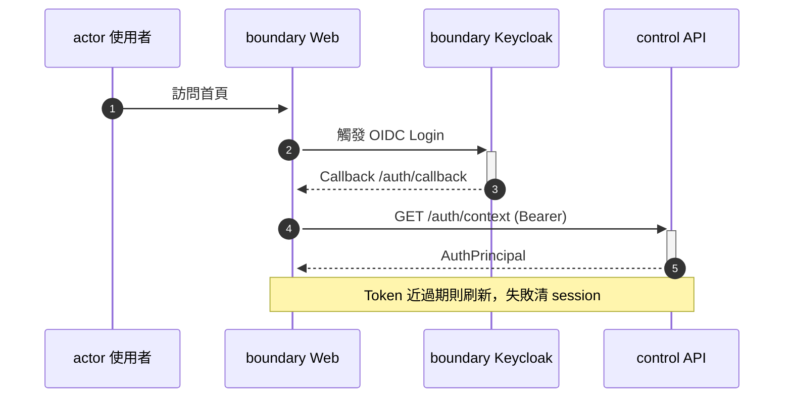

- 前端登入後以 Bearer 呼叫 `GET /auth/context`，並維持 token 刷新策略。Sources: [ARCHITECTURE.md]()

### 文件上傳與背景處理
Sources: [ARCHITECTURE.md](), [PROJECT_STATUS.md]()

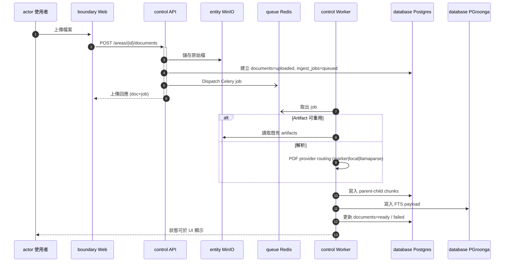

- 解析優先重用 artifacts，找不到才執行 provider-based parsing（PDF：marker 預設、local、llamaparse）。Sources: [ARCHITECTURE.md]()
- 狀態轉換：uploaded → processing → ready|failed；僅 ready 供檢索。Sources: [ARCHITECTURE.md]()

### 文件管理與全文預覽（前端）
Sources: [ARCHITECTURE.md](), [apps/web/src/features/documents/components/DocumentsDrawer.tsx](), [apps/web/src/lib/types.ts](), [apps/web/tests/e2e/specs/auth-areas.spec.ts]()

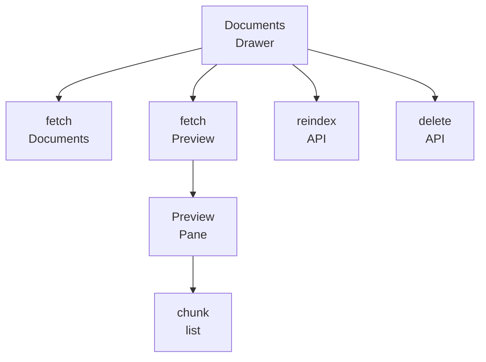

- DocumentsDrawer 提供檔案列表、reindex、delete 與 ready 文件的 chunk-aware 全文預覽（右側 Pane）。Sources: [ARCHITECTURE.md](), [apps/web/src/features/documents/components/DocumentsDrawer.tsx]()

## API 與資料模型

### 對外端點（摘錄）
Sources: [ARCHITECTURE.md](), [PROJECT_STATUS.md]()

| 類別 | 端點 | 說明 |
|---|---|---|
| Auth | GET /auth/context | 回傳解析後的 principal（需 Bearer） |
| Areas | POST/GET/GET(id)/PUT(access)/DELETE | 建立、列表、細節、權限管理、刪除（admin-only 刪除） |
| Documents | POST /areas/{id}/documents | 上傳文件，建立 documents 與 ingest_jobs |
| Documents | GET /areas/{id}/documents | 指定 area 文件列表 |
| Documents | GET /documents/{id} / DELETE / reindex | 讀取、刪除、重新派送 ingest |
| Documents | GET /documents/{id}/preview | ready-only 全文預覽與 child chunk map |
| Jobs | GET /ingest-jobs/{id} | 讀取 ingest job 摘要 |
| Chat | LangGraph thread/run | 改用 LangGraph Server 預設端點 |  
Sources: [ARCHITECTURE.md]()

### Pydantic Schema（API）
Sources: [apps/api/src/app/schemas/documents.py]()

```python
# apps/api/src/app/schemas/documents.py (節錄)
class ChunkSummary(BaseModel):
    total_chunks: int
    parent_chunks: int
    child_chunks: int
    mixed_structure_parents: int
    text_table_text_clusters: int
    last_indexed_at: datetime | None

class DocumentSummary(BaseModel):
    id: UUID
    area_id: UUID
    file_name: str
    content_type: str
    file_size: int
    status: DocumentStatus
    chunk_summary: ChunkSummary
    created_at: datetime
    updated_at: datetime

class IngestJobSummary(BaseModel):
    id: UUID
    document_id: UUID
    status: IngestJobStatus
    stage: str
    chunk_summary: ChunkSummary
    error_message: str | None
    created_at: datetime
    updated_at: datetime
```

- ChunkSummary 與 DocumentSummary/JobSummary 對應 UI 列表資訊與觀測欄位。Sources: [apps/api/src/app/schemas/documents.py]()

### 前端型別（Preview 與 Chat 顯示合約）
Sources: [apps/web/src/lib/types.ts]()

```ts
// apps/web/src/lib/types.ts (節錄)
export interface PreviewChunk {
  chunk_id: string;
  parent_chunk_id: string | null;
  child_index: number | null;
  heading: string | null;
  structure_kind: "text" | "table";
  start_offset: number;
  end_offset: number;
}

export interface DocumentPreviewPayload {
  document_id: string;
  file_name: string;
  content_type: string;
  display_text: string;
  chunks: PreviewChunk[];
}
```

- 全文預覽以 display_text + child chunk map 呈現，offset/heading/structure_kind 供高亮與同步定位。Sources: [apps/web/src/lib/types.ts](), [ARCHITECTURE.md]()

## Chunk Tree 與檢索基礎
Sources: [ARCHITECTURE.md](), [README.zh-TW.md](), [PROJECT_STATUS.md]()

- `document_chunks` 採固定兩層：parent → child；`structure_kind=text|table`。Sources: [ARCHITECTURE.md]()
- Markdown/HTML 表格感知 chunking；table preserve/row-group split。Sources: [ROADMAP.md](), [PROJECT_STATUS.md]()
- ready-only 檢索：SQL gate → vector recall → FTS recall(PGroonga) → RRF → rerank(Cohere) → table-aware assembler → citations。Sources: [README.zh-TW.md](), [PROJECT_STATUS.md]()

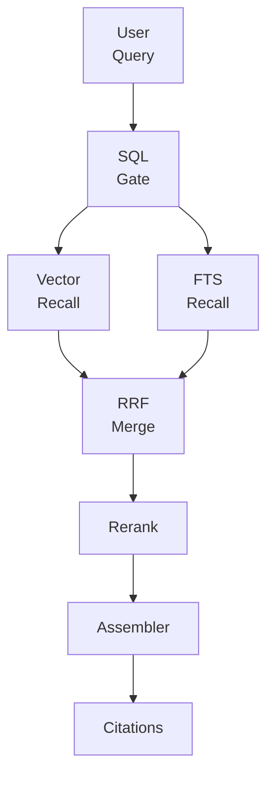

- assembler 為 precision-first：小 parent 送全段，大 parent 以命中 child 為中心擴展；表格命中優先補齊整表與前後說明。Sources: [PROJECT_STATUS.md]()

## 一頁式戰情室與 UI 行為
Sources: [ARCHITECTURE.md](), [apps/web/src/features/documents/components/DocumentsDrawer.tsx](), [apps/web/src/components/RoadmapPanel.tsx](), [apps/web/src/styles.css]()

- Dashboard 整合左側導覽、中央 Chat、右側文件抽屜與彈窗權限，確保不中斷對話的文件管理與全文預覽。Sources: [ARCHITECTURE.md]()
- RoadmapPanel 描述本輪骨架涵蓋（API/Worker/Web health、Compose 基礎）與延後能力（Keycloak login、Area CRUD/access、上傳流程、Chat）。Sources: [apps/web/src/components/RoadmapPanel.tsx]()
- 樣式以 Tailwind 為主，提供 Markdown 顯示之表格/標題/程式碼區塊等規則化樣式。Sources: [apps/web/src/styles.css]()

DocumentsDrawer 片段（摘要格式化與 chunk excerpt）：
Sources: [apps/web/src/features/documents/components/DocumentsDrawer.tsx]()

```ts
function formatChunkSummary(document: DocumentSummary): string {
  return `${document.chunk_summary.total_chunks} chunks (${document.chunk_summary.parent_chunks} parent / ${document.chunk_summary.child_chunks} child)`;
}

function buildChunkExcerpt(preview: DocumentPreviewPayload, startOffset: number, endOffset: number): string {
  const content = preview.display_text
    .slice(Math.max(0, startOffset), Math.max(startOffset, endOffset))
    .replace(/\s+/g, " ").trim();
  return content ? (content.length > 140 ? `${content.slice(0, 140)}…` : content) : "此 chunk 沒有可顯示的文字內容。";
}
```

## 測試與端到端驗證
Sources: [apps/web/tests/e2e/specs/auth-areas.spec.ts](), [apps/web/tests/smoke/specs/phase6-full-flow.smoke.spec.ts](), [apps/web/AGENTS.md]()

- 典型 E2E：登入 → 建立 Area → 打開文件抽屜 → 上傳 → 等待 ready → 預覽 chunk → 問答檢核（或暫跳 Chat 斷言）。Sources: [apps/web/tests/smoke/specs/phase6-full-flow.smoke.spec.ts](), [apps/web/tests/e2e/specs/auth-areas.spec.ts]()
- 權限場景：outsider deny-by-default 無可見 area；maintainer 可上傳/刪除/重新索引；admin 可刪除 area 並觀察 sidebar 更新。Sources: [apps/web/tests/e2e/specs/auth-areas.spec.ts]()
- 前端測試原則：重大流程優先補 Playwright，selector 優先使用可存取名稱/label/role；E2E 不可取代後端授權驗證。Sources: [apps/web/AGENTS.md]()

示例（Smoke Test 片段）：
Sources: [apps/web/tests/smoke/specs/phase6-full-flow.smoke.spec.ts]()

```ts
await page.goto('http://localhost:13000', { waitUntil: 'networkidle' });
await page.click('button[data-testid="login-button"]');
await page.waitForURL(/.*18080.*/);
await page.fill('#username', 'alice');
await page.fill('#password', 'alice123');
await page.click('#kc-login');

await page.fill('input[data-testid="create-area-name"]', areaName);
await page.click('button[data-testid="create-area-submit"]');
await page.click('button:has-text("管理文件")');
await page.setInputFiles('input[data-testid="document-upload"]', { name: fileName, mimeType: 'text/plain', buffer });
await page.click('button[data-testid="upload-document-submit"]');
await expect(page.getByText('ready')).toBeVisible({ timeout: 60000 });
```

## 路線圖與完成里程碑
Sources: [ROADMAP.md](), [PROJECT_STATUS.md]()

- 已完成：Phase 0~6.1（骨架、Auth、Areas、Documents/Ingestion、Chunk Tree、Table-Aware、Retrieval/Rerank/Assembler、Chat on LangGraph、Supabase/PGroonga 移轉、Public HTTPS Entry）。Sources: [PROJECT_STATUS.md]()
- 已提供 provider-based PDF parsing（marker 預設 / local / llamaparse）與 artifacts 重用；XLSX/HTML/DOCX/PPTX/TXT/MD 解析整合 chunk tree。Sources: [ARCHITECTURE.md](), [ROADMAP.md]()
- 後續持續加強：更多 Chat edge cases、area/files/chat 切換回歸、Deep Agents 可擴充點等。Sources: [README.zh-TW.md](), [PROJECT_STATUS.md]()

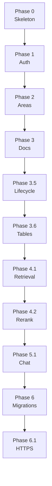

## 基礎設施與單一公開入口
Sources: [README.zh-TW.md](), [ARCHITECTURE.md]()

- 單一公開入口：`https://easypinex.duckdns.org`；`/`→Web、`/api/*`→API、`/auth/*`→Keycloak；Caddy 自動 TLS。Sources: [README.zh-TW.md]()
- Compose 不再對外發佈舊開發埠（13000/18000/18080）；客戶端僅使用 443。Sources: [README.zh-TW.md]()

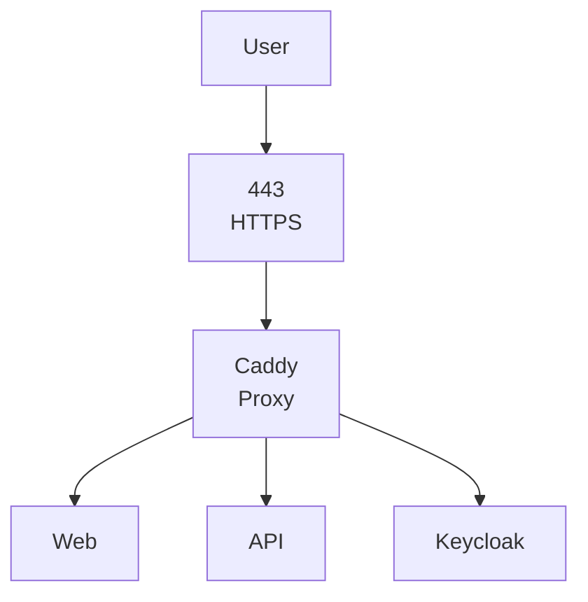

## 結語

系統以單一公開入口串接 Web、API、Worker 與 Keycloak，採用嚴格的 deny-by-default 與 SQL gate 作為授權核心，並以 ready-only 文件生命週期確保檢索品質。前端提供一頁式戰情室體驗，右側文件抽屜支援 chunk-aware 全文預覽；後端則以 provider-based parsing、parent-child chunk tree、PGroonga FTS、RRF 與 rerank/assembler 完成混合召回與 citation 能力。上述設計與流程均已在專案里程碑與 E2E 測試中落地驗證。Sources: [ARCHITECTURE.md](), [README.zh-TW.md](), [PROJECT_STATUS.md](), [apps/web/tests/e2e/specs/auth-areas.spec.ts](), [apps/web/tests/smoke/specs/phase6-full-flow.smoke.spec.ts]()

---

<a id='page-4'></a>

## 知識區域與權限管理

### Related Pages

Related topics: [API 端點與服務層](#page-8), [系統架構總覽與元件關係圖](#page-3)

<details>
<summary>Relevant source files</summary>

The following files were used as context for generating this wiki page:

- [ARCHITECTURE.md](https://github.com/easypinex/deep-agent-rag-stack/blob/main/ARCHITECTURE.md)
- [Summary.md](https://github.com/easypinex/deep-agent-rag-stack/blob/main/Summary.md)
- [PROJECT_STATUS.md](https://github.com/easypinex/deep-agent-rag-stack/blob/main/PROJECT_STATUS.md)
- [README.zh-TW.md](https://github.com/easypinex/deep-agent-rag-stack/blob/main/README.zh-TW.md)
- [AGENTS.md](https://github.com/easypinex/deep-agent-rag-stack/blob/main/AGENTS.md)
- [apps/web/src/lib/api.ts](https://github.com/easypinex/deep-agent-rag-stack/blob/main/apps/web/src/lib/api.ts)
- [apps/api/src/app/schemas/areas.py](https://github.com/easypinex/deep-agent-rag-stack/blob/main/apps/api/src/app/schemas/areas.py)
- [apps/api/src/app/schemas/documents.py](https://github.com/easypinex/deep-agent-rag-stack/blob/main/apps/api/src/app/schemas/documents.py)
- [apps/web/tests/e2e/specs/auth-areas.spec.ts](https://github.com/easypinex/deep-agent-rag-stack/blob/main/apps/web/tests/e2e/specs/auth-areas.spec.ts)
- [apps/web/tests/smoke/specs/phase6-full-flow.smoke.spec.ts](https://github.com/easypinex/deep-agent-rag-stack/blob/main/apps/web/tests/smoke/specs/phase6-full-flow.smoke.spec.ts)
- [README.md](https://github.com/easypinex/deep-agent-rag-stack/blob/main/README.md)
</details>

# 知識區域與權限管理

本頁說明專案中的知識區域（Knowledge Area）與權限管理（Access Management）之目的、資料模型、API 介面、授權流程與測試覆蓋重點。系統以 Keycloak 為身份來源，採用群組與直接使用者角色合併計算有效角色（effective role），並以 deny-by-default 作為授權邏輯基石，確保僅被授權的使用者可見與可操作對應資源。Sources: [ARCHITECTURE.md](), [Summary.md](), [README.zh-TW.md](), [AGENTS.md]()

知識區域提供文件上傳與檢索的作用範圍，結合 area-level RBAC 控制與 ready-only 文件生命週期，最終服務於區域範圍內的檢索與聊天流程。前端提供 AccessModal 進行使用者與群組的授權設定與檢視，後端則公開對應的 CRUD 與 access API。Sources: [ARCHITECTURE.md](), [README.zh-TW.md](), [PROJECT_STATUS.md]()

## 核心概念與角色

- 知識區域（Knowledge Area）
  - 使用者可建立 Knowledge Area；建立者自動為該區域 admin。Sources: [Summary.md](), [PROJECT_STATUS.md]()
- 角色與行為邊界
  - reader：可列文件、問答、查看 citations
  - maintainer：reader + 上傳/刪除文件、重新索引、查看進度與錯誤
  - admin：maintainer + 管理區域設定與 Access
  - 以 Keycloak groups 為基礎的授權；effective role = 直接角色與群組角色的最大值；deny-by-default。Sources: [Summary.md](), [README.zh-TW.md](), [AGENTS.md](), [ARCHITECTURE.md]()

- 授權與保護規則
  - JWT claims 使用 sub 與 groups；SQL gate 為主要保護層；未授權以一致的 404 避免洩漏資源存在性。Sources: [ARCHITECTURE.md](), [README.zh-TW.md](), [AGENTS.md]()
  - 文件生命週期：uploaded -> processing -> ready|failed；只有 ready 可被檢索與參與問答。Sources: [ARCHITECTURE.md](), [Summary.md](), [AGENTS.md](), [apps/api/src/app/schemas/documents.py]()

表：角色能力對照
| 角色 | 能力摘要 |
|---|---|
| reader | 列文件、問答、查看 citations |
| maintainer | reader 能力 + 上傳/刪除文件、重新索引、查看進度與錯誤 |
| admin | maintainer 能力 + 管理區域設定與 Access |
Sources: [Summary.md](), [README.zh-TW.md]()

## API 與前端互動

以下 API 由前端透過 Bearer Token 呼叫（fetchProtected / buildBearerHeaders）。主要涵蓋 area CRUD、access 管理、文件清單與上傳。Sources: [apps/web/src/lib/api.ts](), [PROJECT_STATUS.md](), [ARCHITECTURE.md]()

表：主要 API 與前端呼叫點
| 功能 | Method | Path | 前端函式 |
|---|---|---|---|
| 取得 Auth Context | GET | /auth/context | fetchAuthContext |
| 列出可存取 Areas | GET | /areas | fetchAreas |
| 建立 Area | POST | /areas | createArea |
| 讀取 Area | GET | /areas/{areaId} | fetchAreaDetail |
| 更新 Area | PUT | /areas/{areaId} | updateArea |
| 刪除 Area | DELETE | /areas/{areaId} | deleteArea |
| 讀取 Area Access | GET | /areas/{areaId}/access | fetchAreaAccess |
| 整體替換 Area Access | PUT | /areas/{areaId}/access | replaceAreaAccess |
| 列出文件 | GET | /areas/{areaId}/documents | fetchDocuments |
| 單檔上傳 | POST | /areas/{areaId}/documents | uploadDocument |
Sources: [apps/web/src/lib/api.ts](), [PROJECT_STATUS.md](), [ARCHITECTURE.md]()

說明：
- 前端以 fetchProtected 自動加上 Authorization: Bearer，並將錯誤標準化。Sources: [apps/web/src/lib/api.ts]()
- /auth/context 用於檢視 sub 與 groups 等最小 Auth 狀態。Sources: [apps/web/src/lib/api.ts](), [ARCHITECTURE.md]()
- Area 與 Access API 已於專案狀態文件標記為完成（create/list/detail/update/delete 與 /access 管理）。Sources: [PROJECT_STATUS.md](), [ARCHITECTURE.md]()

sequenceDiagram
autonumber
participant U as actor 使用者
participant W as boundary Web App
participant K as boundary Keycloak
participant A as control API
participant D as database DB

U->>+W: 進入 Dashboard
W->>+K: OIDC 流程（登入）
K-->>-W: Access Token (含 sub, groups)
W->>+A: GET /areas (Bearer)
A->>+D: SQL gate + 可見 Areas
D-->>-A: Areas 列表
A-->>-W: 200 Areas
W-->>U: 顯示可見 Areas

U->>+W: 開啟 Access 設定
W->>+A: GET /areas/{id}/access
A->>+D: 讀取 users/groups 規則
D-->>-A: Access 規則
A-->>-W: 200 Access
W-->>U: 顯示 AccessModal
Note over W,A: admin 進行調整
W->>+A: PUT /areas/{id}/access
A->>+D: 以 admin 權限更新規則
D-->>-A: 更新成功
A-->>-W: 200 新規則
W-->>U: 更新成功提示
Sources: [apps/web/src/lib/api.ts](), [ARCHITECTURE.md](), [PROJECT_STATUS.md](), [README.zh-TW.md]()

## 資料模型與 Schema

後端以 Pydantic schema 定義 area 與文件摘要結構；前端依此結構渲染資料與狀態。以下為關鍵 Schema 與欄位摘要。Sources: [apps/api/src/app/schemas/areas.py](), [apps/api/src/app/schemas/documents.py]()

### Area Schemas
- CreateAreaRequest
  - name: str（min_length=1, max_length=255；去除空白後不可為空）
  - description: str | None
- UpdateAreaRequest
  - 與 Create 相同的欄位與驗證
- AreaSummaryResponse
  - id: UUID
  - name: str
  - description: str | None
  - effective_role: Role
  - created_at: datetime
  - updated_at: datetime
- AreaListResponse
  - items: list[AreaSummaryResponse]
- AccessUserEntry
  - username: str（min_length=1, max_length=255；去除空白後不可為空）
  - role: Role
Sources: [apps/api/src/app/schemas/areas.py]()

表：AreaSummaryResponse 欄位
| 欄位 | 型別 | 說明 |
|---|---|---|
| id | UUID | Area 識別碼 |
| name | str | Area 名稱 |
| description | str or None | Area 說明 |
| effective_role | Role | 目前使用者在此 Area 的有效角色 |
| created_at | datetime | 建立時間 |
| updated_at | datetime | 最後更新時間 |
Sources: [apps/api/src/app/schemas/areas.py]()

### Document 與 Job Schemas（授權顯示相關）
- DocumentSummary
  - id, area_id, file_name, content_type, file_size, status, chunk_summary, created_at, updated_at
- IngestJobSummary
  - id, document_id, status, stage, chunk_summary, error_message, created_at, updated_at
- Document 狀態：uploaded | processing | ready | failed（ready-only 可檢索）Sources: [apps/api/src/app/schemas/documents.py](), [ARCHITECTURE.md](), [Summary.md]()

表：文件狀態（status）
| 值 | 說明 |
|---|---|
| uploaded | 上傳完成（尚未處理） |
| processing | 背景處理中 |
| ready | 完成，允許檢索 |
| failed | 失敗（含錯誤訊息） |
Sources: [apps/api/src/app/schemas/documents.py](), [ARCHITECTURE.md](), [Summary.md]()

classDiagram
class AreaSummaryResponse {
  +UUID id
  +str name
  +str|None description
  +Role effective_role
  +datetime created_at
  +datetime updated_at
}
class CreateAreaRequest {
  +str name
  +str|None description
}
class UpdateAreaRequest {
  +str name
  +str|None description
}
class AccessUserEntry {
  +str username
  +Role role
}
AreaSummaryResponse <.. CreateAreaRequest : create
AreaSummaryResponse <.. UpdateAreaRequest : update
Sources: [apps/api/src/app/schemas/areas.py]()

## 授權流程與 SQL Gate

系統將授權邏輯前置於資料層（SQL gate），以 deny-by-default 與未授權 404 作為安全基礎；JWT 需含 sub 與 groups，effective role 以使用者直接角色與群組角色的最大值計算。當文件檢索時，僅允許 status=ready 的資料進入流程。Sources: [ARCHITECTURE.md](), [Summary.md](), [README.zh-TW.md](), [AGENTS.md](), [apps/api/src/app/schemas/documents.py]()

graph TD
A[Web 請求] --> B[JWT 驗證<br/>sub, groups]
B --> C[計算<br/>effective role]
C --> D[SQL gate<br/>以 Area/Role 過濾]
D --> E{授權通過?}
E -- 是 --> F[執行 CRUD/Query]
E -- 否 --> G[回傳 404]
F --> H{文件檢索?}
H -- 是 --> I[過濾<br/>status=ready]
H -- 否 --> J[一般回應]
I --> K[回應結果]
J --> K[回應結果]
G --> L[隱匿資源存在性]
Sources: [ARCHITECTURE.md](), [Summary.md](), [README.zh-TW.md](), [AGENTS.md](), [apps/api/src/app/schemas/documents.py]()

說明：
- SQL gate 是主要保護層，禁止先抓全部資料再記憶體過濾。Sources: [ARCHITECTURE.md](), [AGENTS.md]()
- 未授權以 404 隱匿資源是否存在。Sources: [README.zh-TW.md]()
- 只有 ready 文件可進入檢索與問答。Sources: [ARCHITECTURE.md](), [Summary.md](), [apps/api/src/app/schemas/documents.py]()

## 前端 UI 與互動

- AccessModal
  - 以彈窗管理 users 與 groups 規則，並提供直覺操作體驗（如「@」關鍵字觸發自動完成）；更新成功會顯示提示與摘要。Sources: [README.zh-TW.md](), [ARCHITECTURE.md](), [apps/web/tests/e2e/specs/auth-areas.spec.ts]()
- 一頁式 Dashboard
  - AreaSidebar、DocumentsDrawer 與中央 ChatPanel 組合的戰情室體驗；不打斷對話即可管理文件與權限。Sources: [ARCHITECTURE.md](), [README.zh-TW.md]()

graph TD
A[Dashboard] --> B[AreaSidebar]
A --> C[ChatPanel]
A --> D[DocumentsDrawer]
A --> E[AccessModal]
B -->|切換/建立| A
D -->|上傳/清單| A
E -->|users/groups| A
Sources: [ARCHITECTURE.md](), [README.zh-TW.md]()

## 作業流程與整合測試證據

E2E 測試顯示各角色在區域與文件操作的實際行為差異，並驗證 deny-by-default 與 CRUD/Access 操作。Sources: [apps/web/tests/e2e/specs/auth-areas.spec.ts](), [apps/web/tests/smoke/specs/phase6-full-flow.smoke.spec.ts]()

- Admin
  - 可建立與重命名 Area、管理 Access（新增群組與角色）、上傳文件，觀測到 ready 狀態與 chunk 摘要。Sources: [apps/web/tests/e2e/specs/auth-areas.spec.ts]()
- Reader
  - 可見區域與文件細節、不可操作 Access 與上傳；可進入聊天（部分聊天斷言目前標記暫跳過）。Sources: [apps/web/tests/e2e/specs/auth-areas.spec.ts]()
- Maintainer
  - 可上傳、刪除文件、重新索引；不可操作 Access 或刪除 Area。Sources: [apps/web/tests/e2e/specs/auth-areas.spec.ts]()
- Outsider
  - 被 deny-by-default 擋下，area list 為空。Sources: [apps/web/tests/e2e/specs/auth-areas.spec.ts]()
- Full Flow Smoke
  - 登入 -> 建立 Area -> 上傳文件 -> 等待 ready -> 發問並驗證回答關鍵字。Sources: [apps/web/tests/smoke/specs/phase6-full-flow.smoke.spec.ts]()

sequenceDiagram
autonumber
box Web
participant U as actor 使用者
participant W as boundary Web App
end
box Backend
participant A as control API
participant D as database DB
end

U->>+W: 建立 Area
W->>+A: POST /areas
A->>+D: 建立 area + creator=admin
D-->>-A: OK
A-->>-W: 200 Area

U->>+W: 管理 Access
W->>+A: PUT /areas/{id}/access
A->>+D: 更新 users/groups
D-->>-A: OK
A-->>-W: 200 Access

U->>+W: 上傳文件
W->>+A: POST /areas/{id}/documents
A->>+D: 建立 doc+job (uploaded)
D-->>-A: OK
A-->>-W: 200 Doc/Job

Note over A,D: 背景處理 -> ready
W->>+A: GET /areas/{id}/documents
A->>+D: 僅授權與 ready 顯示
D-->>-A: 列表 (ready)
A-->>-W: 200 列表
W-->>U: 顯示 ready 與 chunks
Sources: [apps/web/src/lib/api.ts](), [apps/web/tests/e2e/specs/auth-areas.spec.ts](), [apps/web/tests/smoke/specs/phase6-full-flow.smoke.spec.ts](), [ARCHITECTURE.md]()

## 測試與品質門檻

- 單元測試至少涵蓋：
  - effective role 計算、deny-by-default、status != ready 的文件不能被檢索。Sources: [AGENTS.md]()
- 整合測試至少涵蓋：
  - 不同群組讀取權限、upload 狀態轉換、授權者可提問取得 citations、未授權者不可見/操作資源、maintainer 刪除與 reindex、admin 修改 access。Sources: [AGENTS.md]()
- 前端 E2E（Playwright）
  - admin/maintainer/reader/outsider 行為差異、錯誤邊界（連線失敗時的錯誤顯示）。Sources: [apps/web/tests/e2e/specs/auth-areas.spec.ts]()

## 安全與不可妥協規則

- deny-by-default 一律生效；授權敏感路徑保留此語意。Sources: [AGENTS.md](), [ARCHITECTURE.md]()
- SQL gate 是主要保護層；不得以記憶體過濾取代。Sources: [AGENTS.md](), [ARCHITECTURE.md]()
- JWT claims 僅使用 sub 與 groups；Keycloak 為正式身分來源。Sources: [ARCHITECTURE.md](), [Summary.md]()
- 只有 status=ready 的文件可檢索；未達成者不得進入檢索與問答。Sources: [ARCHITECTURE.md](), [Summary.md](), [apps/api/src/app/schemas/documents.py]()
- 以一致的 404 隱匿未授權資源是否存在。Sources: [README.zh-TW.md]()

## 相關 UI 與部署脈絡（輔助理解）

- 一頁式 Dashboard：整合 AreaSidebar、ChatPanel、DocumentsDrawer、AccessModal。Sources: [ARCHITECTURE.md](), [README.zh-TW.md]()
- 公開路由：/ -> Web、/api/* -> API、/auth/* -> Keycloak。Sources: [Summary.md](), [README.zh-TW.md]()

## 總結

知識區域與權限管理以 area-level RBAC 為核心，結合 Keycloak groups、deny-by-default、SQL gate 與 ready-only 文件生命週期，確保在正確的授權邊界內完成文件管理與聊天檢索。前端透過標準化的 API 呼叫與 AccessModal 提供直覺的操作體驗；E2E 測試則驗證了不同角色的實際行為差異與主要流程的正確性。Sources: [ARCHITECTURE.md](), [Summary.md](), [README.zh-TW.md](), [apps/web/src/lib/api.ts](), [apps/web/tests/e2e/specs/auth-areas.spec.ts]()

---

<a id='page-5'></a>

## 文件生命週期與 Ingest 流程

### Related Pages

Related topics: [資料庫結構、遷移與 RPC](#page-6), [檢索管線：SQL Gate、向量與 FTS、RRF 與 Rerank](#page-9)

<details>
<summary>Relevant source files</summary>

The following files were used as context for generating this wiki page:

- [ARCHITECTURE.md](https://github.com/easypinex/deep-agent-rag-stack/blob/main/ARCHITECTURE.md)
- [ROADMAP.md](https://github.com/easypinex/deep-agent-rag-stack/blob/main/ROADMAP.md)
- [PROJECT_STATUS.md](https://github.com/easypinex/deep-agent-rag-stack/blob/main/PROJECT_STATUS.md)
- [Summary.md](https://github.com/easypinex/deep-agent-rag-stack/blob/main/Summary.md)
- [README.zh-TW.md](https://github.com/easypinex/deep-agent-rag-stack/blob/main/README.zh-TW.md)
- [apps/api/src/app/schemas/documents.py](https://github.com/easypinex/deep-agent-rag-stack/blob/main/apps/api/src/app/schemas/documents.py)
- [apps/api/src/app/services/documents.py](https://github.com/easypinex/deep-agent-rag-stack/blob/main/apps/api/src/app/services/documents.py)
- [apps/api/src/app/db/models.py](https://github.com/easypinex/deep-agent-rag-stack/blob/main/apps/api/src/app/db/models.py)
- [apps/worker/src/worker/tasks/ingest.py](https://github.com/easypinex/deep-agent-rag-stack/blob/main/apps/worker/src/worker/tasks/ingest.py)
- [apps/web/src/lib/types.ts](https://github.com/easypinex/deep-agent-rag-stack/blob/main/apps/web/src/lib/types.ts)
- [apps/web/tests/smoke/specs/phase6-full-flow.smoke.spec.ts](https://github.com/easypinex/deep-agent-rag-stack/blob/main/apps/web/tests/smoke/specs/phase6-full-flow.smoke.spec.ts)
- [AGENTS.md](https://github.com/easypinex/deep-agent-rag-stack/blob/main/AGENTS.md)
</details>

# 文件生命週期與 Ingest 流程

## 簡介
本頁說明系統中文件從上傳到可被檢索的完整生命週期與背景 Ingest 流程。流程涵蓋 API 建立文件與工作、物件儲存寫入、Worker 解析/切塊/索引、狀態轉換、刪除與重建索引的交互關係，並落實 deny-by-default 與 ready-only 的檢索邏輯。Sources: [ARCHITECTURE.md](), [Summary.md](), [PROJECT_STATUS.md](), [README.zh-TW.md]()

系統將文件生命週期切分為 uploaded -> processing -> ready|failed，背景 Worker 以 parse -> chunk -> index -> ready 的管線處理，API/DB/Storage 之間透過 Celery 非同步銜接，同時維持 SQL gate 與 RBAC 權限邊界。Sources: [ARCHITECTURE.md](), [PROJECT_STATUS.md](), [README.zh-TW.md]()

## 系統角色與邏輯邊界
- Web：單頁 Dashboard，負責文件上傳、狀態觀察與對話入口。Sources: [ARCHITECTURE.md]()
- API (FastAPI)：處理認證整合、RBAC、文件/工作資源建立與刪除、預覽 API、派送背景工作。Sources: [ARCHITECTURE.md](), [apps/api/src/app/services/documents.py]()
- Worker (Celery)：執行 parse、chunk、index，更新 job/document 狀態與 chunk 統計。Sources: [ARCHITECTURE.md](), [apps/worker/src/worker/tasks/ingest.py]()
- 資料庫 (PostgreSQL + pgvector + PGroonga via Supabase)：持久化 documents/ingest_jobs/document_chunks 與檢索索引基礎。Sources: [Summary.md](), [ROADMAP.md]()
- 物件儲存 (MinIO)：保存原始檔與 parse artifacts。Sources: [ARCHITECTURE.md]()

核心規則：
- deny-by-default 與 SQL gate；未授權者以相同 404 語意保護資源存在性。Sources: [ARCHITECTURE.md](), [AGENTS.md]()
- 只有 status = ready 的文件能參與檢索與聊天。Sources: [ARCHITECTURE.md](), [AGENTS.md]()

## 狀態模型與事件
下列狀態由 API/Worker 嚴格維護，並在 Web/E2E 測試中被驗證。

### Document 狀態與語意
- uploaded：API 接收並寫入物件儲存後的初始狀態。Sources: [apps/api/src/app/services/documents.py](), [apps/api/src/app/db/models.py]()
- processing：Worker 取得工作開始處理（在專案文件與進度敘述中呈現）。Sources: [PROJECT_STATUS.md]()
- ready：parse/chunk/index 完成，允許檢索。Sources: [apps/worker/src/worker/tasks/ingest.py](), [AGENTS.md]()
- failed：任一環節失敗，清理殘留內容並停止檢索。Sources: [apps/worker/src/worker/tasks/ingest.py]()

Web 端 E2E 測試以等待 ready 作為驗收條件。Sources: [apps/web/tests/smoke/specs/phase6-full-flow.smoke.spec.ts]()

### IngestJob 狀態與階段
- 狀態：queued | processing | succeeded | failed。Sources: [apps/api/src/app/db/models.py](), [apps/web/src/lib/types.ts]()
- 階段：stage 預設 queued；Worker 於成功路徑階段轉換為 finalizing -> succeeded；失敗路徑為 failed。Sources: [apps/api/src/app/db/models.py](), [apps/worker/src/worker/tasks/ingest.py]()

表 — 狀態與語意總覽
| 實體        | 狀態/欄位 | 可能值                                   | 語意摘要 |
|-------------|-----------|------------------------------------------|----------|
| Document    | status    | uploaded, processing, ready, failed      | 文件處理生命週期 |
| IngestJob   | status    | queued, processing, succeeded, failed    | 背景工作狀態 |
| IngestJob   | stage     | queued, finalizing, succeeded, failed    | 更細緻的執行階段 |
Sources: [apps/api/src/app/db/models.py](), [apps/worker/src/worker/tasks/ingest.py](), [apps/web/src/lib/types.ts](), [PROJECT_STATUS.md]()

## 資料模型與 Schema

### ORM / DB 模型重點
- Document：id, area_id, file_name, content_type, file_size, storage_key, display_text, normalized_text, status, indexed_at, created_at, updated_at。Sources: [apps/api/src/app/db/models.py]()
- IngestJob：id, document_id, status, stage, error_message, parent_chunk_count, child_chunk_count, created_at, updated_at。Sources: [apps/api/src/app/db/models.py]()
- DocumentChunk：parent-child 兩層結構，並有 structure_kind = text|table（SQL-first 設計，供檢索與引用）。Sources: [ARCHITECTURE.md](), [PROJECT_STATUS.md](), [Summary.md]()

表 — Document 欄位摘要
| 欄位             | 型別/備註             | 說明 |
|------------------|------------------------|------|
| id               | UUID string            | 文件 ID |
| area_id          | FK                     | 所屬 Area |
| file_name        | String                 | 上傳檔名 |
| content_type     | String                 | MIME 類型 |
| file_size        | Integer                | 檔案大小 (bytes) |
| storage_key      | String                 | 物件儲存鍵值 |
| display_text     | Text (nullable)        | 全文預覽顯示用 |
| normalized_text  | Text (nullable)        | 解析正規化內文 |
| status           | Enum(DocumentStatus)   | 狀態控制 |
| indexed_at       | Datetime (nullable)    | 最近成功索引時間 |
| created_at       | Datetime               | 建立時間 |
| updated_at       | Datetime               | 最後更新 |
Sources: [apps/api/src/app/db/models.py]()

接口 Schema（Pydantic）摘要：
- DocumentSummary：包含 chunk_summary 與 timestamps。Sources: [apps/api/src/app/schemas/documents.py]()
- IngestJobSummary：包含 stage、chunk_summary、error_message。Sources: [apps/api/src/app/schemas/documents.py]()
- DocumentPreviewResponse：包含 display_text 與依 child chunk 排序的 chunks（start_offset/end_offset、structure_kind、heading 等）。Sources: [apps/api/src/app/schemas/documents.py]()

表 — DocumentPreviewResponse 與子結構
| 型別                     | 欄位 (節錄)                                  | 說明 |
|--------------------------|-----------------------------------------------|------|
| DocumentPreviewResponse  | document_id, file_name, content_type, display_text, chunks | 全文預覽主體 |
| DocumentPreviewChunk     | chunk_id, parent_chunk_id, child_index, heading, structure_kind, start_offset, end_offset | 子塊邊界與型別 |
Sources: [apps/api/src/app/schemas/documents.py]()

ER 圖 — 主要關聯
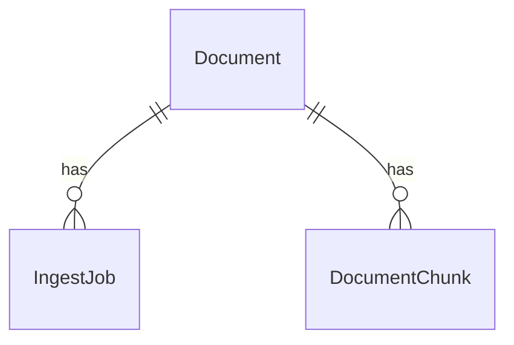
- Document 與 IngestJob、DocumentChunk 為一對多關係；DocumentChunk 以兩層 parent-child 結構持久化。Sources: [apps/api/src/app/db/models.py](), [ARCHITECTURE.md](), [PROJECT_STATUS.md]()

## 上傳與派送背景工作（API 服務）

### 上傳與資源建立
- 權限：需 maintainer 以上才可上傳（require_minimum_area_role）。Sources: [apps/api/src/app/services/documents.py]()
- storage_key 模式：{area_id}/{document_id}/{file_name}。Sources: [apps/api/src/app/services/documents.py]()
- 建立 Document（status=uploaded）後寫入物件儲存並建立 IngestJob，最後 dispatch Celery 任務。Sources: [apps/api/src/app/services/documents.py](), [PROJECT_STATUS.md]()

支援與辨識副檔名：
- SUPPORTED_TEXT_EXTENSIONS = {".txt", ".md"}（本階段真正處理的純文字型）。Sources: [apps/api/src/app/services/documents.py]()
- RECOGNIZED_EXTENSIONS = {".txt", ".md", ".pdf", ".docx", ".pptx", ".html", ".xlsx"}（在產品範圍內受控處理/失敗語意）。Sources: [apps/api/src/app/services/documents.py]()

刪除文件（delete_document）：
- 先移除 parse artifacts prefix 與原始檔，再刪除 chunks、jobs 與 document，確保不留儲存殘留。Sources: [apps/api/src/app/services/documents.py](), [ARCHITECTURE.md]()

解析產物路徑前綴：
- PARSE_ARTIFACTS_DIRECTORY = "artifacts"，以 storage_key 的 parent 路徑附掛。Sources: [apps/api/src/app/services/documents.py]()

程式片段（建立與刪除關鍵邏輯，節錄）
```python
# apps/api/src/app/services/documents.py
SUPPORTED_TEXT_EXTENSIONS = {".txt", ".md"}
RECOGNIZED_EXTENSIONS = {".txt", ".md", ".pdf", ".docx", ".pptx", ".html", ".xlsx"}
PARSE_ARTIFACTS_DIRECTORY = "artifacts"

def create_document_upload(...):
    require_minimum_area_role(...)
    file_name, content_type, payload = _read_validated_upload(...)
    document_id = str(uuid4())
    storage_key = str(PurePosixPath(area_id) / document_id / file_name)
    storage.put_object(object_key=storage_key, payload=payload, content_type=content_type)
    document = Document(..., status=DocumentStatus.uploaded, storage_key=storage_key, ...)
    # 建立 ingest job 並 dispatch Celery（略）

def delete_document(..., document_id: str) -> None:
    document = _get_authorized_document_for_write(...)
    storage.delete_prefix(prefix=_build_parse_artifact_prefix(storage_key=document.storage_key))
    storage.delete_object(object_key=document.storage_key)
    session.execute(delete(DocumentChunk).where(DocumentChunk.document_id == document.id))
    session.execute(delete(IngestJob).where(IngestJob.document_id == document.id))
    session.delete(document)
    session.commit()
```
Sources: [apps/api/src/app/services/documents.py]()

## 背景 Ingest 管線（Worker）

### 任務入口與防呆
- process_document_ingest(job_id, force_reparse=False)：取得設定與資料庫連線，讀取 job；若 job 缺失則 job-missing；若狀態不是 queued 則 job-skipped；若找不到對應 document，標記 job failed 並寫入可讀訊息。Sources: [apps/worker/src/worker/tasks/ingest.py]()

### 成功與失敗狀態處理
- _mark_failed：刪除該文件所有 chunks；job 設 failed 與錯誤訊息、計數歸零；document 設 failed 並清空 normalized_text、display_text、indexed_at。Sources: [apps/worker/src/worker/tasks/ingest.py]()
- _mark_succeeded：寫入 parent/child chunk 計數與 indexed_at；job 設 succeeded 並清空錯誤；document 設 ready。Sources: [apps/worker/src/worker/tasks/ingest.py]()

### 解析、切塊與索引
- Worker 會嘗試重用 parse artifacts；若無則依副檔名進行 provider-based parsing（PDF：marker/local/llamaparse），並統一回寫至內部 parser/chunk 合約（ParsedDocument/ParsedBlock）。Sources: [ARCHITECTURE.md](), [PROJECT_STATUS.md](), [Summary.md]()
- Chunk tree 採兩層 parent->child，並區分 structure_kind=text|table；表格具備保留/分段策略。Sources: [PROJECT_STATUS.md](), [Summary.md]()
- 完成 chunk 後進行 indexing（向量與 PGroonga FTS），最終置換 document 狀態為 ready。Sources: [PROJECT_STATUS.md](), [ROADMAP.md](), [README.zh-TW.md]()

程式片段（Worker 任務關鍵邏輯，節錄）
```python
# apps/worker/src/worker/tasks/ingest.py
@celery_app.task(name="worker.tasks.ingest.process_document_ingest")
def process_document_ingest(job_id: str, force_reparse: bool = False) -> str:
    job = session.get(IngestJob, normalized_job_id)
    if job is None:
        return "job-missing"
    if job.status != IngestJobStatus.queued:
        return "job-skipped"
    document = session.get(Document, job.document_id)
    if document is None:
        job.status = IngestJobStatus.failed
        job.stage = "failed"
        job.error_message = "找不到對應的 document。"
        session.commit()
        return "document-missing"

def _mark_failed(...):
    session.execute(delete(DocumentChunk).where(DocumentChunk.document_id == document.id))
    job.status = IngestJobStatus.failed
    job.stage = "failed"
    document.status = DocumentStatus.failed
    document.normalized_text = None
    document.display_text = None
    document.indexed_at = None
    session.commit()

def _mark_succeeded(...):
    indexed_at = datetime.now(UTC)
    job.stage = "finalizing"
    job.parent_chunk_count = len(chunking_result.parent_chunks)
    job.child_chunk_count = len(chunking_result.child_chunks)
    session.flush()
    job.status = IngestJobStatus.succeeded
    job.stage = "succeeded"
    document.status = DocumentStatus.ready
    document.indexed_at = indexed_at
    session.commit()
```
Sources: [apps/worker/src/worker/tasks/ingest.py]()

### 流程圖（Worker 視角）
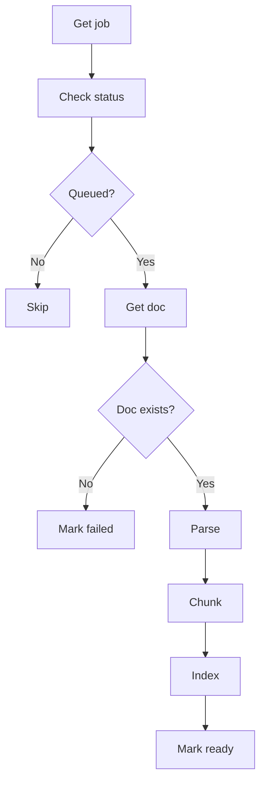
- 僅處理 queued 任務；若無對應文件則失敗；成功路徑為 Parse -> Chunk -> Index -> Mark ready。Sources: [apps/worker/src/worker/tasks/ingest.py](), [PROJECT_STATUS.md](), [README.zh-TW.md]()

## 端對端時序（上傳到 ready）
```mermaid
sequenceDiagram
autonumber
participant U as actor User
participant W as boundary Web
participant A as control API
participant S as collections Storage
participant D as database DB
participant Q as queue Celery
participant R as control Worker

U->>+W: 上傳檔案
W->>+A: POST /areas/{id}/documents
A->>+S: put_object(file)
S-->>-A: ok
A->>+D: insert Document(uploaded)
D-->>-A: ok
A->>+D: insert IngestJob(queued)
D-->>-A: ok
A-)+Q: dispatch(job)
A-->>-W: 201 document+job
Q-)+R: process(job)
R->>+D: get job queued?
D-->>-R: ok
R->>+D: get document
D-->>-R: ok
R->>+S: read object
S-->>-R: data
R->>R: parse→chunk→index
R->>+D: update job/doc ready
D-->>-R: ok
R--)-Q: done
W->>+A: GET job/doc
A-->>-W: status=ready
Note over W,A: 僅 ready 可檢索
```
- 派送後 Worker 非同步處理；完成後 Document 狀態為 ready，可進入檢索。Sources: [apps/api/src/app/services/documents.py](), [apps/worker/src/worker/tasks/ingest.py](), [ARCHITECTURE.md](), [PROJECT_STATUS.md]()

## 預覽與引用（Preview/Citations）介面契約
- DocumentPreviewResponse 提供 display_text 與子塊邊界（start_offset/end_offset），用於前端全文預覽與依 citation 定位。Sources: [apps/api/src/app/schemas/documents.py](), [ARCHITECTURE.md]()
- child chunk 按順序回傳，保留 structure_kind=text|table 與 heading，前端得以實作 chunk-aware 高亮與同步。Sources: [apps/api/src/app/schemas/documents.py](), [ARCHITECTURE.md]()

表 — DocumentPreviewChunk 欄位（節錄）
| 欄位             | 說明 |
|------------------|------|
| chunk_id         | 子塊 ID |
| parent_chunk_id  | 所屬 parent ID |
| child_index      | parent 下順序 |
| heading          | 區塊標題 |
| structure_kind   | text 或 table |
| start_offset     | 在 display_text 起點 |
| end_offset       | 在 display_text 終點 |
Sources: [apps/api/src/app/schemas/documents.py]()

## 解析與 Chunk Tree 設計
- 採 block-aware 合約：ParsedDocument/ParsedBlock，將 PDF/HTML/TXT/MD 等輸出轉回統一結構。Sources: [PROJECT_STATUS.md](), [Summary.md]()
- Chunk Tree 固定兩層：parent -> child；child 以 LangChain RCTS（於專案文件中）或表格分段策略產生，並在 SQL 中以 structure_kind=text|table 持久化。Sources: [PROJECT_STATUS.md](), [ARCHITECTURE.md]()
- PDF 採 provider-based parsing：marker（預設）、local、llamaparse；最終都回到 Markdown/統一 parser。Sources: [ARCHITECTURE.md](), [PROJECT_STATUS.md]()

流程圖 — 解析到切塊
```mermaid
graph TD
  A[Load file] --> B{Has artifacts?}
  B -->|Yes| C[Reuse parse]
  B -->|No| D[Route parser]
  D --> E[PDF provider]
  C --> F[Build blocks]
  E --> F[Build blocks]
  F --> G[Parent sections]
  G --> H[Child split]
  H --> I[Chunk tree]
```
- 有可重用 artifacts 時優先重建；否則依副檔名與 provider 解析，最後落入統一 chunk tree。Sources: [ARCHITECTURE.md](), [PROJECT_STATUS.md]()

## 物件儲存與 Parse Artifacts
- 原始檔存儲於 MinIO，鍵為 {area_id}/{document_id}/{file_name}。Sources: [apps/api/src/app/services/documents.py]()
- Parse artifacts 放於同文件資料夾下的 artifacts/ 前綴，Worker 會嘗試重用以加速處理。Sources: [apps/api/src/app/services/documents.py](), [ARCHITECTURE.md]()
- 可重用 artifacts 範例：marker.cleaned.md、llamaparse.cleaned.md、pdf.unstructured.extracted.html、xlsx.extracted.html、docx.extracted.html、pptx.extracted.html。Sources: [ARCHITECTURE.md]()

## 授權與 SQL Gate 交會
- 上傳需 maintainer 以上（API 層先檢查角色）；區域刪除前需先清物件儲存，避免狀態分裂。Sources: [apps/api/src/app/services/documents.py](), [ARCHITECTURE.md]()
- 檢索必須在 SQL 層先 gate，且非 ready 文件不得進入檢索或被回傳。Sources: [ARCHITECTURE.md](), [AGENTS.md]()

## 前端型別與 E2E 行為
- Web 型別同步對應 DocumentStatus/IngestJobStatus/ChunkSummary 等 API 契約；在 UI 以 ready 作為檢索可用標記。Sources: [apps/web/src/lib/types.ts]()
- E2E：建立 Area -> 管理文件 -> 上傳 -> 等待 ready -> 問答並驗證回答。Sources: [apps/web/tests/smoke/specs/phase6-full-flow.smoke.spec.ts]()

## 端點與回應摘要（文件/工作）
表 — 文件與工作回傳物件（節錄）
| 型別                 | 欄位（節錄）                                           | 用途 |
|----------------------|--------------------------------------------------------|------|
| DocumentSummary      | id, area_id, file_name, content_type, file_size, status, chunk_summary, created_at, updated_at | 文件摘要 |
| IngestJobSummary     | id, document_id, status, stage, chunk_summary, error_message, created_at, updated_at | 工作摘要 |
| DocumentListResponse | items: DocumentSummary[]                               | 列表 |
| UploadDocumentResponse| document, job                                         | 上傳回傳 |
| ReindexDocumentResponse| document, job                                        | 重建索引回傳 |
Sources: [apps/api/src/app/schemas/documents.py]()

## 結語
本模組以 API/Worker 分層協作，透過物件儲存與資料庫持久化將文件從上傳一路推進至 parse->chunk->index->ready，並以嚴格的狀態機制與 RBAC/SQL gate 確保安全與一致性。Preview 與 chunk-aware citation 契約，為後續檢索與對話體驗提供可靠基礎。Sources: [ARCHITECTURE.md](), [apps/api/src/app/services/documents.py](), [apps/worker/src/worker/tasks/ingest.py](), [apps/api/src/app/schemas/documents.py](), [PROJECT_STATUS.md]()

---

<a id='page-6'></a>

## 資料庫結構、遷移與 RPC

### Related Pages

Related topics: [檢索管線：SQL Gate、向量與 FTS、RRF 與 Rerank](#page-9), [部署拓撲、Caddy 與單一公開入口](#page-11)

<details>
<summary>Relevant source files</summary>

The following files were used as context for generating this wiki page:

- [ARCHITECTURE.md](https://github.com/easypinex/deep-agent-rag-stack/blob/main/ARCHITECTURE.md)
- [ROADMAP.md](https://github.com/easypinex/deep-agent-rag-stack/blob/main/ROADMAP.md)
- [PROJECT_STATUS.md](https://github.com/easypinex/deep-agent-rag-stack/blob/main/PROJECT_STATUS.md)
- [Summary.md](https://github.com/easypinex/deep-agent-rag-stack/blob/main/Summary.md)
- [README.zh-TW.md](https://github.com/easypinex/deep-agent-rag-stack/blob/main/README.zh-TW.md)
- [README.md](https://github.com/easypinex/deep-agent-rag-stack/blob/main/README.md)
- [apps/api/src/app/schemas/documents.py](https://github.com/easypinex/deep-agent-rag-stack/blob/main/apps/api/src/app/schemas/documents.py)
- [apps/web/tests/smoke/specs/phase6-full-flow.smoke.spec.ts](https://github.com/easypinex/deep-agent-rag-stack/blob/main/apps/web/tests/smoke/specs/phase6-full-flow.smoke.spec.ts)
- [apps/web/tests/e2e/specs/auth-areas.spec.ts](https://github.com/easypinex/deep-agent-rag-stack/blob/main/apps/web/tests/e2e/specs/auth-areas.spec.ts)
</details>

# 資料庫結構、遷移與 RPC

本頁說明本專案的資料庫結構、遷移策略與檢索用 RPC（match_chunks）的職責分工與資料流。資料層以 Supabase PostgreSQL 為核心，啟用 pgvector 與 PGroonga 以支援向量召回與中文全文召回；最終排序（RRF、rerank）則保留於 Python 層。遷移採用「Supabase migrations 作為 bootstrap + Alembic 升級」的雙軌策略，並提供 migration runner 接手既有 schema。Sources: [ARCHITECTURE.md](), [ROADMAP.md](), [PROJECT_STATUS.md](), [Summary.md](), [README.zh-TW.md]()

## 技術棧與分層職責

- 資料庫與索引
  - Supabase PostgreSQL 啟用 pgvector 與 PGroonga；以 PGroonga 提供不需字典維護的繁體中文檢索。Sources: [ARCHITECTURE.md](), [ROADMAP.md](), [PROJECT_STATUS.md](), [Summary.md]()
- 召回與排序
  - match_chunks RPC：只負責 SQL gate（area/status/filter）、向量召回與 PGroonga 全文召回，並回傳 vector_rank / fts_rank 等最小排序輸入。Sources: [ARCHITECTURE.md](), [ROADMAP.md]()
  - Python 層：執行 RRF、rerank（Cohere v4 或 deterministic）、table-aware assembler；嚴格維持 deny-by-default 與 ready-only 邏輯。Sources: [PROJECT_STATUS.md](), [ARCHITECTURE.md]()
- 安全與邊界
  - deny-by-default、same-404、ready-only 必須在 SQL gate 層生效，避免回傳未授權與未 ready 的資料。Sources: [ARCHITECTURE.md](), [AGENTS.md](), [Summary.md]()

## 資料表與關聯模型

下圖概述核心資料表與關聯。欄位僅列出文件中明確出現者（含狀態與關聯鍵），其餘以高階語意描述。

```mermaid
erDiagram
  AREAS ||--o{ DOCUMENTS : contains
  AREAS ||--o{ AREA_USER_ROLES : "user role"
  AREAS ||--o{ AREA_GROUP_ROLES : "group role"
  DOCUMENTS ||--o{ INGEST_JOBS : "ingest for"
  DOCUMENTS ||--o{ DOCUMENT_CHUNKS : "parent/child"
  DOCUMENT_CHUNKS ||--o{ DOCUMENT_CHUNKS : "parent->child"

  AREAS {
    uuid id PK
    text name
    text description
  }

  AREA_USER_ROLES {
    uuid area_id FK
    text user_sub
    text role  // reader|maintainer|admin
  }

  AREA_GROUP_ROLES {
    uuid area_id FK
    text group_path
    text role  // reader|maintainer|admin
  }

  DOCUMENTS {
    uuid id PK
    uuid area_id FK
    text file_name
    text content_type
    int file_size
    text status  // uploaded|processing|ready|failed
    text display_text  // ready-only preview source
    timestamptz created_at
    timestamptz updated_at
  }

  INGEST_JOBS {
    uuid id PK
    uuid document_id FK
    text status  // queued|processing|succeeded|failed
    text stage
    text error_message
    timestamptz created_at
    timestamptz updated_at
  }

  DOCUMENT_CHUNKS {
    uuid id PK
    uuid document_id FK
    uuid parent_id  // null for parent
    text structure_kind  // text|table
    vector embedding
    text content
    text heading
    int start_offset
    int end_offset
  }
```

- Areas：以 direct 角色與 Keycloak group 角色合併計算 effective role，作為 SQL gate 基礎。Sources: [ROADMAP.md](), [PROJECT_STATUS.md](), [Summary.md]()
- Documents：生命週期 uploaded → processing → ready|failed；只有 ready 可進檢索與預覽。Sources: [ARCHITECTURE.md](), [PROJECT_STATUS.md](), [Summary.md]()
- Ingest jobs：分離文件狀態與背景處理狀態，保留 stage、錯誤與 chunk 摘要。Sources: [PROJECT_STATUS.md](), [apps/api/src/app/schemas/documents.py]()
- Document chunks：SQL-first parent→child，含 structure_kind=text|table、embedding、offset 與 heading 等檢索所需欄位。Sources: [ARCHITECTURE.md](), [PROJECT_STATUS.md](), [Summary.md]()

## 狀態模型與約束

### 文件與 Job 狀態

| 實體 | 狀態列舉 | 說明 |
|---|---|---|
| documents.status | uploaded, processing, ready, failed | 只有 ready 可檢索與預覽 |
| ingest_jobs.status | queued, processing, succeeded, failed | pipeline 觀測與錯誤回饋 |
| document_chunks.structure_kind | text, table | chunk 結構語意，支援表格感知 |

Sources: [ARCHITECTURE.md](), [PROJECT_STATUS.md](), [Summary.md](), [apps/api/src/app/schemas/documents.py]()

### 狀態流與資料一致性

```mermaid
graph TD
  A[Upload] --> B[API create\ndocument+job]
  B --> C[Store raw\nMinIO]
  C --> D[Worker parse]
  D --> E[Chunk tree\n(parent/child)]
  E --> F[Indexing\npgvector/PGroonga]
  F --> G[Doc status\nready|failed]

  style A fill:#e8f,stroke:#333
  style G fill:#efe,stroke:#333
```

- parse→chunk→index→ready 為正式路徑；reindex 以 replace-all 語意重建 chunks；delete 需先清除 storage 再清資料。Sources: [PROJECT_STATUS.md](), [ARCHITECTURE.md]()
- area hard delete 前必須清除 documents 的 storage artifacts；清理失敗不得刪除資料庫記錄。Sources: [ARCHITECTURE.md]()

## 遷移策略與 Migration Runner

資料層遷移採雙軌管控：
- Supabase migrations：`supabase/migrations/` 作為 schema 正式來源與雲端對齊。Sources: [ARCHITECTURE.md](), [PROJECT_STATUS.md]()
- Alembic + migration runner：啟動時以 `python -m app.db.migration_runner` 接手已存在的 Supabase bootstrap schema，補 stamp 並升級至最新 head。Sources: [ARCHITECTURE.md](), [PROJECT_STATUS.md]()

```mermaid
graph TD
  A[Start API] --> B[Detect schema]
  B --> C[Supabase\nbootstrap?]
  C -->|Yes| D[Runner stamp]
  D --> E[Alembic\nupgrade head]
  C -->|No| E
```

- 單一公開入口與 infra 統一：Caddy 為唯一對外入口；compose 內既有 DB 升級入口固定為 migration runner。Sources: [README.zh-TW.md](), [Summary.md](), [ARCHITECTURE.md]()

## Hybrid Search RPC：match_chunks

RPC 的設計原則為「資料庫職責收斂」：
- 輸入：依 area、status 與必要的 metadata filters 做 SQL gate；執行向量召回與 PGroonga 全文召回。Sources: [ARCHITECTURE.md](), [ROADMAP.md]()
- 輸出：僅回傳候選與 vector_rank / fts_rank 等最小排序輸入。Sources: [ARCHITECTURE.md]()
- 非職責：最終排序策略（RRF）、業務排序規則、rerank 與 assembler 全留在 Python。Sources: [ARCHITECTURE.md](), [ROADMAP.md]()

```mermaid
sequenceDiagram
autonumber
participant C as control Client
participant A as control API
participant DB as database Postgres/PG
participant PY as control Python Rank
participant AS as control Assembler

C->>+A: Query in area
A->>+DB: call match_chunks()
DB-->>-A: candidates + ranks
A->>+PY: RRF + rerank
PY-->>-A: ranked parents
A->>+AS: assemble contexts
AS-->>-A: chat-ready contexts
A-->>C: citations + answer

Note over DB: SQL gate +<br/>vector + FTS
Note over PY: RRF in Python;<br/>fail-open on rerank
```

- 關鍵保護：SQL gate 必須先執行；same-404 與 ready-only 保持一致；rerank 失敗 fail-open，但不得越權或鬆綁 gate。Sources: [ARCHITECTURE.md](), [PROJECT_STATUS.md]()

## Chunk Tree 與表格感知

- SQL-first chunk schema：以實體欄位保存 parent-child 關聯、position、heading、offset、structure_kind 等，不得放進半結構欄位。Sources: [ARCHITECTURE.md]()
- 表格規則：Markdown/HTML/XLSX/DOCX/PPTX 支援表格感知；小表整表保留，超大表以 row-group 分段，child 可重複表頭；offset 仍須對回 display_text。Sources: [ARCHITECTURE.md](), [PROJECT_STATUS.md](), [Summary.md]()
- 檢索材化：assembler 以 parent 為單位，precision-first；table 命中時優先補齊整表與前後說明文字；同 parent 多命中以 parent 邊界去重。Sources: [PROJECT_STATUS.md]()

```mermaid
classDiagram
  class Document {
    +uuid id
    +uuid area_id
    +status
  }
  class Chunk {
    +uuid id
    +uuid document_id
    +uuid parent_id?
    +structure_kind: text|table
    +heading
    +content
    +start_offset
    +end_offset
    +embedding
  }

  Document "1" --> "many" Chunk : has
  Chunk "1" --> "many" Chunk : children
```

Sources: [ARCHITECTURE.md](), [PROJECT_STATUS.md]()

## 資料介面與觀測

API 回傳以摘要與預覽為核心，對齊資料層結構：
- DocumentSummary 與 IngestJobSummary 皆含 chunk_summary、狀態、時間戳；Preview 採 display_text + child chunk map，ready-only 且 same-404。Sources: [ARCHITECTURE.md](), [PROJECT_STATUS.md](), [apps/api/src/app/schemas/documents.py]()

範例（schemas）：
```python
class ChunkSummary(BaseModel):
    total_chunks: int
    parent_chunks: int
    child_chunks: int
    mixed_structure_parents: int
    text_table_text_clusters: int
    last_indexed_at: datetime | None

class DocumentSummary(BaseModel):
    id: UUID
    area_id: UUID
    file_name: str
    content_type: str
    file_size: int
    status: DocumentStatus
    chunk_summary: ChunkSummary
    created_at: datetime
    updated_at: datetime
```
Sources: [apps/api/src/app/schemas/documents.py]()

E2E/Smoke 行為驗證（反映資料層約束與計數）：
- 上傳 → ready 並顯示 chunk 計數與錯誤訊息（損毀 PDF 為 failed，chunks=0）。Sources: [apps/web/tests/e2e/specs/auth-areas.spec.ts]()
- Chat 僅在文件 ready 後可獲得與內容相符的回答與 citations。Sources: [apps/web/tests/smoke/specs/phase6-full-flow.smoke.spec.ts]()

## 安全與授權 SQL Gate

- deny-by-default：無有效角色者不可見資源；不得以前端隱藏取代授權。Sources: [ARCHITECTURE.md](), [AGENTS.md](), [Summary.md]()
- SQL gate 為主要保護層：禁止先撈全量後於記憶體過濾；檢索與預覽 route 必須維持 same-404 與 ready-only。Sources: [ARCHITECTURE.md](), [PROJECT_STATUS.md]()

```mermaid
graph TD
  U[Caller] --> G[SQL gate]
  G -->|ok| R[Recall]
  G -->|deny| X[404 same]
  R --> J[RRF/rerank]
  J --> S[Assemble]
```

Sources: [ARCHITECTURE.md](), [PROJECT_STATUS.md]()

## 單一公開入口與資料層整合

- 入口與路由：`/` Web、`/api/*` API、`/auth/*` Keycloak；Caddy 提供 443 與自動 TLS。資料庫升級由 migration runner 管控。Sources: [README.zh-TW.md](), [Summary.md](), [ARCHITECTURE.md]()

## 總結

本專案的資料層以 Supabase PostgreSQL 為核心，透過 PGroonga 與 pgvector 支援 hybrid recall，並以 match_chunks RPC 將資料庫職責收斂於「授權與候選召回」。最終排序、成本控管與表格感知的上下文組裝全部留在 Python，維持演進彈性。遷移面則以 Supabase migrations 做 bootstrap，再由 migration runner 對齊 Alembic head，確保本機與雲端的一致性與升級可靠性。Sources: [ARCHITECTURE.md](), [ROADMAP.md](), [PROJECT_STATUS.md](), [Summary.md](), [README.zh-TW.md]()

---

<a id='page-7'></a>

## 一頁式戰情室 UI 與文件預覽

### Related Pages

Related topics: [聊天執行：Deep Agents 與 LangGraph Server](#page-10), [知識區域與權限管理](#page-4)

<details>
<summary>Relevant source files</summary>

The following files were used as context for generating this wiki page:

- [apps/web/src/components/layout/DashboardLayout.tsx](https://github.com/easypinex/deep-agent-rag-stack/blob/main/apps/web/src/components/layout/DashboardLayout.tsx)
- [apps/web/src/pages/AreasPage.tsx](https://github.com/easypinex/deep-agent-rag-stack/blob/main/apps/web/src/pages/AreasPage.tsx)
- [apps/web/src/features/documents/components/DocumentsDrawer.tsx](https://github.com/easypinex/deep-agent-rag-stack/blob/main/apps/web/src/features/documents/components/DocumentsDrawer.tsx)
- [apps/web/src/features/chat/components/ChatPanel.tsx](https://github.com/easypinex/deep-agent-rag-stack/blob/main/apps/web/src/features/chat/components/ChatPanel.tsx)
- [apps/web/src/lib/types.ts](https://github.com/easypinex/deep-agent-rag-stack/blob/main/apps/web/src/lib/types.ts)
- [ARCHITECTURE.md](https://github.com/easypinex/deep-agent-rag-stack/blob/main/ARCHITECTURE.md)
- [apps/web/README.zh-TW.md](https://github.com/easypinex/deep-agent-rag-stack/blob/main/apps/web/README.zh-TW.md)
- [README.zh-TW.md](https://github.com/easypinex/deep-agent-rag-stack/blob/main/README.zh-TW.md)
- [apps/web/tests/e2e/specs/auth-areas.spec.ts](https://github.com/easypinex/deep-agent-rag-stack/blob/main/apps/web/tests/e2e/specs/auth-areas.spec.ts)
- [apps/web/tests/smoke/specs/pdf-upload.smoke.spec.ts](https://github.com/easypinex/deep-agent-rag-stack/blob/main/apps/web/tests/smoke/specs/pdf-upload.smoke.spec.ts)
- [apps/web/tests/smoke/specs/llamaparse-pdf-upload.smoke.spec.ts](https://github.com/easypinex/deep-agent-rag-stack/blob/main/apps/web/tests/smoke/specs/llamaparse-pdf-upload.smoke.spec.ts)
</details>

# 一頁式戰情室 UI 與文件預覽

本頁說明前端「一頁式戰情室」的 UI 佈局與文件預覽能力，涵蓋頁面組件結構、資料流、與端到端互動。此戰情室以 Dashboard 形式整合左側 Knowledge Areas 導覽、中央 Chat 與右側文件管理抽屜/全文預覽，支援文件上傳、索引狀態觀察、以及對話期間的 citation 對應全文定位。Sources: [ARCHITECTURE.md](), [apps/web/README.zh-TW.md](), [README.zh-TW.md]()

系統將「登入 → 選取 Area → 管理文件 → 提問與查看引用」整合在單頁工作區中，並透過 E2E/Smoke 測試驗證文件上傳與 ready 狀態、抽屜操作、與 Chat 基礎流程。Sources: [apps/web/tests/e2e/specs/auth-areas.spec.ts](), [apps/web/tests/smoke/specs/pdf-upload.smoke.spec.ts](), [apps/web/tests/smoke/specs/llamaparse-pdf-upload.smoke.spec.ts]()

## 佈局與工作區組合

本節以 DashboardLayout 與 AreasPage 為中心，說明戰情室頁如何組裝側邊欄、主內容與頂部工具列。Sources: [apps/web/src/components/layout/DashboardLayout.tsx](), [apps/web/src/pages/AreasPage.tsx]()

### DashboardLayout：頁面骨架與受保護工作區標示
- 提供 props：children、sidebar、headerActions，並以雙欄結構呈現。左側 aside 容納區域導覽；右側為主內容區。頂部 header 帶有「Protected Workspace」標示與動作列。Sources: [apps/web/src/components/layout/DashboardLayout.tsx]()
- 與 AuthProvider 整合，透過 useAuth 取得 principal 與 logout。Sources: [apps/web/src/components/layout/DashboardLayout.tsx]()
- 視覺區塊：
  - Sidebar：固定寬度 w-80，包含品牌連結與導覽內容插槽。
  - Header：顯示 Protected Workspace 與右側自訂動作。
  - Content：主內容顯示核心互動（如 Areas 詳細、Chat、抽屜/Modal 觸發）。Sources: [apps/web/src/components/layout/DashboardLayout.tsx]()

簡化片段：
```tsx
// apps/web/src/components/layout/DashboardLayout.tsx
interface DashboardLayoutProps {
  children: ReactNode;
  sidebar?: ReactNode;
  headerActions?: ReactNode;
}
// ...aside for sidebar...
// ...header with "Protected Workspace"...
```
Sources: [apps/web/src/components/layout/DashboardLayout.tsx]()

### AreasPage：工作區載入、區域選取與抽屜/Modal 管理
- 狀態：areas、selectedAreaId、selectedArea、workspaceError/Notice、isDocumentsOpen、isAccessOpen、isAreaEditOpen、isDeletingArea。Sources: [apps/web/src/pages/AreasPage.tsx]()
- 啟動時執行 loadWorkspace：
  - 併發 fetchAuthContext 與 fetchAreas
  - 決定預設選取區域順序：preferredAreaId → 先前選取 → 第一個 area → null
  - 若有選取，進一步載入單一 area 詳細資料；錯誤時清空並顯示 workspaceError。Sources: [apps/web/src/pages/AreasPage.tsx]()
- 匯入組件：DashboardLayout、AreaSidebar、AccessModal、AreaEditModal、DocumentsDrawer、ChatPanel。Sources: [apps/web/src/pages/AreasPage.tsx]()

Mermaid 流程圖（工作區載入與區域選取）：
```mermaid
graph TD
  A[Page mount] --> B[loadWorkspace]
  B --> C[fetchAuthContext]
  B --> D[fetchAreas]
  C --> E[set auth ctx]
  D --> F[set areas]
  F --> G{select area?}
  G -->|yes| H[loadArea]
  G -->|no| I[clear selection]
  H --> J[set selectedArea]
  I --> K[no area UI]
  B --> L{error?}
  L -->|yes| M[set workspaceError]
```
Sources: [apps/web/src/pages/AreasPage.tsx]()

## 文件管理抽屜（DocumentsDrawer）

右側滑出抽屜，於不中斷對話的前提下管理所選 Area 的文件生命周期、狀態、與全文預覽快取。Sources: [apps/web/src/features/documents/components/DocumentsDrawer.tsx](), [apps/web/src/lib/types.ts](), [ARCHITECTURE.md]()

### Props、狀態與快取
- Props：isOpen、onClose、areaId、areaName、effectiveRole。Sources: [apps/web/src/features/documents/components/DocumentsDrawer.tsx]()
- 狀態：
  - documents、documentJobs
  - previewDocumentCache（document_id → DocumentPreviewPayload）
  - selectedDocumentId、selectedChunkId、hoverChunkId
  - isLoading、isPreviewLoading、isSubmittingUpload
  - uploadFile、activeActionId、error、notice
  - 滾動/對齊輔助 refs：chunkListContainerRef、chunkItemRefs、lastChunkSelectionSourceRef。Sources: [apps/web/src/features/documents/components/DocumentsDrawer.tsx]()
- 文件載入：loadDocuments 透過 fetchDocuments(areaId) 取得清單與摘要（含 chunk 統計），錯誤時填入 error。Sources: [apps/web/src/features/documents/components/DocumentsDrawer.tsx]()

簡化片段（介面與摘要工具）：
```tsx
// apps/web/src/features/documents/components/DocumentsDrawer.tsx
interface DocumentsDrawerProps {
  isOpen: boolean;
  onClose: () => void;
  areaId: string;
  areaName: string;
  effectiveRole: string;
}
function formatChunkSummary(document: DocumentSummary): string {
  return `${document.chunk_summary.total_chunks} chunks (${document.chunk_summary.parent_chunks} parent / ${document.chunk_summary.child_chunks} child)`;
}
function buildChunkExcerpt(preview: DocumentPreviewPayload, startOffset: number, endOffset: number): string {
  const content = preview.display_text.slice(Math.max(0, startOffset), Math.max(startOffset, endOffset)).replace(/\s+/g, " ").trim();
  return content ? (content.length > 140 ? `${content.slice(0, 140)}…` : content) : "此 chunk 沒有可顯示的文字內容。";
}
```
Sources: [apps/web/src/features/documents/components/DocumentsDrawer.tsx]()

### 上傳、重新索引與刪除
- API 函式：uploadDocument、reindexDocument、deleteDocument、fetchIngestJob（狀態顯示）。Sources: [apps/web/src/features/documents/components/DocumentsDrawer.tsx]()
- E2E 驗證：
  - 上傳 PDF/Markdown → 列表出現檔名與 ready 狀態，並顯示「N chunks (P parent / C child)」。Sources: [apps/web/tests/e2e/specs/auth-areas.spec.ts](), [apps/web/tests/smoke/specs/pdf-upload.smoke.spec.ts]()
  - 損毀 PDF → 顯示 failed 與 parser 訊息，chunk 統計為 0/0；預覽區顯示「尚未可預覽」。Sources: [apps/web/tests/e2e/specs/auth-areas.spec.ts]()
  - maintainer 可刪除文件，刪除後列表移除該項。Sources: [apps/web/tests/e2e/specs/auth-areas.spec.ts]()

### 全文預覽與 chunk 對齊
- 預覽資料型別：
  - DocumentPreviewPayload：document_id、file_name、content_type、display_text、chunks。Sources: [apps/web/src/lib/types.ts]()
  - PreviewChunk：chunk_id、parent_chunk_id、child_index、heading、structure_kind、start_offset、end_offset。Sources: [apps/web/src/lib/types.ts]()
- 抽屜與右側 DocumentPreviewPane 搭配，依 chunk offset 範圍建立 excerpt 與卷動定位。Sources: [apps/web/src/features/documents/components/DocumentsDrawer.tsx](), [ARCHITECTURE.md]()

資料型別摘要表：
| 型別 | 欄位 | 說明 |
|---|---|---|
| DocumentPreviewPayload | document_id, file_name, content_type, display_text, chunks | 預覽全文與 child chunk 範圍定義 |
| PreviewChunk | chunk_id, parent_chunk_id, child_index, heading, structure_kind, start_offset, end_offset | 子 chunk 邊界、結構型別與標題資訊 |
Sources: [apps/web/src/lib/types.ts]()

Mermaid 流程圖（文件上傳到 ready 顯示於抽屜）：
```mermaid
graph TD
  A[User select file] --> B[uploadDocument]
  B --> C[API ingest]
  C --> D[fetchIngestJob]
  D --> E{status ready?}
  E -->|yes| F[fetchDocuments]
  F --> G[Update list]
  E -->|no| D
```
Sources: [apps/web/src/features/documents/components/DocumentsDrawer.tsx](), [apps/web/tests/smoke/specs/pdf-upload.smoke.spec.ts](), [apps/web/tests/e2e/specs/auth-areas.spec.ts]()

## 對話與全文預覽整合（ChatPanel）

ChatPanel 提供 area-scoped 對話、串流更新、與 citation 觸發的全文預覽行為。Sources: [apps/web/src/features/chat/components/ChatPanel.tsx](), [apps/web/src/lib/types.ts](), [ARCHITECTURE.md]()

### Props 與狀態
- Props：areaId、accessTokenGetter、onError、onNoticeClear。Sources: [apps/web/src/features/chat/components/ChatPanel.tsx]()
- 狀態：
  - chatQuestion、chatMessages、isSubmittingChat
  - isPreviewOpen、isPreviewLoading
  - previewDocumentCache（document_id → DocumentPreviewPayload）
  - activePreviewCitation（ChatContextReference 或 null）
  - isChatSubmitLockedRef（避免重複送出）Sources: [apps/web/src/features/chat/components/ChatPanel.tsx]()

### 資料載入與串流
- 當 areaId 改變：
  - 清空輸入、預覽與訊息鎖
  - 透過 loadAreaThreadHistory(areaId, accessTokenGetter) 載入歷史訊息
  - 以 createUserMessage / createAssistantMessage 轉為前端 ViewModel 並 setChatMessages。Sources: [apps/web/src/features/chat/components/ChatPanel.tsx]()
- 送出問題時，透過 streamAreaThreadChat 串流更新，搭配 applyStreamUpdate / updateLastAssistantMessage 更新畫面。Sources: [apps/web/src/features/chat/components/ChatPanel.tsx]()

### 引用與全文預覽
- 當使用者點選 citation，使用 fetchDocumentPreview 取得 DocumentPreviewPayload，打開右側 DocumentPreviewPane，並依引用 start_offset/end_offset 進行卷動與高亮。Sources: [apps/web/src/features/chat/components/ChatPanel.tsx](), [ARCHITECTURE.md]()

Mermaid 序列圖（Chat 串流與全文預覽）：
```mermaid
sequenceDiagram
  autonumber
  participant U as actor User
  participant CP as control ChatPanel
  participant LG as boundary LangGraph Transport
  participant API as boundary API
  participant DP as boundary DocPreview Pane

  U->>+CP: Select Area
  CP->>+LG: loadAreaThreadHistory
  LG-->>-CP: History messages
  CP-->>U: Render messages

  U->>+CP: Submit question
  CP->>+LG: streamAreaThreadChat
  LG-->>CP: Stream updates
  CP-->>U: Incremental render
  LG-->>-CP: Stream end

  U->>+CP: Click citation
  CP->>+API: fetchDocumentPreview
  API-->>-CP: DocumentPreviewPayload
  CP->>+DP: Open & scroll
  DP-->>-U: Highlight chunk
```
Sources: [apps/web/src/features/chat/components/ChatPanel.tsx](), [ARCHITECTURE.md]()

### Chat 資料結構（前端 ViewModel）
- ChatMessageViewModel：id、role、content、answerBlocks、citations、phaseState、toolCalls、isStreaming、isError、usedKnowledgeBase、selectedCitationContextIndex。Sources: [apps/web/src/lib/types.ts]()
- ChatContextReference：提供 context_label、document_id/name、parent/child chunk 關聯、heading、structure_kind、offset、excerpt、source、truncated。Sources: [apps/web/src/lib/types.ts]()

摘要表：
| 結構 | 關鍵欄位 | 用途 |
|---|---|---|
| ChatMessageViewModel | role, content, citations, phaseState, toolCalls | 前端訊息呈現與串流狀態控制 |
| ChatContextReference | document_id, parent_chunk_id, child_chunk_ids, start_offset, end_offset, excerpt | citation 與全文定位的橋接 |
Sources: [apps/web/src/lib/types.ts]()

## 端到端互動與測試佐證

本節以 E2E 與 Smoke 測試片段，驗證從登入、建立 Area、開啟抽屜與上傳，到 ready 狀態顯示與 chunk 統計的正確性。Sources: [apps/web/tests/e2e/specs/auth-areas.spec.ts](), [apps/web/tests/smoke/specs/pdf-upload.smoke.spec.ts](), [apps/web/tests/smoke/specs/llamaparse-pdf-upload.smoke.spec.ts]()

- 登入與進入 Areas：
  - 若已認證，直接前往 Areas；否則進 Keycloak 登入後回 Areas。Smoke 覆蓋登入頁跳轉與帳密填寫。Sources: [apps/web/tests/smoke/specs/pdf-upload.smoke.spec.ts]()
- 建立 Area 與開啟文件抽屜：
  - 透過「管理文件」按鈕開啟抽屜，上傳 PDF 或 Markdown。Sources: [apps/web/tests/e2e/specs/auth-areas.spec.ts]()
- 上傳成功與狀態檢查：
  - 檢查列表含檔名、狀態「ready」、以及「N chunks (P parent / C child)」。Sources: [apps/web/tests/e2e/specs/auth-areas.spec.ts](), [apps/web/tests/smoke/specs/pdf-upload.smoke.spec.ts]()
- 損毀 PDF 失敗案例：
  - 顯示「failed」、具體 parser 訊息、chunk 為 0/0，且預覽區顯示「尚未可預覽」。Sources: [apps/web/tests/e2e/specs/auth-areas.spec.ts]()
- LlamaParse gated smoke：
  - 在特定環境變數下執行，流程同上並最終應見 ready。Sources: [apps/web/tests/smoke/specs/llamaparse-pdf-upload.smoke.spec.ts]()

Mermaid 流程圖（E2E 高層路徑）：
```mermaid
graph TD
  A[Login] --> B[Areas Page]
  B --> C[Create Area]
  C --> D[Open Drawer]
  D --> E[Upload File]
  E --> F{Ingest done?}
  F -->|ready| G[Show ready]
  F -->|failed| H[Show error]
  G --> I[Chunks visible]
```
Sources: [apps/web/tests/e2e/specs/auth-areas.spec.ts](), [apps/web/tests/smoke/specs/pdf-upload.smoke.spec.ts]()

## 前端 API 協作摘要

基於元件匯入可觀察到下列前端 API/transport 幫手函式，對應主要行為如下。Sources: [apps/web/src/features/documents/components/DocumentsDrawer.tsx](), [apps/web/src/pages/AreasPage.tsx](), [apps/web/src/features/chat/components/ChatPanel.tsx]()

| 模組 | 函式/用途 | 說明 |
|---|---|---|
| lib/api | fetchAuthContext | 載入登入後 principal 資訊 |
| lib/api | fetchAreas / fetchAreaDetail | 載入區域清單與單一區域詳細 |
| lib/api | fetchDocuments | 抽屜內載入文件清單與摘要 |
| lib/api | uploadDocument | 上傳檔案並啟動背景 ingest |
| lib/api | fetchDocumentPreview | 取得全文預覽與 chunk 範圍 |
| lib/api | reindexDocument / deleteDocument | 針對文件的維運操作 |
| lib/api | fetchIngestJob | 顯示/輪詢 ingest job 狀態 |
| chat/transport/langgraph | loadAreaThreadHistory | 載入對話歷史 |
| chat/transport/langgraph | streamAreaThreadChat | 串流對話更新 |
Sources: [apps/web/src/features/documents/components/DocumentsDrawer.tsx](), [apps/web/src/pages/AreasPage.tsx](), [apps/web/src/features/chat/components/ChatPanel.tsx]()

## 與架構文件的一致性

- 單頁戰情室：DashboardLayout、AreaSidebar、ChatPanel、DocumentPreviewPane、DocumentsDrawer、AccessModal 的角色分工與 ARCHITECTURE 記載一致。Sources: [ARCHITECTURE.md]()
- 文件生命週期與 ready-only 檢視：抽屜 UI 與測試流程均呈現 uploaded → processing → ready/failed，以及 ready 文件才進入檢視/檢索的原則（UI層見狀態，檢索原則源自架構敘述）。Sources: [ARCHITECTURE.md](), [apps/web/tests/e2e/specs/auth-areas.spec.ts]()
- 前端 README 指出一頁式 Dashboard、Keycloak 正式登入/回呼，以及以 Documents/Chat 整合在 /areas 頁的操作體驗。Sources: [apps/web/README.zh-TW.md](), [README.zh-TW.md]()

## 結語

一頁式戰情室將 Areas 導覽、文件管理抽屜與 Chat 整合在單頁佈局中。DocumentsDrawer 提供上傳、狀態觀察與全文預覽快取；ChatPanel 以串流方式呈現回答並可依 citation 觸發全文定位。上述互動與狀態管理，透過前端 API 幫手函式與測試案例得以驗證，並與架構文件所述的 ready-only 與組件責任一致。Sources: [apps/web/src/components/layout/DashboardLayout.tsx](), [apps/web/src/pages/AreasPage.tsx](), [apps/web/src/features/documents/components/DocumentsDrawer.tsx](), [apps/web/src/features/chat/components/ChatPanel.tsx](), [ARCHITECTURE.md](), [apps/web/tests/e2e/specs/auth-areas.spec.ts](), [apps/web/tests/smoke/specs/pdf-upload.smoke.spec.ts]()

---

<a id='page-8'></a>

## API 端點與服務層

### Related Pages

Related topics: [知識區域與權限管理](#page-4), [檢索管線：SQL Gate、向量與 FTS、RRF 與 Rerank](#page-9)

<details>
<summary>Relevant source files</summary>

The following files were used as context for generating this wiki page:

- [apps/api/src/app/main.py](https://github.com/easypinex/deep-agent-rag-stack/blob/main/apps/api/src/app/main.py)
- [apps/api/src/app/routes/root.py](https://github.com/easypinex/deep-agent-rag-stack/blob/main/apps/api/src/app/routes/root.py)
- [apps/api/src/app/routes/areas.py](https://github.com/easypinex/deep-agent-rag-stack/blob/main/apps/api/src/app/routes/areas.py)
- [apps/api/src/app/routes/documents.py](https://github.com/easypinex/deep-agent-rag-stack/blob/main/apps/api/src/app/routes/documents.py)
- [apps/api/src/app/routes/jobs.py](https://github.com/easypinex/deep-agent-rag-stack/blob/main/apps/api/src/app/routes/jobs.py)
- [apps/api/src/app/schemas/auth.py](https://github.com/easypinex/deep-agent-rag-stack/blob/main/apps/api/src/app/schemas/auth.py)
- [apps/api/src/app/schemas/areas.py](https://github.com/easypinex/deep-agent-rag-stack/blob/main/apps/api/src/app/schemas/areas.py)
- [apps/api/src/app/schemas/documents.py](https://github.com/easypinex/deep-agent-rag-stack/blob/main/apps/api/src/app/schemas/documents.py)
- [apps/api/src/app/schemas/health.py](https://github.com/easypinex/deep-agent-rag-stack/blob/main/apps/api/src/app/schemas/health.py)
- [apps/api/src/app/services/tasks.py](https://github.com/easypinex/deep-agent-rag-stack/blob/main/apps/api/src/app/services/tasks.py)
- [apps/api/src/app/services/areas.py](https://github.com/easypinex/deep-agent-rag-stack/blob/main/apps/api/src/app/services/areas.py)
- [apps/api/src/app/services/documents.py](https://github.com/easypinex/deep-agent-rag-stack/blob/main/apps/api/src/app/services/documents.py)
- [apps/api/tests/test_areas_api.py](https://github.com/easypinex/deep-agent-rag-stack/blob/main/apps/api/tests/test_areas_api.py)
- [apps/api/tests/test_documents_api.py](https://github.com/easypinex/deep-agent-rag-stack/blob/main/apps/api/tests/test_documents_api.py)
- [ARCHITECTURE.md](https://github.com/easypinex/deep-agent-rag-stack/blob/main/ARCHITECTURE.md)
- [ROADMAP.md](https://github.com/easypinex/deep-agent-rag-stack/blob/main/ROADMAP.md)
- [PROJECT_STATUS.md](https://github.com/easypinex/deep-agent-rag-stack/blob/main/PROJECT_STATUS.md)
- [README.zh-TW.md](https://github.com/easypinex/deep-agent-rag-stack/blob/main/README.zh-TW.md)
- [Summary.md](https://github.com/easypinex/deep-agent-rag-stack/blob/main/Summary.md)
- [apps/web/src/lib/types.ts](https://github.com/easypinex/deep-agent-rag-stack/blob/main/apps/web/src/lib/types.ts)
- [apps/web/src/components/RoadmapPanel.tsx](https://github.com/easypinex/deep-agent-rag-stack/blob/main/apps/web/src/components/RoadmapPanel.tsx)
</details>

# API 端點與服務層

本頁彙整本專案 API 端點與服務層的架構設計、授權邏輯、資料流程與對應資料模型。API 採 FastAPI，負責 OAuth2/JWT 驗證、RBAC 授權邊界、文件與背景工作管理、以及與 Chat/runtime 的服務協作。背景 ingest/indexing 由 Celery worker 執行，API 扮演協調者與對外介面角色。Sources: [ARCHITECTURE.md](), [README.zh-TW.md]()

API 以「deny-by-default + SQL gate」為核心原則，只對授權通過的使用者暴露可見資源；只有 status=ready 的文件可進入檢索/聊天。Chat runtime 由 LangGraph Server 承載，Web 前端直接使用 LangGraph SDK 預設端點，API 不再維護自訂 chat routes。Sources: [ARCHITECTURE.md]()

## 架構與分層

- Web 前端：React + Tailwind 的一頁式 Dashboard，透過 Bearer token 呼叫 API，並使用 LangGraph SDK 與 chat runtime 串流互動。Sources: [ARCHITECTURE.md](), [README.zh-TW.md]()
- API：FastAPI 暴露 auth/context、areas、documents、jobs 等端點，處理 JWT 驗證、RBAC、存取邏輯與服務協作。Sources: [ARCHITECTURE.md]()
- Worker：Celery 執行 ingest/indexing 背景工作，處理 parsing、chunk tree、embedding、FTS payload 與狀態轉換。Sources: [ARCHITECTURE.md]()
- 資料層：PostgreSQL + pgvector + PGroonga（Supabase 風格 schema），MinIO 儲存原始檔。Sources: [ARCHITECTURE.md](), [README.zh-TW.md](), [PROJECT_STATUS.md](), [Summary.md]()

```mermaid
graph TD
  A[Web 前端] --> B[API]
  B --> C[Auth/JWT 驗證]
  B --> D[RBAC/SQL gate]
  B --> E[Documents/Jobs]
  B --> F[Retrieval Svc]
  B --> G[LangGraph SDK]
  E --> H[MinIO 儲存]
  E --> I[PostgreSQL]
  E --> J[Celery Dispatch]
  J --> K[Worker]
  K --> I
  K --> H
```
上述拓樸呈現 Web 透過 API 進行授權檢查與資源操作；背景 ingest/indexing 經由 Celery 執行，最終資料寫入資料庫與物件儲存。Chat 以 LangGraph SDK 與 runtime 溝通，API 不持有自訂 chat transport。Sources: [ARCHITECTURE.md](), [README.zh-TW.md]()

## 認證與授權邊界

- JWT 驗證：以 Keycloak issuer + JWKS 驗證，要求 access token 內存在 sub 與 groups。Sources: [ARCHITECTURE.md]()
- RBAC 計算：direct user roles 與 group roles 取最大值為 effective role；未具有效角色者以 404 隱匿資源存在性（deny-by-default）。Sources: [ARCHITECTURE.md]()
- SQL gate：授權必須在 SQL/資料存取層先過濾，避免以記憶體過濾替代。Sources: [ARCHITECTURE.md](), [Summary.md]()
- Ready-only：僅 documents.status=ready 可進入 retrieval/chat。Sources: [ARCHITECTURE.md](), [Summary.md]()

```mermaid
sequenceDiagram
  autonumber
  participant U as actor 使用者
  participant W as boundary Web
  participant A as control API
  participant K as entity Keycloak
  participant DB as database Postgres

  U->>+W: 進入受保護頁
  W->>+K: OIDC Login
  K-->>-W: Access Token(sub, groups)
  W->>+A: GET /auth/context (Bearer)
  A->>+K: 驗證 issuer/JWKS
  K-->>-A: 驗證通過
  A->>+DB: SQL gate 查詢使用者/群組角色
  DB-->>-A: 最大值角色
  A-->>-W: auth context (有效角色/404)
```
此序列圖描述以 Keycloak OIDC 為來源的 JWT 驗證與 SQL gate 授權決策流程，最終以 404 隱藏未授權資源。Sources: [ARCHITECTURE.md](), [Summary.md]()

## 端點總覽

下表彙整目前文件與狀態文件中明確列出的端點與語意。

| 方法 | 路徑 | 說明 | 角色/限制 |
|---|---|---|---|
| GET | /auth/context | 回傳經 JWT 驗證的使用者主體（需含 sub, groups） | JWT 必填 | 
| POST | /areas | 建立 area，建立者自動成為 admin | 任意已登入使用者；creator becomes admin |
| GET | /areas | 列出可存取 areas（附 effective role） | SQL gate；deny-by-default |
| GET | /areas/{area_id} | 讀取 area 詳細資訊 | SQL gate；404 on deny |
| PUT | /areas/{area_id} | 更新 area 名稱/描述 | admin only |
| DELETE | /areas/{area_id} | 硬刪除 area（先清 storage 再刪資料） | admin only |
| GET | /areas/{area_id}/access | 讀取 area access | SQL gate |
| PUT | /areas/{area_id}/access | 以整體替換方式更新 direct user/group roles | admin only |
| POST | /areas/{area_id}/documents | 上傳文件並建立 ingest job | maintainer+ |
| GET | /areas/{area_id}/documents | 列出文件摘要 | SQL gate；deny-by-default |
| GET | /documents/{document_id} | 讀取文件摘要 | SQL gate；same-404 |
| GET | /documents/{document_id}/preview | 取得 ready 文件全文預覽與 child chunk map | ready-only；same-404 |
| POST | /documents/{document_id}/reindex | 觸發重建 chunk tree / indexing；可帶 force_reparse | maintainer+；replace-all |
| DELETE | /documents/{document_id} | 刪除文件、相關 jobs/chunks 與原始檔 | maintainer+ |
| GET | /ingest-jobs/{job_id} | 查詢 ingest job 狀態 | SQL gate |
Sources: [ARCHITECTURE.md](), [PROJECT_STATUS.md](), [Summary.md](), [README.zh-TW.md]()

```mermaid
graph TD
  A[Areas] -->|CRUD| B[/areas]
  B --> C[/areas/{id}]
  C --> D[/areas/{id}/access]
  E[Documents] --> F[/areas/{id}/documents]
  E --> G[/documents/{id}]
  E --> H[/documents/{id}/preview]
  E --> I[/documents/{id}/reindex]
  E --> J[/documents/{id} DELETE]
  K[Jobs] --> L[/ingest-jobs/{id}]
  M[Auth] --> N[/auth/context]
```
端點分群對應資源與職責：areas、documents、jobs 與 auth。Sources: [ARCHITECTURE.md](), [PROJECT_STATUS.md]()

## 文件上傳與背景工作協作

```mermaid
sequenceDiagram
  autonumber
  participant U as actor 使用者
  participant W as boundary Web
  participant API as control API
  participant S as entity MinIO
  participant DB as database Postgres
  participant Q as queue Celery
  participant WK as control Worker

  U->>+W: 選擇檔案
  W->>+API: POST /areas/{id}/documents
  API->>+S: 儲存原始檔
  S-->>-API: 儲存完成
  API->>+DB: 建立 documents=uploaded, ingest_jobs=queued
  DB-->>-API: OK
  API-)+Q: 派送 ingest job
  API-->>-W: 上傳回應(queued)
  Q-)+WK: 執行 ingest
  WK->>WK: parse -> chunk -> index
  WK->>+DB: 更新 chunks, status=ready/failed
  DB-->>-WK: OK
```
API 僅負責驗證、持久化原始檔、建立 documents/ingest_jobs 並派送 Celery。Worker 進行實際 parsing/chunking/indexing 與狀態轉換。Sources: [ARCHITECTURE.md](), [PROJECT_STATUS.md](), [Summary.md]()

### 文件重建與刪除

- Reindex：清除舊 chunks、保留可重用 parse artifacts，必要時可 force_reparse 忽略 artifacts 重跑 parser。Sources: [ARCHITECTURE.md](), [PROJECT_STATUS.md]()
- Delete：移除 document、相關 jobs、chunks 與原始檔；area hard delete 需先清 storage。Sources: [ARCHITECTURE.md](), [PROJECT_STATUS.md]()

```mermaid
sequenceDiagram
  autonumber
  participant C as boundary Client
  participant A as control API
  participant DB as database Postgres
  participant S as entity MinIO
  participant Q as queue Celery
  participant W as control Worker

  C->>+A: POST /documents/{id}/reindex?force_reparse=[bool]
  A->>+DB: 清舊 chunks、新 ingest_job
  DB-->>-A: OK
  A-)+Q: 派送 reindex
  Q-)+W: 執行 parse/chunk/index
  W->>+DB: 寫入新 chunks/status
  DB-->>-W: OK

  C->>+A: DELETE /documents/{id}
  A->>+S: 刪除原始檔與 artifacts
  S-->>-A: OK
  A->>+DB: 刪 document/jobs/chunks
  DB-->>-A: OK
```
Sources: [ARCHITECTURE.md](), [PROJECT_STATUS.md]()

## 檢索與 Chat 串接（服務層）

檢索流程以 internal services 執行：先 SQL gate，再 vector recall、FTS recall(PGroonga)，以 RRF 合併，接著 rerank（Cohere/ deterministic），最後由 table-aware assembler 輸出 chat-ready contexts 與 citation metadata。Web 端以 LangGraph SDK 與 runtime 溝通，API 不持有客製 chat routes。Sources: [ROADMAP.md](), [PROJECT_STATUS.md](), [README.zh-TW.md](), [ARCHITECTURE.md]()

```mermaid
graph TD
  A[Query] --> B[SQL gate]
  B --> C[Vector]
  B --> D[FTS]
  C --> E[RRF merge]
  D --> E
  E --> F[Rerank]
  F --> G[Assembler]
  G --> H[Contexts]
  H --> I[LangGraph]
```
RRF 與 rerank 之後以 table-aware assembler 做精準組裝，並產生 citation-ready metadata。Sources: [PROJECT_STATUS.md](), [ROADMAP.md]()

## API 資料模型（文件/工作摘要）

以下為 API schema 片段（Pydantic）。Sources: [apps/api/src/app/schemas/documents.py]()

```python
# apps/api/src/app/schemas/documents.py

class ChunkSummary(BaseModel):
    total_chunks: int
    parent_chunks: int
    child_chunks: int
    mixed_structure_parents: int
    text_table_text_clusters: int
    last_indexed_at: datetime | None

class DocumentSummary(BaseModel):
    model_config = {"from_attributes": True}
    id: UUID
    area_id: UUID
    file_name: str
    content_type: str
    file_size: int
    status: DocumentStatus
    chunk_summary: ChunkSummary
    created_at: datetime
    updated_at: datetime

class IngestJobSummary(BaseModel):
    model_config = {"from_attributes": True}
    id: UUID
    document_id: UUID
    status: IngestJobStatus
    stage: str
    chunk_summary: ChunkSummary
    error_message: str | None
    created_at: datetime
    updated_at: datetime

class DocumentListResponse(BaseModel):
    items: list[DocumentSummary]
```
Sources: [apps/api/src/app/schemas/documents.py]()

### 類別關聯圖

```mermaid
classDiagram
  class ChunkSummary {
    +int total_chunks
    +int parent_chunks
    +int child_chunks
    +int mixed_structure_parents
    +int text_table_text_clusters
    +datetime last_indexed_at
  }
  class DocumentSummary {
    +UUID id
    +UUID area_id
    +str file_name
    +str content_type
    +int file_size
    +DocumentStatus status
    +ChunkSummary chunk_summary
    +datetime created_at
    +datetime updated_at
  }
  class IngestJobSummary {
    +UUID id
    +UUID document_id
    +IngestJobStatus status
    +str stage
    +ChunkSummary chunk_summary
    +str? error_message
    +datetime created_at
    +datetime updated_at
  }
  class DocumentListResponse {
    +list~DocumentSummary~ items
  }

  DocumentSummary --> ChunkSummary
  IngestJobSummary --> ChunkSummary
  DocumentListResponse --> DocumentSummary
```
此圖對應 documents API 回傳結構，反映 chunk-aware lifecycle 與索引觀測欄位。Sources: [apps/api/src/app/schemas/documents.py]()

## 文件全文預覽合約（前端對應）

前端 DocumentPreviewPayload 與 PreviewChunk 對應 API 的 preview 回傳格式，用於 chunk-aware 全文高亮與同步定位。Sources: [apps/web/src/lib/types.ts](), [ARCHITECTURE.md](), [PROJECT_STATUS.md]()

| 欄位 | 型別 | 說明 |
|---|---|---|
| document_id | string | 文件識別碼 |
| file_name | string | 檔案名稱 |
| content_type | string | MIME 類型 |
| display_text | string | 供預覽/定位的全文 |
| chunks | PreviewChunk[] | child chunk map |

PreviewChunk 結構：

| 欄位 | 型別 | 說明 |
|---|---|---|
| chunk_id | string | child chunk 識別碼 |
| parent_chunk_id | string \| null | 所屬 parent 識別碼 |
| child_index | number \| null | 同 parent 下順序 |
| heading | string \| null | chunk 所屬標題 |
| structure_kind | "text" \| "table" | 內容結構型別 |
| start_offset | number | 全文起始 offset |
| end_offset | number | 全文結束 offset |
Sources: [apps/web/src/lib/types.ts](), [ARCHITECTURE.md](), [PROJECT_STATUS.md]()

## 資料庫/實體關係（高層）

```mermaid
erDiagram
  AREAS ||--o{ DOCUMENTS : contains
  AREAS ||--o{ AREA_USER_ROLES : maps
  AREAS ||--o{ AREA_GROUP_ROLES : maps
  DOCUMENTS ||--o{ INGEST_JOBS : triggers
  DOCUMENTS ||--o{ DOCUMENT_CHUNKS : has
  DOCUMENT_CHUNKS ||--o{ DOCUMENT_CHUNKS : parent_child
```
以兩層 parent->child chunk tree 為核心，對應 SQL-first 的 structure_kind、chunk_type 等檢索欄位；files 與 artifacts 由 MinIO 持有。Sources: [ARCHITECTURE.md](), [PROJECT_STATUS.md](), [Summary.md]()

## 非功能性與部署邊界（與 API 相關）

- 對外單一入口：Caddy 反向代理，公開路由 /（Web）、/api/*（API）、/auth/*（Keycloak）；/auth/admin* 預設封鎖。Sources: [README.zh-TW.md](), [Summary.md]()
- 健康檢查：API health endpoint 存在（Web 首頁顯示 API health）。Sources: [README.zh-TW.md](), [apps/web/src/components/RoadmapPanel.tsx]()
- 資料庫升級：compose 內固定以 python -m app.db.migration_runner 執行。Sources: [Summary.md]()

## 測試重點（與 API 授權/檢索邊界）

- 單元測試需覆蓋：effective role 計算、deny-by-default、status != ready 不能檢索、FTS query builder/SQL 組裝、Cohere rerank 之候選結構。Sources: [ARCHITECTURE.md](), [AGENTS.md]()
- 整合測試需覆蓋：Group A/B 權限邊界、upload 狀態轉換、授權提問與 citations、未授權不可見、maintainer 刪除/reindex、admin 修改 access。Sources: [ARCHITECTURE.md](), [AGENTS.md]()

## 總結

API 端點與服務層以 FastAPI 為核心，嚴格落實 deny-by-default 與 SQL gate，並以 documents.status=ready 控制檢索入口。端點涵蓋 auth/context、areas CRUD 與 access、documents 與 ingest jobs 管理；服務層協調 Celery 背景任務與檢索流程（SQL gate → vector/FTS → RRF → rerank → assembler），前端則以 LangGraph SDK 與 chat runtime 串流互動。上述設計與資料模型（包含 chunk-aware 結構）共同確保可驗證、可觀測、且符合企業場景的存取與檢索品質。Sources: [ARCHITECTURE.md](), [PROJECT_STATUS.md](), [ROADMAP.md](), [README.zh-TW.md](), [apps/api/src/app/schemas/documents.py](), [Summary.md]()

---

<a id='page-9'></a>

## 檢索管線：SQL Gate、向量與 FTS、RRF 與 Rerank

### Related Pages

Related topics: [資料庫結構、遷移與 RPC](#page-6), [聊天執行：Deep Agents 與 LangGraph Server](#page-10)

<details>
<summary>Relevant source files</summary>

The following files were used as context for generating this wiki page:

- [ARCHITECTURE.md](https://github.com/easypinex/deep-agent-rag-stack/blob/main/ARCHITECTURE.md)
- [ROADMAP.md](https://github.com/easypinex/deep-agent-rag-stack/blob/main/ROADMAP.md)
- [Summary.md](https://github.com/easypinex/deep-agent-rag-stack/blob/main/Summary.md)
- [PROJECT_STATUS.md](https://github.com/easypinex/deep-agent-rag-stack/blob/main/PROJECT_STATUS.md)
- [README.zh-TW.md](https://github.com/easypinex/deep-agent-rag-stack/blob/main/README.zh-TW.md)
- [apps/web/tests/smoke/specs/phase6-full-flow.smoke.spec.ts](https://github.com/easypinex/deep-agent-rag-stack/blob/main/apps/web/tests/smoke/specs/phase6-full-flow.smoke.spec.ts)
- [apps/api/src/app/schemas/documents.py](https://github.com/easypinex/deep-agent-rag-stack/blob/main/apps/api/src/app/schemas/documents.py)
- [README.md](https://github.com/easypinex/deep-agent-rag-stack/blob/main/README.md)
</details>

# 檢索管線：SQL Gate、向量與 FTS、RRF 與 Rerank

本頁說明專案內部的檢索管線設計，涵蓋授權與資料邏輯邊界的 SQL Gate、向量召回與 PGroonga 全文召回的 Hybrid Recall、RRF 合併策略與 Cohere Rerank 重排，以及最終供聊天使用的 table-aware assembler 與 citation 合約。此管線貫穿 API 內部服務與 LangGraph/Deep Agents 聊天執行時，並嚴格遵守 deny-by-default 與 ready-only 的資料生命週期約束。Sources: [ARCHITECTURE.md](), [Summary.md](), [PROJECT_STATUS.md]()

此檢索能力不對外公開成獨立 API，而是作為內部服務由聊天 runtime 的單一工具 retrieve_area_contexts 調用；最終僅暴露 assembled-context 級別的 citations，並以 guardrails 控制成本與可觀測性。Sources: [ARCHITECTURE.md](), [PROJECT_STATUS.md]()

## 總覽與邊界

- 授權與資料範圍控制
  - 採用 deny-by-default 設計，授權以 SQL Gate 為主保護層，不得以記憶體過濾取代。Sources: [ARCHITECTURE.md](), [Summary.md]()
  - 僅 status = ready 的文件可參與檢索與問答；未 ready 的內容不得有可檢索的 chunks。Sources: [ARCHITECTURE.md](), [Summary.md](), [PROJECT_STATUS.md]()
  - 檢索服務先做 area scope + effective role 驗證，然後才進入 recall。Sources: [ARCHITECTURE.md]()
- Hybrid Recall 與排序
  - 以 pgvector 做向量召回，以 PGroonga 實作中文 FTS 召回；先以資料庫 RPC 執行 metadata filtering + 向量/FTS 候選，再於 Python 端以 RRF 合併與 Cohere Rerank 重排。Sources: [ARCHITECTURE.md](), [Summary.md](), [PROJECT_STATUS.md]()
- 聊天整合
  - LangGraph Server 作為 runtime，Deep Agents 僅暴露單一檢索工具 retrieve_area_contexts；多輪記憶以 thread state 為準，並在流中提供 messages-tuple/custom/values。Sources: [ARCHITECTURE.md](), [README.zh-TW.md]()

## 資料模型與索引基礎

- Chunk Tree 與檢索單位
  - 文件 chunk 採固定兩層：parent -> child；僅 child chunk 參與 recall。Sources: [ARCHITECTURE.md](), [PROJECT_STATUS.md]()
  - 結構辨識：document_chunks.structure_kind = text | table；table 採整表保留或 row-group split。Sources: [ARCHITECTURE.md](), [PROJECT_STATUS.md]()
  - 檢索欄位：document_chunks.embedding（向量）、content（PGroonga FTS）。Sources: [ARCHITECTURE.md](), [PROJECT_STATUS.md]()
- 文件狀態與全文對齊
  - documents.status 決定可檢索性；documents.display_text 為全文預覽來源，且需與 chunks 的 start_offset/end_offset 對齊。Sources: [ARCHITECTURE.md](), [PROJECT_STATUS.md]()
- 向量索引
  - PostgreSQL ANN 預設使用 hnsw；並在 documents(area_id, status) 上設檢索過濾索引。Sources: [PROJECT_STATUS.md]()

Mermaid（資料關聯概覽）
```mermaid
graph TD
  A[Document] -->|has| B[Parent]
  B -->|has| C[Child]
  C -->|fields| D[Embedding]
  C -->|fields| E[Content]
  A -->|status| F[ready]
  A -->|text| G[display_text]
```
說明：child 是檢索最小單位；embedding 用於向量召回，content 由 PGroonga 建索引；ready-only 與 display_text 對齊規則確保檢索/預覽一致性。Sources: [ARCHITECTURE.md](), [PROJECT_STATUS.md]()

## SQL Gate 與資料庫 RPC

- SQL Gate 原則
  - SQL Gate 為主要保護層，負責以 area/role/status 限定檢索邊界，避免在應用層以記憶體過濾洩露資源存在性。Sources: [ARCHITECTURE.md](), [Summary.md]()
- Hybrid Search RPC（match_chunks）
  - 資料庫層收斂為單一 RPC：僅負責 area/status/filter、向量召回、PGroonga 全文召回，並回傳 vector_rank/fts_rank 等最小排序輸入；最終 RRF 與 ranking 保留在 Python 層。Sources: [ARCHITECTURE.md](), [PROJECT_STATUS.md]()

Mermaid（SQL Gate 與 RPC 流程）
```mermaid
graph TD
  A[Caller] --> B[Internal Retrieval]
  B --> C[SQL Gate]
  C --> D[DB RPC: match_chunks]
  D --> E[Vector/FTS Candidates]
  E --> F[Python RRF]
  F --> G[Rerank]
  G --> H[Assembler]
```
說明：Internal Retrieval 先執行 SQL Gate，再呼叫資料庫 RPC 回收候選；後續排序與組裝在 Python。Sources: [ARCHITECTURE.md](), [PROJECT_STATUS.md]()

## 向量召回與 PGroonga 全文召回

- 向量召回
  - 使用 pgvector + hnsw；child chunk 的向量輸入為 heading + content 的自然拼接，改善主題召回。Sources: [PROJECT_STATUS.md]()
- 全文召回（PGroonga）
  - 使用 PGroonga 進行中文分詞檢索，查詢以 &@~ 或 pgroonga.match_search 語義；對 content 欄位建索引，無需 tsvector。Sources: [Summary.md](), [PROJECT_STATUS.md]()
- Ready-only 與 Chunk Type 限定
  - 僅 documents.status = ready 且 chunk_type = child 的 chunk 會進入 recall。Sources: [ARCHITECTURE.md]()

Mermaid（Hybrid Recall）
```mermaid
graph TD
  A[Child chunks] --> B[Vector ANN]
  A --> C[PGroonga FTS]
  B --> D[Vector hits]
  C --> E[FTS hits]
  D --> F[RRF]
  E --> F
```
說明：兩路召回結果以 RRF 合併，不做線性正規化。Sources: [Summary.md](), [ARCHITECTURE.md]()

## RRF 合併策略

- 演算法
  - 採用 Reciprocal Rank Fusion，預設 RRF_K = 60；不進行向量分數與 FTS 分數的線性 normalization。Sources: [Summary.md]()
- 合併輸入
  - 以資料庫 RPC 回傳的 vector_rank 與 fts_rank 作為最小排序輸入，於 Python 層合併成候選序列。Sources: [ARCHITECTURE.md]()

## Rerank（Cohere Rerank v4 與 Fail-Open）

- 重排層
  - 於 Internal Retrieval 內部進行：SQL Gate -> 向量/FTS -> RRF -> Rerank。Sources: [PROJECT_STATUS.md]()
- 成本控制
  - 僅重排前 RERANK_TOP_N 的 parent-level 候選；每筆文件內容以 RERANK_MAX_CHARS_PER_DOC 限制長度；輸入格式固定加上 Header:/Content: 前綴。Sources: [PROJECT_STATUS.md]()
- 失敗回退
  - Rerank runtime failure 採 fail-open：回退到 RRF 結果，不得改變 SQL Gate、same-404 與 ready-only 的語意。Sources: [ARCHITECTURE.md](), [PROJECT_STATUS.md]()

Mermaid（Rerank 流）
```mermaid
graph TD
  A[RRF results] --> B[Top-N parents]
  B --> C[Assemble text]
  C --> D[Rerank service]
  D -->|ok| E[Reranked]
  D -->|fail| A
```
說明：若重排失敗則直接回退到 RRF 合併序列，維持授權與狀態邏輯不變。Sources: [ARCHITECTURE.md](), [PROJECT_STATUS.md]()

## Table-Aware Assembler 與 Citations

- 組裝策略
  - 以 parent 為單位的 precision-first materializer：小 parent 直接回完整 parent；大 parent 以命中 child 為中心做 budget-aware expansion。Sources: [PROJECT_STATUS.md]()
  - 命中表格時優先補齊完整表格與前後說明文字；合併多個 row-group child 僅保留一次表頭。Sources: [ARCHITECTURE.md](), [PROJECT_STATUS.md]()
- Guardrails
  - 以 ASSEMBLER_MAX_CONTEXTS 控制送入 LLM 的 context 單位上限與前端顯示上限；以 ASSEMBLER_MAX_CHARS_PER_CONTEXT 控制 materialization 字元預算；以 ASSEMBLER_MAX_CHILDREN_PER_PARENT 限制每 parent 採信的 hit child 數。Sources: [ARCHITECTURE.md](), [PROJECT_STATUS.md]()
- Citation 合約
  - Deep Agents 對外 citations 收斂為 assembled-context level references；僅回給 LLM context_label、context_index、document_name、heading、assembled_text；start_offset/end_offset 僅屬於 UI 的定位 payload，不送入 LLM。Sources: [ARCHITECTURE.md]()

Mermaid（Assembler 流）
```mermaid
graph TD
  A[Reranked hits] --> B[Group by parent]
  B --> C[Small parent -> full]
  B --> D[Big parent -> expand]
  D --> E[Table merge]
  C --> F[Contexts]
  E --> F
  F --> G[Citations]
```
說明：以 parent 邊界去重、依表格策略合併 row-groups，最終輸出聊天可用 contexts 與引用來源。Sources: [PROJECT_STATUS.md](), [ARCHITECTURE.md]()

## API 與 Runtime 整合

- 內部服務與單一 Tool
  - 檢索僅作為 API 內部 service，不提供 public route；Deep Agents runtime 僅暴露 retrieve_area_contexts tool，Agent 不可直接拆呼叫 vector/FTS/rerank。Sources: [ARCHITECTURE.md]()
- Stream 合約與多輪記憶
  - 採 LangGraph Server 內建 thread/run；多輪記憶以 thread state 為主；stream 採 messages-tuple、custom、values；custom.phase 用於高層狀態、custom.tool_call 用於工具輸入輸出。Sources: [ARCHITECTURE.md]()
- 權杖與授權
  - JWT 解析出 identity/sub/groups 供 LangGraph routes 與 API app 共用；deny-by-default 與 same-404 一致。Sources: [ARCHITECTURE.md](), [README.zh-TW.md]()

Mermaid（聊天與檢索時序）
```mermaid
sequenceDiagram
autonumber
participant U as actor User
participant W as boundary Web
participant L as control LangGraph
participant A as control DeepAgent
participant R as control RetrievalSvc
participant D as database DB RPC

U->>+W: 問題輸入
W->>+L: thread/run
L->>+A: invoke agent
A->>+R: call retrieve_area_contexts
R->>+D: SQL Gate + match_chunks
D-->>-R: vector/FTS candidates
R->>R: RRF + Rerank
R-->>-A: contexts + citations
A-->>-L: messages-tuple/custom/values
L-->>-W: stream tokens + events
W-->>U: 回答 + 引用
Note over L,A: 多輪記憶以 thread state 維持
```
說明：整體聊天時序中，檢索只透過單一工具進入，資料庫負責候選召回，排序/組裝在應用層完成。Sources: [ARCHITECTURE.md](), [README.zh-TW.md]()

## 配置與參數

| 參數 | 類型/預設 | 說明 |
|---|---|---|
| RRF_K | 數值/60 | RRF 合併的 K；不做線性分數正規化。Sources: [Summary.md]() |
| RERANK_TOP_N | 數值 | 僅對前 N 個 parent-level 候選進行重排。Sources: [PROJECT_STATUS.md]() |
| RERANK_MAX_CHARS_PER_DOC | 數值 | 單份候選參與重排的最大字元數。Sources: [PROJECT_STATUS.md]() |
| ASSEMBLER_MAX_CONTEXTS | 數值 | 送入 LLM 的 context 單位上限，同時為前端顯示上限。Sources: [ARCHITECTURE.md]() |
| ASSEMBLER_MAX_CHARS_PER_CONTEXT | 數值 | 單一 context 的 materialization 字元預算。Sources: [ARCHITECTURE.md]() |
| ASSEMBLER_MAX_CHILDREN_PER_PARENT | 數值 | 每 parent 可採信的 hit child 上限。Sources: [PROJECT_STATUS.md]() |
| CHUNK_TABLE_PRESERVE_MAX_CHARS | 數值 | 控制整表是否保留為單一 child。Sources: [ARCHITECTURE.md]() |
| CHUNK_TABLE_MAX_ROWS_PER_CHILD | 數值 | 超大表格時每個 child 的分組列數。Sources: [ARCHITECTURE.md]() |

## 相關端點與契約

| 功能 | 端點/路徑 | 說明 |
|---|---|---|
| 聊天 runtime | LangGraph built-in thread/run | 正式 Web transport；檢索以單一 tool 暴露。Sources: [ARCHITECTURE.md]() |
| 全文預覽 | GET /documents/{document_id}/preview | 維持 same-404 與 ready-only；回傳 display_text + child chunk map。Sources: [ARCHITECTURE.md]() |
| 文件上傳/索引 | 多個 Documents/Jobs API | 僅 ready 狀態可被檢索；由 worker 完成 parse -> chunk -> index -> ready。Sources: [ARCHITECTURE.md](), [PROJECT_STATUS.md](), [README.zh-TW.md]() |

## 測試與驗證

- 覆蓋重點
  - 單元：deny-by-default、生效角色計算、status != ready 不可檢索、Rerank 前後候選結構、FTS query builder 與 SQL 組裝。Sources: [AGENTS.md]()
  - 整合：群組授權邊界、upload -> processing -> ready 流程、授權使用者可取得 citations、未授權不可見或操作、maintainer 刪除/reindex、admin 修改 access。Sources: [AGENTS.md]()
- 端到端 Smoke（聊天）
  - 測試流程涵蓋建立區域、上傳文件、待至 ready、發問並驗證回答包含關鍵詞。Sources: [apps/web/tests/smoke/specs/phase6-full-flow.smoke.spec.ts]()

範例（節錄自 smoke 測試）
```ts
const chatInput = page.getByPlaceholder('Ask a question...');
await chatInput.fill('這份測試文件是關於什麼的？');
await page.keyboard.press('Enter');
await expect(page.getByText(/Phase 6|Supabase|整合/)).toBeVisible({ timeout: 40000 });
```
Sources: [apps/web/tests/smoke/specs/phase6-full-flow.smoke.spec.ts]()

## 與文件生命週期與 Schema 的關係

- 狀態機
  - uploaded -> processing -> ready|failed；只有 ready 才寫入可檢索的 chunks。Sources: [ARCHITECTURE.md](), [PROJECT_STATUS.md]()
- Schema 合約
  - document_chunks 的核心欄位（parent-child、position、structure_kind、offset 等）採 SQL-first，不以 metadata_json 承載查詢/排序/驗證用資訊；embedding 與 content 為正式檢索欄位。Sources: [ARCHITECTURE.md](), [PROJECT_STATUS.md]()
- API Schema（摘要）
  - DocumentSummary 與 IngestJobSummary 皆含 chunk_summary 與狀態欄位，供前端追蹤 indexing 與 chunk 結果概要。Sources: [apps/api/src/app/schemas/documents.py]()

## 總結

本檢索管線以 SQL Gate 為核心的安全邊界，結合 pgvector 與 PGroonga 的 Hybrid Recall，採 RRF 進行結果融合，並以 Cohere Rerank 在受控成本下提升排序品質；最後由 table-aware assembler 在嚴格的 guardrails 下輸出聊天可用的高品質 contexts 與 citations。整體流程在 LangGraph/Deep Agents runtime 中以單一工具方式對外，確保授權一致性、ready-only 語意與產品級可觀測性。Sources: [ARCHITECTURE.md](), [Summary.md](), [PROJECT_STATUS.md](), [README.zh-TW.md]()

---

<a id='page-10'></a>

## 聊天執行：Deep Agents 與 LangGraph Server

### Related Pages

Related topics: [系統架構總覽與元件關係圖](#page-3), [一頁式戰情室 UI 與文件預覽](#page-7), [檢索管線：SQL Gate、向量與 FTS、RRF 與 Rerank](#page-9)

<details>
<summary>Relevant source files</summary>

The following files were used as context for generating this wiki page:

- [README.zh-TW.md](https://github.com/easypinex/deep-agent-rag-stack/blob/main/README.zh-TW.md)
- [ARCHITECTURE.md](https://github.com/easypinex/deep-agent-rag-stack/blob/main/ARCHITECTURE.md)
- [PROJECT_STATUS.md](https://github.com/easypinex/deep-agent-rag-stack/blob/main/PROJECT_STATUS.md)
- [README.md](https://github.com/easypinex/deep-agent-rag-stack/blob/main/README.md)
- [AGENTS.md](https://github.com/easypinex/deep-agent-rag-stack/blob/main/AGENTS.md)
- [apps/api/AGENTS.md](https://github.com/easypinex/deep-agent-rag-stack/blob/main/apps/api/AGENTS.md)
- [apps/web/AGENTS.md](https://github.com/easypinex/deep-agent-rag-stack/blob/main/apps/web/AGENTS.md)
- [apps/web/src/features/chat/transport/langgraph.ts](https://github.com/easypinex/deep-agent-rag-stack/blob/main/apps/web/src/features/chat/transport/langgraph.ts)
- [apps/web/tests/smoke/specs/phase6-full-flow.smoke.spec.ts](https://github.com/easypinex/deep-agent-rag-stack/blob/main/apps/web/tests/smoke/specs/phase6-full-flow.smoke.spec.ts)
- [apps/web/src/components/RoadmapPanel.tsx](https://github.com/easypinex/deep-agent-rag-stack/blob/main/apps/web/src/components/RoadmapPanel.tsx)
</details>

# 聊天執行：Deep Agents 與 LangGraph Server

## 簡介
本章節說明在本專案中，以 Deep Agents 作為主代理、搭配 LangGraph Server 的 thread/run 執行模型，如何構成聊天（Chat）執行路徑。整體設計重點包含：以單一檢索工具 retrieve_area_contexts 整合 SQL gate、ready-only 文件約束、向量與全文召回、RRF、rerank 與 table-aware assembler；以及在前端以 LangGraph SDK 的預設 thread/run 端點串流 messages-tuple、custom、values 三類事件，達到可觀測且具 citations 的對話體驗。Sources: [README.zh-TW.md](), [ARCHITECTURE.md](), [PROJECT_STATUS.md]()

此執行路徑是整體「一頁式戰情室（Dashboard）」體驗的重要基石，與區域導覽、文件管理抽屜與權限管理彈窗協同運作，達成企業場景下可控、可驗證、可追蹤的聊天輔助能力。Sources: [README.zh-TW.md](), [PROJECT_STATUS.md]()

## 架構與元件
Sources: [ARCHITECTURE.md](), [README.zh-TW.md](), [PROJECT_STATUS.md]()

- Deep Agents 主 agent
  - 真正用於回應的主體，負責決定是否呼叫單一檢索工具 retrieve_area_contexts，並產出 answer 與 citations。Sources: [PROJECT_STATUS.md](), [README.zh-TW.md]()
- LangGraph Server（內建 thread/run）
  - 作為 chat runtime 與串流承載層，前端透過 SDK 的預設 thread/run 端點送出問題與接收事件。Sources: [README.zh-TW.md](), [ARCHITECTURE.md]()
- Custom Auth（LangGraph server 端）
  - 伺服端驗證 Bearer token，並將已驗證的 sub/groups 注入圖（graph）輸入供檢索工具做 SQL gate。Sources: [ARCHITECTURE.md]()
- 檢索工具 retrieve_area_contexts
  - 封裝「SQL gate + ready-only + vector recall + FTS recall + RRF + rerank + table-aware assembler」，並輸出 citations 與 assembled contexts。Sources: [ARCHITECTURE.md](), [README.zh-TW.md]()
- 前端 Transport（LangGraph SDK）
  - 採用 messages-tuple 作為正式 token 串流來源，custom 承載 phase/tool_call 等產品事件，values 送回最終 answer/contexts。Sources: [apps/web/src/features/chat/transport/langgraph.ts](), [ARCHITECTURE.md]()

```mermaid
graph TD
  A[Web App] --> B[LangGraph SDK]
  B --> C[Caddy Proxy]
  C --> D[LangGraph Server]
  D --> E[Custom Auth]
  E --> F[Deep Agent]
  F --> G[Retrieval Tool]
  G --> H[SQL Gate]
  H --> I[Recall + RRF]
  I --> J[Rerank]
  J --> K[Assembler]
  K --> F
  F --> D
  D --> B
  B --> A
```
上述圖示化了從前端送出請求到 Deep Agents 呼叫檢索工具、完成組裝、回傳串流事件的整體路徑。Sources: [ARCHITECTURE.md](), [README.zh-TW.md](), [apps/web/src/features/chat/transport/langgraph.ts]()

## 前端執行與串流事件
Sources: [apps/web/src/features/chat/transport/langgraph.ts](), [ARCHITECTURE.md]()

### 常數與核心結構
- GRAPH_ID = "agent"：對應 apps/api/langgraph.json 的公開 graph 名稱。Sources: [apps/web/src/features/chat/transport/langgraph.ts]()
- PRIMARY_TOKEN_STREAM_EVENT = "messages-tuple"：正式 token 串流來源。custom 僅承載 phase 與 tool_call。Sources: [apps/web/src/features/chat/transport/langgraph.ts]()
- Session Storage Keys：
  - AREA_THREAD_STORAGE_KEY = "deep-agent.langgraph.area-threads"（每個 area 對應一個 thread）。Sources: [apps/web/src/features/chat/transport/langgraph.ts]()
  - ASSISTANT_ID_STORAGE_KEY = "deep-agent.langgraph.assistant-id"。Sources: [apps/web/src/features/chat/transport/langgraph.ts]()
- LangGraphChatStreamUpdate 結構：
  - delta、references、completed、answer、answerBlocks、trace、phaseState、toolCall、usedKnowledgeBase。Sources: [apps/web/src/features/chat/transport/langgraph.ts]()

範例程式片段（取自前端 transport，展示常數與事件結構）：
```ts
// apps/web/src/features/chat/transport/langgraph.ts

const AREA_THREAD_STORAGE_KEY = "deep-agent.langgraph.area-threads";
const ASSISTANT_ID_STORAGE_KEY = "deep-agent.langgraph.assistant-id";
const GRAPH_ID = "agent";
const PRIMARY_TOKEN_STREAM_EVENT = "messages-tuple";

export interface LangGraphChatStreamUpdate {
  delta?: string;
  references?: ChatContextReference[];
  completed?: boolean;
  answer?: string;
  answerBlocks?: ChatAnswerBlock[];
  trace?: Record<string, unknown>;
  phaseState?: ChatPhaseState | null;
  toolCall?: ChatToolCallState;
  usedKnowledgeBase?: boolean;
}
```
Sources: [apps/web/src/features/chat/transport/langgraph.ts]()

對應表（前端關鍵常數與用途）：
| 常數/鍵 | 值 | 用途 |
|---|---|---|
| GRAPH_ID | agent | 對應公開的 LangGraph graph 名稱 |
| PRIMARY_TOKEN_STREAM_EVENT | messages-tuple | 正式 token 串流來源 |
| AREA_THREAD_STORAGE_KEY | deep-agent.langgraph.area-threads | area 與 thread 的對應表 |
| ASSISTANT_ID_STORAGE_KEY | deep-agent.langgraph.assistant-id | 前端儲存的 assistant 識別 |
Sources: [apps/web/src/features/chat/transport/langgraph.ts]()

### 串流時序
- messages-tuple：傳遞 token delta 與訊息增量（主要來源）。Sources: [ARCHITECTURE.md](), [apps/web/src/features/chat/transport/langgraph.ts]()
- custom：僅承載 phase 與 tool_call 等產品事件，供 UI 即時顯示檢索/工具呼叫狀態與輸入/輸出。Sources: [ARCHITECTURE.md]()
- values：完成時提交最終 answer、citations、assembled contexts 與 trace。Sources: [ARCHITECTURE.md]()

```mermaid
sequenceDiagram
autonumber
participant U as actor 使用者
participant W as boundary Web App
participant S as control LangGraph SDK
participant G as control LangGraph Server
participant A as control Deep Agent
participant T as control Retrieval Tool

U->>+W: 輸入問題
W->>+S: thread/run 請求（area_id, question）
S->>+G: HTTP 請求（Bearer token）
G->>G: Custom auth 驗證 sub/groups
G->>+A: 啟動 agent 決策
alt 需要知識庫
  A->>+T: 呼叫 retrieve_area_contexts
  T-->>-A: contexts + citations
else 不需知識庫
  A-->>A: 直接組裝回答
end
A-->>-G: 回傳 messages + artifacts
G-->>S: messages-tuple（token）
G-->>S: custom（phase/tool_call）
G-->>-S: values（answer/contexts/trace）
S-->>-W: 串流事件
W-->>U: 顯示回應與 citations
```
Sources: [ARCHITECTURE.md](), [apps/web/src/features/chat/transport/langgraph.ts]()

## 認證注入與 Thread 狀態
Sources: [ARCHITECTURE.md]()

- 認證注入
  - LangGraph Server 端以 custom auth 驗證 Bearer token，並把已驗證的 sub/groups 注入 graph input，確保檢索工具能在 SQL gate 層落實授權。Sources: [ARCHITECTURE.md]()
- Thread 與 artifacts
  - 前端以 area_id 建立或恢復對應的 LangGraph thread；歷史多輪訊息由 thread state 保存。Sources: [ARCHITECTURE.md]()
  - 每個 assistant turn 會在 thread state 的 message_artifacts 持久化 answer_blocks、citations 與 used_knowledge_base，前端 reload 後可恢復 chips 與右側全文預覽的互動狀態。Sources: [ARCHITECTURE.md]()

## 檢索工具與組裝
Sources: [README.zh-TW.md](), [ARCHITECTURE.md](), [AGENTS.md](), [apps/api/AGENTS.md]()

- 單一工具：retrieve_area_contexts
  - 固定套用 SQL gate、ready-only、vector recall、FTS recall、RRF、rerank 與 table-aware assembler。Sources: [ARCHITECTURE.md](), [README.zh-TW.md]()
  - SQL gate 與 deny-by-default 為主保護層；非 ready 文件不得參與檢索。Sources: [apps/api/AGENTS.md](), [AGENTS.md]()
- 輸出
  - citations：供 UI 句尾 chips 與全文預覽定位；由 Assembled Contexts 與 [[C1]] markers 對應。Sources: [ARCHITECTURE.md]()
  - answer_blocks：結構化回答片段，與 citations 同步落在 artifacts 中。Sources: [ARCHITECTURE.md]()

```mermaid
graph TD
  A[Graph Input] --> B[SQL Gate]
  B --> C[Ready Only]
  C --> D[Vector Recall]
  C --> E[FTS Recall]
  D --> F[RRF Merge]
  E --> F
  F --> G[Rerank]
  G --> H[Assembler]
  H --> I[Citations]
  H --> J[Answer Blocks]
```
此圖呈現 retrieve_area_contexts 的策略管線與輸出物。Sources: [ARCHITECTURE.md](), [README.zh-TW.md](), [apps/api/AGENTS.md]()

## 前端 UI 與一頁式戰情室
Sources: [README.zh-TW.md](), [PROJECT_STATUS.md]()

- ChatPanel：多輪對話與串流狀態、工具呼叫透明化檢視；句尾 citation chips 與右側全文預覽欄互動。Sources: [ARCHITECTURE.md](), [README.zh-TW.md]()
- DocumentPreviewPane：依 citations 的 start_offset/end_offset 自動捲動並高亮 child chunk。Sources: [ARCHITECTURE.md]()
- 一頁式 Dashboard：左側區域導覽、中央 chat、右側文件管理抽屜與權限管理彈窗。Sources: [README.zh-TW.md](), [PROJECT_STATUS.md]()

## 執行流程與驗證切片
Sources: [apps/web/tests/smoke/specs/phase6-full-flow.smoke.spec.ts](), [PROJECT_STATUS.md]()

測試片段顯示從建立區域、上傳文件、等待 ready、提出問題到驗證 AI 回答的完整流程：
- 上傳 TXT 文件並等待狀態顯示 ready。Sources: [apps/web/tests/smoke/specs/phase6-full-flow.smoke.spec.ts]()
- 關閉抽屜後在 Chat 輸入問題並送出，期望回答包含關鍵字（Phase 6 / Supabase / 整合）。Sources: [apps/web/tests/smoke/specs/phase6-full-flow.smoke.spec.ts]()

此驗證對應於後端 chat 路徑（LangGraph thread/run）與前端串流事件消費的一致性重點。Sources: [PROJECT_STATUS.md]()

## 公開介面與設定摘要
Sources: [ARCHITECTURE.md](), [README.md](), [apps/web/src/features/chat/transport/langgraph.ts]()

| 類別 | 名稱 | 說明 |
|---|---|---|
| Graph | agent | 公開 graph 名稱（對應 langgraph.json） |
| Runtime | thread/run | LangGraph Server 內建執行端點，前端以 SDK 呼叫 |
| Auth | Custom auth | 伺服端 Bearer token 驗證並注入 sub/groups |
| 事件 | messages-tuple | 正式 token 串流來源 |
| 事件 | custom | phase 與 tool_call 的即時產品事件 |
| 事件 | values | 最終 answer/contexts/trace 提交 |
| Thread Storage | area-threads | area 與 thread 的前端對應表 |
| Artifacts | message_artifacts | 持久化 answer_blocks、citations、used_knowledge_base |
Sources: [ARCHITECTURE.md](), [README.md](), [apps/web/src/features/chat/transport/langgraph.ts]()

## 未完成與限制
Sources: [README.md](), [PROJECT_STATUS.md]()

- 需擴大對「Keycloak + LangGraph + Deep Agents」真實 compose 的 smoke 覆蓋。Sources: [README.md]()
- 工具失敗、無脈絡回答與串流邊界案例需更多端到端驗證。Sources: [README.md]()
- 區域管理與 access/documents/chat 交界的回歸覆蓋需擴大。Sources: [README.md]()

## 結語
本系統透過「Deep Agents 主 agent + 單一 retrieve_area_contexts 工具 + LangGraph Server thread/run」的設計，將授權（SQL gate + ready-only）、多策略召回、重排序與可追蹤的 citations 有機整合，並以前端 SDK 事件協定（messages-tuple/custom/values）提供可觀測且具互動體驗的一頁式戰情室聊天流程。此設計使聊天不僅能回答問題，更能在企業邊界內安全且可控地使用知識庫脈絡。Sources: [ARCHITECTURE.md](), [README.zh-TW.md](), [PROJECT_STATUS.md](), [apps/web/src/features/chat/transport/langgraph.ts]()

---

<a id='page-11'></a>

## 部署拓撲、Caddy 與單一公開入口

### Related Pages

Related topics: [安裝、啟動與驗證指引](#page-2), [系統架構總覽與元件關係圖](#page-3)

<details>
<summary>Relevant source files</summary>

The following files were used as context for generating this wiki page:

- [infra/docker-compose.yml](https://github.com/easypinex/deep-agent-rag-stack/blob/main/infra/docker-compose.yml)
- [infra/docker/caddy/Caddyfile.template](https://github.com/easypinex/deep-agent-rag-stack/blob/main/infra/docker/caddy/Caddyfile.template)
- [infra/docker/caddy/entrypoint.sh](https://github.com/easypinex/deep-agent-rag-stack/blob/main/infra/docker/caddy/entrypoint.sh)
- [infra/docker/api/Dockerfile](https://github.com/easypinex/deep-agent-rag-stack/blob/main/infra/docker/api/Dockerfile)
- [infra/docker/web/Dockerfile](https://github.com/easypinex/deep-agent-rag-stack/blob/main/infra/docker/web/Dockerfile)
- [infra/docker/worker/Dockerfile](https://github.com/easypinex/deep-agent-rag-stack/blob/main/infra/docker/worker/Dockerfile)
- [infra/keycloak/deep-agent-dev-realm.json](https://github.com/easypinex/deep-agent-rag-stack/blob/main/infra/keycloak/deep-agent-dev-realm.json)
- [scripts/compose.sh](https://github.com/easypinex/deep-agent-rag-stack/blob/main/scripts/compose.sh)
- [README.zh-TW.md](https://github.com/easypinex/deep-agent-rag-stack/blob/main/README.zh-TW.md)
- [infra/README.md](https://github.com/easypinex/deep-agent-rag-stack/blob/main/infra/README.md)
- [infra/keycloak/README.md](https://github.com/easypinex/deep-agent-rag-stack/blob/main/infra/keycloak/README.md)
- AGENTS.md
- ARCHITECTURE.md
- Summary.md
- ROADMAP.md
- PROJECT_STATUS.md
- apps/web/README.md
- apps/web/README.zh-TW.md
- infra/docker/README.zh-TW.md
</details>

# 部署拓撲、Caddy 與單一公開入口

本頁說明專案在公開環境的單一入口部署模型：以 Caddy 作為唯一對外 Reverse Proxy，統一路由 Web、API 與 Keycloak，並由 Caddy 自動申請與維護 TLS 憑證。內容涵蓋路由拓撲、TLS 與封鎖策略、環境變數、啟動流程與常見疑難排解，協助在真實網域與 HTTPS 環境下正確對外服務。Sources: [README.zh-TW.md](), [ARCHITECTURE.md](), [Summary.md](), [ROADMAP.md](), [PROJECT_STATUS.md]()

## 總覽拓撲與路由模型
Sources: [ARCHITECTURE.md](), [README.zh-TW.md]()

- Caddy 是唯一對外入口，接管 80/443，並將流量分派到：
  - Web: /
  - API: /api/*
  - Keycloak: /auth/*
- /auth/admin* 對外可見性由環境設定控制，預設封鎖。Sources: [ARCHITECTURE.md](), [Summary.md](), [ROADMAP.md]()

graph TD
  A[Internet Client] --> B[Caddy]
  B --> C[Web UI]
  B --> D[API]
  B --> E[Keycloak]
  C -->|Browser SPA| A
  D -->|JSON APIs| C
  E -->|OIDC Auth| C

說明：
- 所有用戶端存取統一走 HTTPS 443，HTTP 80 僅供 ACME 驗證與 HTTP→HTTPS 轉址。Web 與 API 與 Keycloak 共用同一公開網域。Sources: [README.zh-TW.md](), [Summary.md]()

## Caddy 職責與 TLS 策略
Sources: [README.zh-TW.md](), [ARCHITECTURE.md](), [Summary.md](), [ROADMAP.md](), [infra/docker/README.zh-TW.md]()

- 單一公開入口：只暴露 443（與 ACME 的 80），分派 /、/api/*、/auth/*。Sources: [README.zh-TW.md](), [ARCHITECTURE.md]()
- 自動 TLS：Caddy 自動申請、續期與熱更新證書。Sources: [README.zh-TW.md](), [Summary.md]()
- 固定 Keycloak Base Path：/auth。Sources: [README.zh-TW.md](), [ARCHITECTURE.md]()
- 管控 /auth/admin*：以 KEYCLOAK_EXPOSE_ADMIN 控制是否對外，預設關閉。Sources: [Summary.md](), [ROADMAP.md](), [PROJECT_STATUS.md]()
- 主要 Caddy 相關環境變數：PUBLIC_HOST、TLS_ACME_EMAIL、TLS_ACME_STAGING、KEYCLOAK_EXPOSE_ADMIN。Sources: [infra/docker/README.zh-TW.md]()

graph TD
  A[Cert ACME] --> B[Caddy]
  B --> C[TLS Renew]
  B --> D[Hot Reload]
  B --> E[Route /]
  B --> F[Route /api/*]
  B --> G[Route /auth/*]
  G --> H[Block /auth/admin*]

說明：
- Caddy 以 PUBLIC_HOST 綁定的單一網域對外服務，並以 ACME 自動管理 TLS；/auth/admin* 預設封鎖，避免管理端面板暴露至公網。Sources: [infra/docker/README.zh-TW.md](), [Summary.md](), [ROADMAP.md]()

## PUBLIC_HOST、DNS 與對外可達性
Sources: [README.zh-TW.md](), [ROADMAP.md]()

- 將 PUBLIC_HOST 的 DNS 指向部署主機，並將外部 80/443 轉發至 Docker 主機。Sources: [README.zh-TW.md]()
- 對外公開入口統一為 https://<PUBLIC_HOST>；Web 對應 /、API 對應 /api/*、Keycloak 對應 /auth/*。Sources: [README.zh-TW.md]()
- compose 已不再將舊的 13000/18000/18080 對外發佈。Sources: [README.zh-TW.md]()

graph TD
  A[DNS A/AAAA] --> B[PUBLIC_HOST]
  B --> C[Internet]
  C --> D[FW 80/443]
  D --> E[Docker Host]
  E --> F[Caddy]
  F --> G[Web/API/Auth]

說明：
- PUBLIC_HOST 為整個公開入口的唯一權威來源，簡化三套服務（Web, API, Keycloak）的對外 URL 管理。Sources: [README.zh-TW.md](), [ROADMAP.md]()

## 服務端點與健康檢查
Sources: [README.zh-TW.md](), [ARCHITECTURE.md](), [apps/web/README.zh-TW.md]()

- Web: https://<PUBLIC_HOST>/。Sources: [README.zh-TW.md]()
- API Health: https://<PUBLIC_HOST>/api/health。Sources: [README.zh-TW.md]()
- Keycloak OIDC Base: https://<PUBLIC_HOST>/auth。Sources: [README.zh-TW.md]()
- 前端使用 VITE_API_BASE_URL + /health 顯示 API 健康狀態；以 /auth/context 建立登入後 principal。Sources: [apps/web/README.zh-TW.md]()

## 關聯環境變數與建置資產
Sources: [infra/docker/README.zh-TW.md](), [apps/web/README.zh-TW.md](), [README.zh-TW.md]()

- Caddy（容器執行期）：
  - PUBLIC_HOST：公開主機名
  - TLS_ACME_EMAIL：ACME 帳戶信箱
  - TLS_ACME_STAGING：是否使用 ACME 測試端點
  - KEYCLOAK_EXPOSE_ADMIN：是否對外開放 /auth/admin*
  Sources: [infra/docker/README.zh-TW.md]()
- Web（開發/部署）：
  - VITE_API_BASE_URL、VITE_KEYCLOAK_URL、VITE_KEYCLOAK_REALM、VITE_KEYCLOAK_CLIENT_ID、WEB_ALLOWED_HOSTS、VITE_AUTH_MODE
  Sources: [apps/web/README.zh-TW.md]()
- Compose wrapper 與固定專案名：
  - ./scripts/compose.sh up --build，固定使用 repo 根目錄 .env 與 infra/docker-compose.yml；Compose project name 固定 deep-agent-rag-stack。Sources: [README.zh-TW.md]()

| 類別 | 變數 | 用途 |
|---|---|---|
| Caddy | PUBLIC_HOST | 對外單一網域識別 |
| Caddy | TLS_ACME_EMAIL | ACME 帳戶信箱 |
| Caddy | TLS_ACME_STAGING | 啟用 ACME 測試端點 |
| Caddy | KEYCLOAK_EXPOSE_ADMIN | 控制 /auth/admin* 是否對外 |
| Web | VITE_API_BASE_URL | 前端 API 基底 URL |
| Web | VITE_KEYCLOAK_URL | Keycloak 入口（/auth） |
| Web | VITE_KEYCLOAK_REALM | Keycloak realm |
| Web | VITE_KEYCLOAK_CLIENT_ID | Keycloak client ID |
| Web | WEB_ALLOWED_HOSTS | 允許的 Host header 白名單 |
| Web | VITE_AUTH_MODE | 正式/測試驗證模式 |
Sources: [infra/docker/README.zh-TW.md](), [apps/web/README.zh-TW.md]()

## 啟動流程與 Compose 包裝腳本
Sources: [README.zh-TW.md]()

- 以 ./scripts/compose.sh up --build 啟動整個 stack；該 wrapper 固定使用根目錄 .env 與 infra/docker-compose.yml，並固定 Compose project name，避免環境飄移。Sources: [README.zh-TW.md]()
- 啟動後公開服務路徑：
  - Web: https://<PUBLIC_HOST>
  - API Health: https://<PUBLIC_HOST>/api/health
  - Keycloak OIDC: https://<PUBLIC_HOST>/auth
  Sources: [README.zh-TW.md]()

sequenceDiagram
  autonumber
  participant Dev as actor Developer
  participant Sh as boundary compose.sh
  participant DC as control Docker Compose
  participant Cd as control Caddy
  participant W as control Web
  participant A as control API
  participant K as control Keycloak

  Dev->>+Sh: ./scripts/compose.sh up --build
  Sh->>+DC: Load .env + compose.yml
  DC-->>-Sh: Build & Start services
  DC->>+Cd: Start reverse proxy
  DC->>+W: Start web container
  DC->>+A: Start api container
  DC->>+K: Start keycloak
  Cd-->>-Dev: HTTPS 443 ready
  Note over Cd,W,A,K: Routes: /, /api/*, /auth/*
  Dev-->>Dev: Point DNS to PUBLIC_HOST
  Dev->>Cd: Open https://PUBLIC_HOST
  Cd->>W: Serve SPA
  Dev->>Cd: GET /api/health
  Cd->>A: Proxy to API /health
  A-->>Cd: 200 OK
  Cd-->>Dev: 200 OK

說明：
- wrapper 確保環境一致性（.env 與 compose 檔路徑固定），並以固定 project name 避免 container 命名漂移。Sources: [README.zh-TW.md]()

範例命令
```bash
./scripts/compose.sh up --build
```
Sources: [README.zh-TW.md]()

## 安全性邊界與封鎖策略
Sources: [Summary.md](), [ARCHITECTURE.md](), [ROADMAP.md](), [PROJECT_STATUS.md]()

- /auth/admin* 對外封鎖為預設，必要時才以 KEYCLOAK_EXPOSE_ADMIN 放行。Sources: [Summary.md](), [ROADMAP.md](), [PROJECT_STATUS.md]()
- 三服務（Web、API、Keycloak）共用一張以 PUBLIC_HOST 綁定的 TLS 憑證，減少錯誤設定風險。Sources: [Summary.md]()
- 單一入口集中控管路由與 TLS，降低多入口暴露面。Sources: [ARCHITECTURE.md]()

graph TD
  A[Caddy] --> B[/ Route]
  A --> C[/api Route]
  A --> D[/auth Route]
  D --> E[Block admin*]
  A --> F[TLS Central]
  F --> G[Single Cert]

說明：
- 以單一入口實現路由收斂與 TLS 集中管理，管理面板預設封鎖，避免敏感端點外露。Sources: [ARCHITECTURE.md](), [Summary.md](), [ROADMAP.md]()

## 端到端登入與流量路徑（序列圖）
Sources: [ARCHITECTURE.md](), [apps/web/README.zh-TW.md](), [README.zh-TW.md]()

sequenceDiagram
  autonumber
  box Client
    participant U as actor User
    participant B as boundary Browser
  end
  box Edge
    participant RP as control Caddy
  end
  box App
    participant FE as control Web SPA
    participant BE as control API
  end
  box IdP
    participant KC as control Keycloak (/auth)
  end

  U->>+B: Open https://PUBLIC_HOST
  B->>+RP: GET /
  RP->>+FE: Serve SPA
  FE-->>-B: App shell
  U->>B: Click Login
  B->>+RP: GET /auth/*
  RP->>+KC: Proxy OIDC
  KC-->>-RP: Login page
  RP-->>-B: Login page
  U->>B: Submit Credentials
  B->>+RP: Redirect back
  RP->>+FE: Serve /areas
  FE->>+RP: GET /api/auth/context
  RP->>+BE: Proxy /api/auth/context
  BE-->>-RP: 200 principal
  RP-->>-FE: 200 principal
  FE-->>-B: Render Areas

說明：
- 前端透過 Caddy 統一進入 Keycloak 與 API；登入完成後以 /api/auth/context 建立使用者脈絡。Sources: [apps/web/README.zh-TW.md](), [ARCHITECTURE.md](), [README.zh-TW.md]()

## 疑難排解
Sources: [apps/web/README.zh-TW.md](), [PROJECT_STATUS.md](), [README.zh-TW.md]()

- 若前端顯示 API 錯誤，先檢查 API container 健康與 VITE_API_BASE_URL。Sources: [apps/web/README.zh-TW.md]()
- 若出現 Failed to fetch，確認 API_CORS_ORIGINS 已包含目前前端來源（本機開發需允許 http://localhost:3000）。Sources: [apps/web/README.zh-TW.md]()
- 若 Vite 顯示 Blocked request. This host is not allowed.，將公開網域加入 WEB_ALLOWED_HOSTS。Sources: [apps/web/README.zh-TW.md]()
- 若瀏覽器顯示 Web Crypto 不可用或 PKCE 停用，請使用 https://<PUBLIC_HOST> 或 http://localhost。Sources: [apps/web/README.zh-TW.md]()
- 真實環境切換時，已提供 PKCE fallback 與 WEB_ALLOWED_HOSTS，以降低登入失敗風險。Sources: [PROJECT_STATUS.md]()

---

總結：本專案以 Caddy 作為唯一公開入口，集中處理 TLS 與路由，將 Web、API 與 Keycloak 以單一網域與固定前綴分流，並以環境變數控管敏感端點曝光。配合固定的 PUBLIC_HOST、Compose 啟動流程與前端 Host 白名單，可在真實 DNS 與 HTTPS 環境下穩定提供服務並簡化維運。Sources: [README.zh-TW.md](), [ARCHITECTURE.md](), [Summary.md](), [ROADMAP.md](), [PROJECT_STATUS.md](), [infra/docker/README.zh-TW.md](), [apps/web/README.zh-TW.md]()

---

<a id='page-12'></a>

## 擴充性與多 Agent 協作

### Related Pages

Related topics: [專案總覽與里程碑](#page-1), [API 端點與服務層](#page-8)

<details>
<summary>Relevant source files</summary>

The following files were used as context for generating this wiki page:

- [AGENTS.md](https://github.com/easypinex/deep-agent-rag-stack/blob/main/AGENTS.md)
- [ARCHITECTURE.md](https://github.com/easypinex/deep-agent-rag-stack/blob/main/ARCHITECTURE.md)
- [README.zh-TW.md](https://github.com/easypinex/deep-agent-rag-stack/blob/main/README.zh-TW.md)
- [PROJECT_STATUS.md](https://github.com/easypinex/deep-agent-rag-stack/blob/main/PROJECT_STATUS.md)
- [ROADMAP.md](https://github.com/easypinex/deep-agent-rag-stack/blob/main/ROADMAP.md)
- [apps/api/AGENTS.md](https://github.com/easypinex/deep-agent-rag-stack/blob/main/apps/api/AGENTS.md)
- [apps/web/AGENTS.md](https://github.com/easypinex/deep-agent-rag-stack/blob/main/apps/web/AGENTS.md)
- [apps/web/tests/smoke/specs/phase6-full-flow.smoke.spec.ts](https://github.com/easypinex/deep-agent-rag-stack/blob/main/apps/web/tests/smoke/specs/phase6-full-flow.smoke.spec.ts)
</details>

# 擴充性與多 Agent 協作

本頁說明本專案的多 Agent 協作模式與可擴充性設計，涵蓋角色分工、協作流程、測試與安全治理，以及與執行期 Deep Agents/LangGraph 的整合關係。重點在於以明確的角色邊界和嚴格的授權規則，支撐 NotebookLM 風格的文件問答平台在企業情境下的可維運與可演進。Sources: [AGENTS.md](), [README.zh-TW.md]()

多 Agent 在此指工程開發過程的任務拆分與角色分工，而非對外產品機能；產品端的 Agent 執行採 Deep Agents 主 agent 串接單一檢索工具並由 LangGraph Server 提供 thread/run runtime。Sources: [README.zh-TW.md](), [ARCHITECTURE.md]()

## 協作模型總覽
Sources: [AGENTS.md](), [apps/api/AGENTS.md](), [apps/web/AGENTS.md]()

- 任務可拆分時，以專責 sub-agent 並行實作；主要角色包含 planner、api-agent、worker-agent、web-agent、infra-agent、qa-security-agent；ui-design-agent 為可選。Sources: [AGENTS.md]()
- 角色邊界：
  - planner：拆解任務、安排順序、識別依賴；不預設實作業務邏輯。Sources: [AGENTS.md]()
  - api-agent：FastAPI endpoints、auth integration、SQL gate、schemas、service；不負責 worker pipeline 或前端。Sources: [AGENTS.md](), [apps/api/AGENTS.md]()
  - worker-agent：loaders、chunking、embeddings、indexing、job transitions；不負責 web UI。Sources: [AGENTS.md]()
  - web-agent：React/Tailwind UI、auth flow、upload/chat UX、API integration；不任意修改後端業務規則。Sources: [AGENTS.md](), [apps/web/AGENTS.md]()
  - infra-agent：Docker Compose、Dockerfiles、startup scripts、health checks、env、本機啟動。Sources: [AGENTS.md]()
  - qa-security-agent：測試、授權驗證、誤用案例、回歸檢查與安全敏感審查。Sources: [AGENTS.md]()

```mermaid
graph TD
  A[Planner 定義] --> B[Sub-agent 切分]
  B --> C[API 實作]
  B --> D[Worker 實作]
  B --> E[Web 實作]
  B --> F[Infra 準備]
  C --> G[QA/Security 驗證]
  D --> G
  E --> G
  F --> G
  G --> H[總結與缺口]
```
上述流程強調先由 planner 明確拆解與分派，sub-agent 可並行，最後由 QA/Security 驗證與總結缺口。Sources: [AGENTS.md]()

## 角色與職責對照
Sources: [AGENTS.md](), [apps/api/AGENTS.md](), [apps/web/AGENTS.md]()

| 角色 | 職責重點 | 邊界/限制 |
|---|---|---|
| planner | 任務拆解、依賴識別、時序規劃 | 非必要不實作業務邏輯 |
| api-agent | FastAPI routes、auth、SQL gate、service | 不管 worker pipeline 與前端 UI |
| worker-agent | loaders、chunking、embedding、indexing、job 狀態轉換 | 不管 web UI |
| web-agent | React/Tailwind、auth flow、upload/chat UX、API 整合 | 不任意更動後端規則 |
| infra-agent | Compose、Dockerfiles、health/env、本機啟動 | — |
| qa-security-agent | 測試、授權驗證、誤用/回歸、安全審查 | — |
| ui-design-agent(選) | Figma->IA/元件/頁面/互動備註 | — |
Sources: [AGENTS.md](), [apps/api/AGENTS.md](), [apps/web/AGENTS.md]()

## 模組邊界與工程規範
Sources: [AGENTS.md](), [ARCHITECTURE.md]()

- 不可妥協的業務規則：deny-by-default；JWT 使用 sub/groups；effective role 取使用者與群組映射的最大值；僅 status=ready 參與檢索/問答；SQL gate 必須在回傳前執行；不得引入 pg_trgm；受控 rerank 候選數與 chunk 大小。Sources: [AGENTS.md]()
- 全域工程規則：優先最小可運作改動；不引入不必要抽象；維持前後端契約；MVP 優先；不得擴大產品邊界；授權敏感路徑維持 deny-by-default；Python ORM 一律採 SQLAlchemy 2 寫法。Sources: [AGENTS.md](), [apps/api/AGENTS.md]()
- 文件規範：檔案/類別/方法/變數均需中文 docstring/註解；英文 README 與對應繁中 README.zh-TW 同步。Sources: [AGENTS.md]()
- Python 版本讀取規則：優先 .python-version、pyproject requires-python、以及 .venv/bin/python 存在時視為專案 interpreter。Sources: [AGENTS.md]()
- API 模組實作風格：route 要薄、service 清楚；安全敏感程式需明確 docstring；反向路徑測試；使用 SQLAlchemy 2 寫法。Sources: [apps/api/AGENTS.md]()

## 任務流程與共作節點
Sources: [AGENTS.md]()

```mermaid
sequenceDiagram
autonumber
participant P as planner
participant A as api-agent
participant W as worker-agent
participant V as web-agent
participant I as infra-agent
participant Q as qa-security-agent
P->>+P: 定義範圍/依賴/切分
P-->>-A: Sub-task: API
P-->>-W: Sub-task: Worker
P-->>-V: Sub-task: Web
P-->>-I: Sub-task: Infra
par 並行實作
  A->>A: Routes/Auth/SQL gate
  W->>W: Loaders/Indexing
  V->>V: UI/UX 整合
  I->>I: Compose/Health/Env
end
Q->>+A: 授權/反向路徑測試
Q->>+W: 狀態/失敗案例驗證
Q->>+V: E2E 關鍵路徑驗證
Q-->>-P: 問題與回歸報告
P->>P: 總結修改與缺口
```
此序列將「先拆解、後並行、再驗證、最後總結」的節拍形式化，適用於多 Agent 的穩健協作。Sources: [AGENTS.md]()

## 測試與安全治理
Sources: [AGENTS.md](), [apps/web/AGENTS.md](), [apps/web/tests/smoke/specs/phase6-full-flow.smoke.spec.ts]()

- 單元測試至少涵蓋：effective role 計算、deny-by-default、非 ready 文件不可檢索、Cohere rerank 前後 candidate 結構、FTS query builder 與 SQL 組裝。Sources: [AGENTS.md]()
- 整合測試至少涵蓋：group A/B 差異授權、upload 狀態轉換、已授權可問答並得 citations、未授權看不見或操作資源、maintainer 可刪除與 reindex、admin 可修改 access。Sources: [AGENTS.md]()
- 前端 E2E 原則：優先覆蓋 login/areas/access/upload/chat；以可存取名稱/label/role 為 selector 優先；E2E 不可取代後端授權驗證；使用 test mode/fake token/mocks 時需明確註記限制。Sources: [apps/web/AGENTS.md]()
- 範例 Smoke 測試涵蓋：建立 Area、上傳 txt、等待 ready、開始 Chat、驗證回覆含關鍵字。Sources: [apps/web/tests/smoke/specs/phase6-full-flow.smoke.spec.ts]()

```ts
// 片段：等待文件 ready 並發問
await expect(page.getByText('ready')).toBeVisible({ timeout: 60000 });
const chatInput = page.getByPlaceholder('Ask a question...');
await chatInput.fill('這份測試文件是關於什麼的？');
await page.keyboard.press('Enter');
await expect(page.getByText(/Phase 6|Supabase|整合/)).toBeVisible({ timeout: 40000 });
```
Sources: [apps/web/tests/smoke/specs/phase6-full-flow.smoke.spec.ts]()

## 執行期 Agents 與檢索整合
Sources: [ARCHITECTURE.md](), [README.zh-TW.md](), [PROJECT_STATUS.md]()

- Chat runtime 以 LangGraph Server thread/run；主路徑採 Deep Agents，僅暴露單一 retrieve_area_contexts 工具；多輪記憶以 built-in thread state。Sources: [ARCHITECTURE.md](), [PROJECT_STATUS.md](), [README.zh-TW.md]()
- 檢索防護：同一條 pipeline 收斂 SQL gate、ready-only、vector recall、FTS recall、RRF、(Cohere) rerank 與 assembler；rerank 失敗採 fail-open，不改變 SQL gate/ready-only/same-404。Sources: [ARCHITECTURE.md]()
- 對外 citations：以 assembled-context 為單位；UI 定位的 start/end offset 僅屬於前端預覽，不送入 LLM。Sources: [ARCHITECTURE.md]()

```mermaid
sequenceDiagram
autonumber
participant U as actor 使用者
participant W as boundary Web前端
participant L as control LangGraph
participant D as control DeepAgent
participant T as control retrieve_area_contexts
participant DB as database PostgreSQL/Supabase
U->>+W: 問題輸入
W->>+L: thread/run 請求
L->>+D: 交由主 agent
alt 需要知識
  D->>+T: 呼叫檢索工具
  T->>+DB: SQL gate + recall
  DB-->>-T: 候選(向量/FTS)
  T-->>-D: RRF/rerank/assemble
else 不需知識
  D->>D: 直接產答
end
D-->>-L: 回答+contexts
L-->>-W: SSE tokens/values
W-->>-U: 顯示回答+引用
```
此圖呈現 Deep Agents 只透過單一工具檢索，並在 DB 層先執行 SQL 授權與 ready-only 篩選。Sources: [ARCHITECTURE.md]()

## 文件上傳與背景工作協作
Sources: [ARCHITECTURE.md](), [PROJECT_STATUS.md]()

- 流程：Web 上傳 -> API 建立 documents/ingest_jobs 並存 MinIO -> Celery Worker 解析/分段/索引 -> status 轉為 ready 才可檢索；reindex 支援 replace-all 與可選 force_reparse；delete 清理原始檔/工作/chunks。Sources: [ARCHITECTURE.md](), [PROJECT_STATUS.md]()

```mermaid
graph TD
  A[Web 上傳] --> B[API 存檔/建job]
  B --> C[MinIO 儲存]
  B --> D[Worker 解析]
  D --> E[Chunk/Embed/FTS]
  E --> F[Status=ready]
  F --> G[可檢索/預覽]
```
此流程強調 ready-only 與 SQL-first chunk schema 的可觀測性與擴充性。Sources: [ARCHITECTURE.md]()

## API 與權限邊界
Sources: [ARCHITECTURE.md](), [AGENTS.md]()

- 關鍵端點與規則：同一路徑全面套用 SQL gate 與 deny-by-default，未授權統一 same-404；僅 ready 文件可參與檢索/預覽。Sources: [ARCHITECTURE.md](), [AGENTS.md]()

| API | 說明 | 授權重點 |
|---|---|---|
| GET /auth/context | 解析 JWT 為 principal | Keycloak issuer + JWKS，要求 sub/groups |
| POST /areas | 建立 Area，建立者成 admin | deny-by-default，creator becomes admin |
| GET /areas, GET /areas/{id} | 僅回傳可存取 Area | 有效角色=使用者+群組最大值 |
| GET/PUT /areas/{id}/access | 管理 Access | 僅 admin 可整體替換 |
| POST /areas/{id}/documents | 上傳文件 | 僅 maintainer 以上 |
| GET /documents/{id}/preview | ready-only 全文預覽 | same-404、deny-by-default |
| POST /documents/{id}/reindex | 重建 chunks | replace-all，支援 force_reparse |
| DELETE /documents/{id} | 刪除文件 | 清理 storage 後刪 DB |
Sources: [ARCHITECTURE.md]()

## 設定與擴充點
Sources: [ARCHITECTURE.md](), [PROJECT_STATUS.md](), [README.zh-TW.md]()

| 設定鍵 | 說明 |
|---|---|
| CHAT_PROVIDER=deepagents | 使用 Deep Agents 主 agent |
| ASSEMBLER_MAX_CONTEXTS / ASSEMBLER_MAX_CHARS_PER_CONTEXT / ASSEMBLER_MAX_CHILDREN_PER_PARENT | 控制組裝 contexts 的數量/字元/子節點上限 |
| PDF_PARSER_PROVIDER=marker|local|llamaparse | PDF provider-based parsing 路徑選擇 |
| MARKER_MODEL_CACHE_DIR | Marker/Surya 模型快取路徑 |
| CHUNK_TABLE_PRESERVE_MAX_CHARS / CHUNK_TABLE_MAX_ROWS_PER_CHILD | 表格保留/分組策略 |
| LANGSMITH_TRACING, LANGSMITH_API_KEY | 可選追蹤與錯誤保護 |
| PUBLIC_HOST + Caddy + /auth | 單一公開入口與固定 Keycloak base path |
Sources: [ARCHITECTURE.md](), [PROJECT_STATUS.md](), [README.zh-TW.md]()

## 未來與範圍邊界
Sources: [README.zh-TW.md](), [AGENTS.md]()

- 專案未來朝向 Deep Agents 能力深化（工具調用、任務執行），並規劃 MCP/Skill 等擴充；但目前產品邊界嚴格維持僅檔案來源、area-level RBAC、ready-only 檢索、固定技術棧。Sources: [README.zh-TW.md](), [AGENTS.md]()

## 結語
本專案以明確的多 Agent 協作模型與嚴格的授權與資料邊界，支撐自架文件問答系統的可擴充性。開發過程重視角色分工與測試治理；執行期以 Deep Agents + LangGraph 收斂單一檢索工具，並以 SQL gate 與 ready-only 確保安全與品質，形成能穩健演進的企業級基礎。Sources: [AGENTS.md](), [ARCHITECTURE.md](), [README.zh-TW.md]()

---

